# 프로젝트명: Warrior is just going (Devloper : Photon)
다운로드 :
스토브 : https://store.onstove.com/ko/games/4711

# [ 목차 ]

### 1. [컨셉](#1)
### 2. [관련 이미지와 동영상](#2)
### 3. [대표 이미지](#3)
### 4. [컨셉 & 대표이미지 기반 작품묘사](#4)
### 5. [Warrior is just going 구성 요소](#5)
#####  5-1. [메커니즘](#5-1)
#####  5-2. [이야기](#5-2)
#####  5-3. [미적요소](#5-3)
#####  5-4. [기술](#5-4)
### 6. [게임 시스템 디자인](#6)
#####  6-a. [게임 오브젝트 분해 (구성 요소 분석)](#6-1)
#####  6-b. [파라미터(속성) 뽑아 보기](#6-2)
#####  6-c. [행동 뽑아 보기](#6-3)
#####  6-d. [상태 뽑아 보기](#6-4)
#####  6-e. [플레이어 캐릭터 속성(파라미터)](#6-5)
#####  6-f. [게임의 규칙](#6-6)
#####  6-g. [게임에서 사용될 공식](#6-7)
### 7. [요구사항](#7)
### 8. [프로토타입 개발 요구사항](#8)
### 9. [프로토타입 개발작업 결과](#9)
### 10. [알파1 프로토타입 개발 요구사항](#10)
### 11. [알파1 개발작업 결과](#11)
### 12. [알파2 프로토타입 개발 요구사항](#12)
### 13. [알파2 개발작업 결과](#13)
### 14. [베타 프로토타입 개발 요구사항](#14)
### 15. [베타 개발작업 결과](#15)

# [컨셉]

## 메인 컨셉 : 보상

- 어떤 행위를 했을 때, 플레이어에게 지급이 되는 보상.

### 서브 컨셉 1 : 1인칭

- 플레이어가 게임 속 캐릭터가 되는 시점.

### 서브 컨셉 2 : 인벤토리

- 물품을 담을 수 있는 가방.

### 서브 컨셉 3 : 확률

- 어떤 일이 벌어질 지 예상할 수 없는 난수 혹은 경우의 수.

### 서브 컨셉 4 : 몬스터

- 플레이어가 진행을 하면서 마주하게 될 플레이어를 방해할 매개체.

### 서브 컨셉 5 : 결정

- 플레이어는 계속해서 게임을 진행하게 된다. 이 때, 진행하면서 플레이어는 무언가를 결정을 해야할 때가 오기도 한다.

  

# [관련 이미지 & 동영상]

- 이미지  
  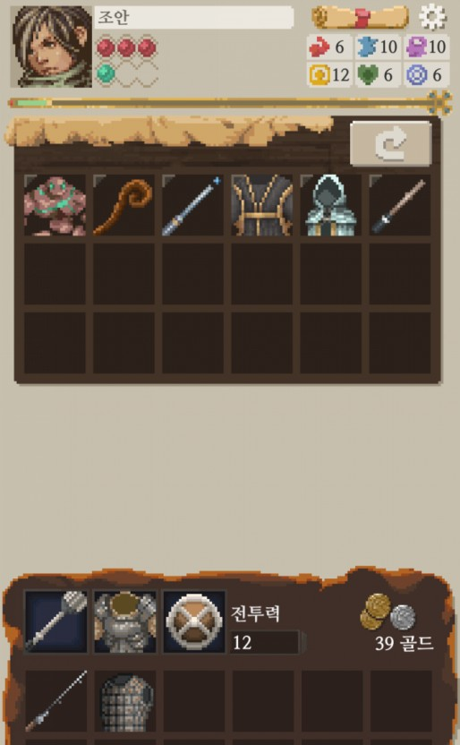
- 동영상
  
  

  

# [대표 이미지]

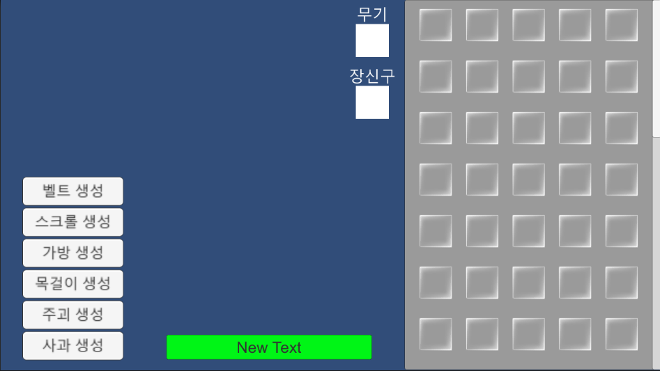

  

# [컨셉 & 대표이미지 기반 작품묘사]

> ### 대표이미지 기반 :
(UI구성) 플레이어가 사용하는 UI는 대부분 우측에 표시될 예정이며, 플레이어가 취할 행동을 결정하는 버튼은 좌측에 표시된다.

(화면 좌측) 플레이어의 시점에서 보이는 개체가 어떤 것인지 볼 수 있다. 예를 들면 몬스터의 이미지, 그 몬스터의 정보, 보물 상자 개체의 이미지가 뜬다.

(화면 우측) 화면 우측에는 플레이어의 인벤토리, 현재 장착하고 아이템이 무엇인지 뜬다.

> ### 컨셉 기반:

(보상) 무언가를 조우하게 된 이후, 결과로 보상을 주거나 거절하게 된다. 얻은 보상은 우측 인벤토리에 넣어지게 된다.

(몬스터) 화면 좌측에서 조우한 몬스터와 싸우는 화면이 출력된다. 몬스터가 타격을 받으면 뒤로 잠깐 밀려나며, 몬스터가 플레이어를 타격하면 잠시 앞으로 다가오다가 뒤로 다시 물러난다.

(인벤토리) 우측 인벤토리의 슬롯의 갯수는 변하지 않는다. 인벤토리의 슬롯의 갯수를 생각하며 아이템을 얻는 것이 중요하다.

  

# [ Warrior is just going 구성 요소]

- Warrior is just going ( 용사는 그저 나아갈 뿐 )

 

## 1. 메커니즘

[도전 과제]

1. 계속해서 이벤트와 조우하며, 이벤트를 처리하는 것으로 보상을 얻는다.
2. 모든 스테이지를 클리어해서 스토리를 모두 보는 것이 목표이다.
3. 스테이지에서 모든 분대원들이 쓰러지지 않아야 한다.
4. 강력한 분대를 위해 분대원들을 강화시켜야 한다.

[재미 요소]

1. 마지막 스테이지 이전까지 무작위의 이벤트를 만나야 하기 때문에 어떤 결과가 나올지 알 수 없기 때문에 기대감이 부풀 수 있다.
2. 보상으로 좋은 아이템을 얻었을 때의 쾌감을 얻을 수 있다.
3. 인벤토리의 갯수가 제한적이기 때문에 아이템을 담을 수 있는 아이템을 얻는 등 작은 전략을 구상할 수 있다.
4. 스토리가 적힌 아이템 설명으로 게임의 스토리를 유추할 수 있다.

 

## 2. 이야기

[만들게 된 배경]  
제한된 인벤토리 슬롯을 가지고 여러 적들을 만나거나 상자를 발견하여 여러 보상을 얻어서 최종 스테이지를 클리어하는 간단한 로그라이크 게임이 있으면 좋겠다고 생각하며 만들게 되었다.

[카메라 관점]  
1인칭 시점으로 좌측에서 캐릭터의 시점으로 조우한 개체를 볼 수 있다.

 

## 3. 미적요소

[디자인] 

시간 : 중세 판타지

캐릭터 : 캐릭터 시점으로 보이는 적들이나 상자는 모두 중세 판타지 게임에서 나오는 몬스터나 보물 상자로 표시된다.

아이템 : 중세 판타지에서 나올 검, 가방 아이템, 보석이나 포션이 나올 예정이다.

인게임 UI 디자인 : 중세 판타지에서 쓰일 스크롤 형태, 또는 석재 UI 형태를 사용할 예정이다.

배경화면 디자인 : 던전으로 생각될 동굴 배경화면을 사용할 예정이다. 단, 최종 스테이지는 마왕이기 때문에 

[음향]  
활에 맞는 소리, 검으로 베는 소리, 뭉둥이로 때리는 소리, 그리고 물건을 뒤적이는 소리를 사용하여 중세 판타지 용사가 사용할 만한 음향을 사용할 예정이다.
 

## 4. 기술
2D PC 게임으로 유니티를 사용하여 제작.

# [ 게임 시스템 디자인 ]
## a. 게임 오브젝트 분해

### a-1.아이템
|연번|오브젝트 이름|태그|등급|오브젝트 이미지|오브젝트 기초 설명|오브젝트 스토리 설명|오브젝트 효과 설명|
|:----:|:----:|:----:|:----:|:----:|:----:|:----:|:----:|
|1|사과|소비|E||평범한 사과다.|먹어도 배는 부르지 않는다. 조금 더 컸으면....|사용 시 체력이 5 회복된다.|
|2|주괴|무기|E||철 덩어리다.|이전에 마땅한 무기가 없어서 대충 이것을 집어서 싸운 적이 있다. 아주 옛날 이야기지만.|착용 시 공격력이 2 증가한다.|
|3|목걸이|장신구|E||마법이 담긴 목걸이다.|하지만 그렇게 강력한 마법은 들어있지 않아 보인다. 그래도 상대의 움직임을 조금 볼 수 있을 정도나…|착용 시 공격 성공이 3% 보정된다.|
|4|가방|가방|B|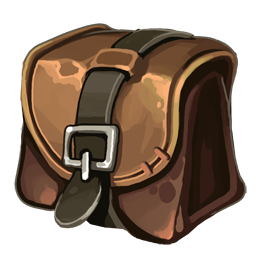|가죽으로 만들어진 가방이다.|여정에 떠난 이들에게 가장 도움이 되는 물건이다.|4개의 아이템을 안에 넣을 수 있다.|
|5|스크롤|가방|X|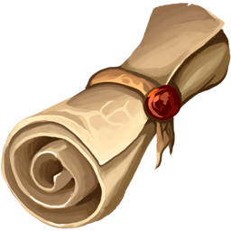|물건을 담을 수 있는 신비한 종이다.|스크롤을 만드는 법은 배웠지만 그녀가 내게는 재능이 없다고 아쉬워했다.|8개의 아이템을 안에 넣을 수 있다.|
|6|벨트|가방|D||가죽으로 만들어진 벨트다.|내가 커서 다행히 뭘 수납할 용도로 사용할 수 있다.|3개의 아이템을 안에 넣을 수 있다.|
|7|가죽 갑옷|갑옷|D||가죽으로 만들어진 갑옷이다.|처음 전투에 관련된 교육을 받았을 때 이 갑옷을 입은 기억이 있다. 뭔가 가슴이 먹먹해진다.|착용 시 방어력이 3 증가한다.|
|8|코인|부적|E|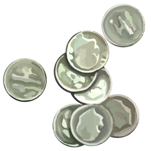|은으로 만들어진 동전이다.|사람은 이것을 가지고 자신의 운을 시험하기도 한다. 이런 나에게도 행운을 줄 수 있을까?|착용 시 크리티컬 확률이 2% 증가한다.|
|9|코팅 부츠|갑옷|H||아주 희귀하게 나오는 슬라임의 점액체를 두른 가죽 부츠다.|온전한 슬라임 점액체는 이렇게 탄력 있고 내구성이 있었단 말인가…!!|착용 시 방어력이 25 증가한다.|
|10|들쥐 부적|부적|S||거대 들쥐의 가죽으로 만든 부적이다.|가죽에 있는 이 고대어… 들쥐도 원래 이러진 않았구나.|착용 시 크리티컬 데미지가 100% 증가한다.|
|11|거미의 독니|무기|AH||들판 거미의 독니이다.|이렇게 멀쩡한 독니를 구하긴 힘든데….|착용 시 공격력이 20 증가한다.|
|12|그린 슬라임 포션|소비|G||그린 슬라임에게 추출 가능한 물약이다.|온전한 그린 슬라임 점액체는 훌륭한 약재라고도 불릴 정도인데… 이거 구하기 힘든데, 운이 좋네…. 이걸로 죽은 사람도 살릴 수 있으면 좋을련만.|사용 시 체력이 125 회복된다.|
|13|블루 울프의 갈기|장신구|S||블루 울프의 갈기이다.|달빛을 머금은 블루 울프의 갈기를 가지고 있으면 눈이 좋아진다지? 상대의 움직임을 잘 파악할 수 있게 될 거야.|착용 시 공격 성공이 15% 보정된다.|
|14|소형 포션|소비|D||달인 약재에 마법을 부여해서 빠르게 몸에 흡수되게 만든 약이다.|이거라면 나도 마실 수 있다.|사용 시 체력이 10 회복된다.|
|15|검|무기|D|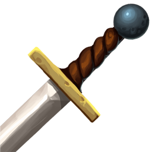|검사들이 사용하는 검이다.|흔히 보이는 평범한 검이지만, 그렇기 때문에 누구든지 이 검을 잡고 휘두를 수 있었다. 나도 그랬으니까.|착용 시 공격력이 4 증가한다.|
|16|젬|부적|E||마법이 농축된 보석이다.|흔히 악마에 의해 잠식되어 변이된 동물이나 마물에게 얻을 수…. 아… 악마가 아니었나?|착용 시 크리티컬 데미지가 10% 증가하며, 크리티컬 확률이 1% 증가한다.|
|17|깨진 반지|부적|E||누군가의 반지이다.|마물에게 죽은 사람의 것인가… 그 원한이 얼마나 큰지 나는 이미 알고 있다.|착용 시 크리티컬 데미지가 15% 증가한다.|
|18|고기|소비|C|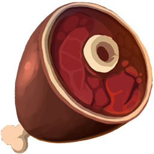|마물의 고기다.|나는 맛있게 먹을 수 있는 식량이다.|사용 시 체력이 15 회복된다.|
|19|철 갑옷|갑옷|C||철로 만들어진 갑옷이다.|용사 일행이 이런 갑옷을 착용했었다.|착용 시 방어력이 6 증가한다.|
|20|도끼|무기|C||강력한 한 방을 노릴 수 있는 무기다.|제대로 겨냥하고 베면 나무를 간단히 벨 만큼 강력한 무기다.|착용 시 공격력이 6 증가한다.|
|21|트레저 부츠|갑옷|C||모험자들을 위해 개량된 가죽 부츠다.|민첩하게 움직일 수 있도록 만들어져서 그런지, 적의 허점을 쉽게 공략할 수 있을 것 같다.|착용 시 방어력이 5 증가하며, 크리티컬 확률이 2% 증가한다.|
|22|청옥석|장신구|C||아름다운 청록색 보석이 박혀져 있는 목걸이이다.|이런 보석은 어떻게 얻는 거지?|착용 시 공격 성공이 6% 보정된다.|
|23|대검|무기|B||일반 검보다 더 강하고 묵직한 공격을 할 수 있다.|용사 일행은 대검을 사용하지 않았었지…|착용 시 공격력이 9 증가한다.|
|24|은 주괴|부적|B||은으로 만들어진 주괴이다.|은은 신비로운 능력이 담겨져 있다고 알려져 있는데… 이게 내게 행운을 줄 수도 있다.|착용 시 크리티컬 확률이 5% 증가한다.|
|25|신선한 고기|소비|B||질 좋은 고기다.|그들과 함께 먹은 고기가 가장 맛있었지.|사용 시 체력이 20 회복된다.|
|26|열쇠|부적|B|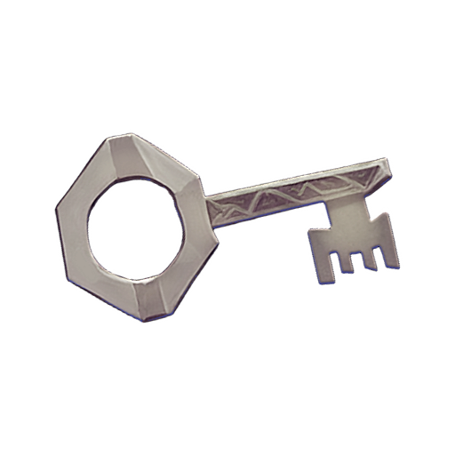|누군가의 집 열쇠이다.|피가 묻어 있는 것을 보니 이미 이 열쇠의 주인은 죽은 것 같다. 그 원한은 내가 대신 갚아야겠지?|착용 시 크리티컬 데미지가 60% 증가한다.|
|27|아이언 링|장신구|B||철로 만들어진 반지다.|이 쇠반지가 내게 큰 도움을 주었으면 한다.|착용 시 공격 성공이 5% 보정되며, 크리티컬 데미지가 30% 증가한다.|
|28|실프 헬멧|갑옷|A||바람의 정령의 가호가 담긴 투구다.|바람의 정령의 힘으로 더 민첩하게 움직일 수 있을 것이다.|착용 시 방어력이 8 증가하며, 공격 성공이 5% 보정된다.|
|29|은 갑옷|갑옷|A||은으로 만들어진 갑옷이다.|마물에게 있어서 은은 거의 독이나 다름없다. 하지만 나는 다르다. 다르다….|착용 시 방어력이 12 증가한다.|
|30|트레저 팬츠|갑옷|A||가벼운 가죽 재질의 바지다.|편하게 움직일 수 있어서 좋긴 한데… 내구성이 좋지가 않다.|착용 시 방어력이 7 증가하며, 크리티컬 확률이 2% 증가한다.|
|31|기력의 간|소비|A||기력을 회복시켜 주는 신비의 간이다.|이 간을 그때 얻을 수 있었으면 좋았을 텐데…|사용 시 체력이 25 회복된다.|
|32|푸른 마법책|무기|A||마법이 적힌 책이다.|마법사는 내게 재능이 없다고 했었지.... 하지만 지금은 다릅니다, 마법사.|착용 시 공격력이 8 증가하며, 크리티컬 확률이 3% 증가한다.|
|33|레이피어|무기|A|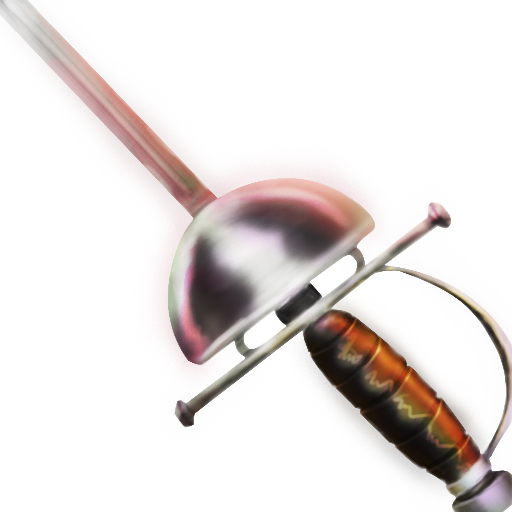|빠른 공격을 할 수 있게 해주는 검이다.|적의 공격을 흘리고 반격하기 좋다.|착용 시 공격력이 7 증가하며, 공격 성공이 5% 보정된다.|
|34|포에나|무기|S|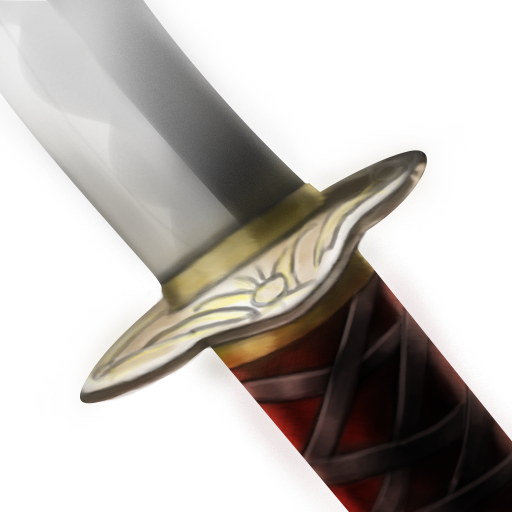|마물을 천 마리 이상 죽였다고 알려진 검이다.|이 무기는 마물에게 있어서 공포의 대상이다. 그럼 이제 내가 그 길을 가주겠어.|착용 시 공격력이 23 증가하며, 크리티컬 데미지가 60% 증가한다.|
|35|슬라임의 보은|부적|X||블랙 슬라임에게 얻을 수 있는 점액을 정제한 것이다.|이건 마시는 것보다는 갖고 다니는 것이 좋다. 억지로 슬라임이 되어 버린 원혼들이 나를 도울 거니까.|착용 시 크리티컬 확률이 35% 증가한다.|
|36|전갈 반지|장신구|X||전갈의 독이 묻혀진 반지다.|이 전갈의 독은 추출하게 되면 독성이 아예 없다고 하지… 추출하게 되면.|착용 시 공격 성공이 20% 보정되며, 크리티컬 데미지가 60% 증가한다.|
|37|그린 울프 갈기 망토|갑옷|X||그린 울프의 갈기로 만든 망토다.|그린 울프의 갈기는 단단하지. 얻기도 힘든데, 운이 좋아.|착용 시 방어력이 30 증가하며, 공격 성공이 10% 보정된다.|
|38|포이즌 글라디우스|무기|X||포이즌 스파이더의 독을 흡수한 검이다.|글라우디스가… 독을 흡수했어…?|착용 시 공격력이 30 증가하며, 크리티컬 데미지가 50% 증가한다.|
|39|스팀팩|소비|X|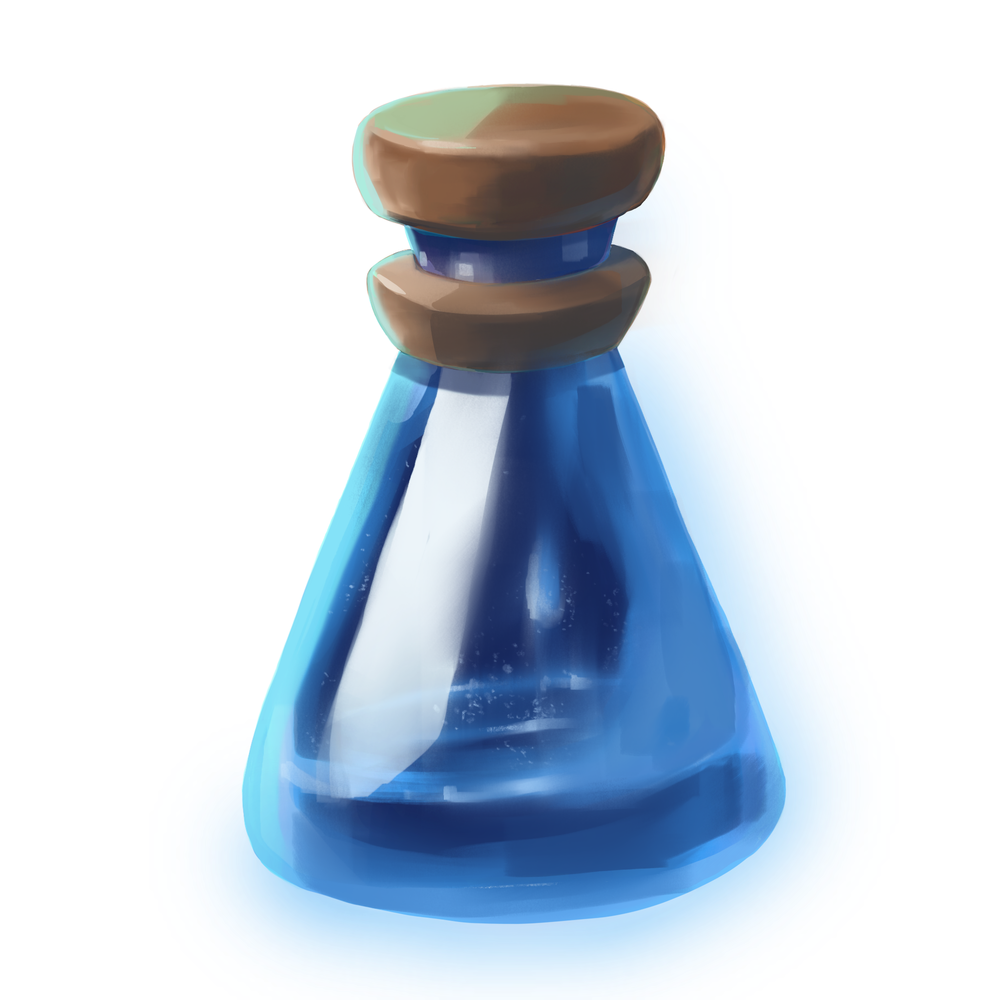|티스 웜에게서 추출 가능한 약재로 만든 약이다.|가지고 다니면 내게 힘을 주는 신비의 약… 마저할 이유가 없지.|사용 시 영구적으로 공격력이 5 증가하며, 크리티컬 데미지가 30% 증가한다.|
|40|블러드 아이언|부적|X||마왕의 수하인 킹스 아이의 피가 굳어 만들어진 철이다.|이 망할 눈 때문에….|착용 시 크리티컬 확률이 35% 증가하며, 크리티컬 데미지가 110% 증가한다.|
|41|피의 목걸이|장신구|A||피와 같은 색을 띄는 혈석을 가공해 만든 목걸이다.|이 피의 정체는 뭐지? 뭔지는 몰라도 집중력이 올라가는 기분이다. 힘까지도.|착용 시 공격 성공이 5% 보정되며, 공격력이 3 증가한다.|
|42|원한의 해골|부적|A||누군가의 두개골이다.|마물의 해골인가? 아니면 인간의 해골인가? 뭔지는 몰라도, 이 해골에서 원한이 느껴진다. 이 원한을 힘으로 사용하자.|착용 시 크리티컬 데미지가 60% 증가하며, 공격력이 2 증가한다.|
|43|붉은 보석|부적|A||마물의 피에 적셔졌다고 알려진 보석이다.|마물들의 차디찬 원한이 담겨져 있다고 무방하겠군. 하지만 나에게는 그런 건 안 통한다.|착용 시 크리티컬 데미지가 75% 증가한다.|
|44|보은의 뼈|부적|A||동물의 뼈다.|마기에 의해 흉포해진 동물이 남긴 뼈인가. 구해줘서 고맙다는 거군…|착용 시 크리티컬 확률이 9% 증가한다.|
|45|배틀 액스|무기|AH|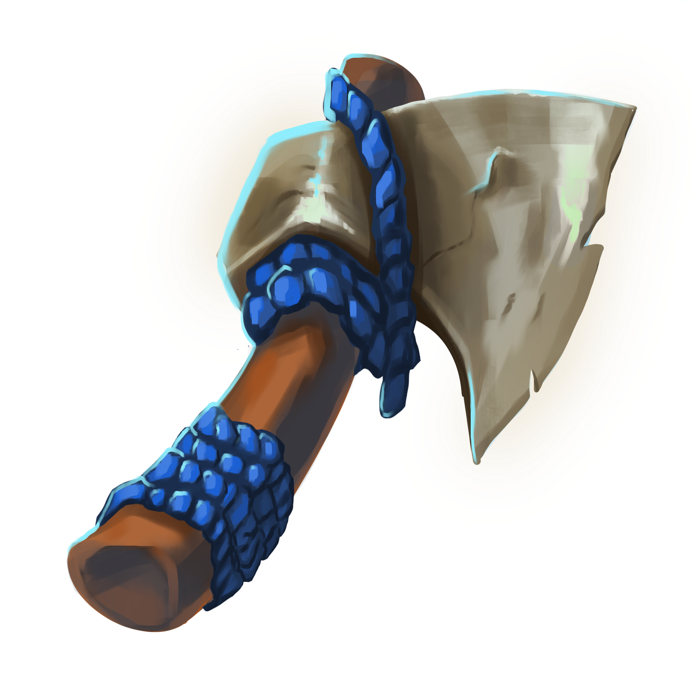|보통 도끼보다 더 단단하고 날카로운 도끼다.|이 도끼…. 보통 얻기 힘든데… 누군가의 유품인가?|착용 시 공격력이 14 증가하며, 크리티컬 데미지가 25% 증가한다.|
|46|최상급 고기|소비|AH||마물에게 얻을 수 있는 영양분이 풍부한 고기다.|이 고기…. 그들이 내게 줬었던 고기였구나. 어쩐지 맛있더라… 젠장.|사용 시 체력이 30 회복된다.|
|47|강철 갑옷|갑옷|AH||강철로 만들어진 갑옷이다.|철 갑옷보다 더 단단해서 웬만한 공격은 다 막을 수 있다. 웬만한 공격은.|착용 시 방어력이 14 증가한다.|
|48|라피스 라줄리 목걸이|장신구|AH||청금석으로 만들어진 목걸이다.|청금석으로 수정 구슬을 만든다고 할 정도로 청금석에는 예지의 힘이 깃들어 있다고들 한다.|착용 시 공격 성공이 9% 보정된다.|
|49|철갑 갑피|갑옷|AH||철로 만들어진 갑주다.|펼치면 온몸을 보호할 수 있는 장비라… 쓸만하겠는데?|착용 시 방어력이 12 증가하며, 공격 성공이 4% 보정된다.|
|50|힘의 물약|장신구|A||마시면 힘이 강해진다는 물약이다.|이것의 재료는 만드라고라에… 아니다… 더 알고 싶지 않아.|사용 시 영구적으로 공격력이 2 증가한다.|
|51|인내의 물약|소비|A||마시면 몸이 더 견고해진다는 물약이다.|이건 마물들이 자주 마시던 거다. 그러니 나도 부작용이 일어나진 않는다.|사용 시 영구적으로 체력이 10 증가한다.|
|52|집중의 물약|소비|AH||마시면 집중력이 올라간다는 물약이다.|스승님께서는 이런 것을 마시지 말라고 하셨지만… 지금은 상황이 다르다.|사용 시 영구적으로 크리티컬 확률이 1% 증가한다.|
|53|괴력육|소비|A||먹으면 순간적인 괴력을 낼 수 있다는 고기다.|대체 인간들은 이런 것을 어떻게 만들어 낸 거지?|사용 시 영구적으로 크리티컬 데미지가 30% 증가한다.|
|54|월도|무기|AH|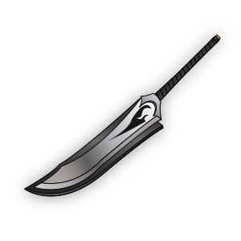|자루가 긴 칼이다.|창과 검의 숙련도가 필요한 도구라…. 그래도 성능 하나는 쓸만하군.|착용 시 공격력이 18 증가한다.|
|55|기력버섯|소비|S||먹으면 기력이 회복된다는 버섯이다.|웬만한 고기보다 영양분이 풍부하다고 하던데….|사용 시 체력이 40 회복된다.|
|56|하프 엘릭서|소비|H||좋은 약초만을 모아 만든 전설의 물약이다.|엘릭서보다 효력이 낮지만… 그래도 웬만한 포션보단 좋다고 알려져 있다.|사용 시 체력이 50 회복된다.|
|57|누군가의 쪽지|부적|S||누군가가 남긴 쪽지다.|강력한 한이 이 쪽지에 감돌고 있다. 내용이…. 사랑하는 아내… 아니다. 여기까지만 읽자.|착용 시 크리티컬 데미지가 85% 증가한다.|
|58|전투 방패|무기|AH||방패로도 무기로도 적합한 도구다.|전사가 이걸로 마물을 내려찍던데… 나도 한 번 해볼까?|착용 시 공격력이 11 증가하며, 방어력이 5 증가한다.|
|59|활|무기|AH|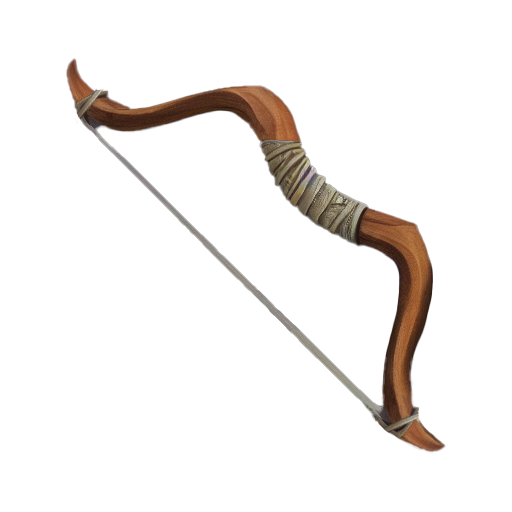|마물을 죽이기에 적합한 활이다.|일반적인 활은 마물에게 생채기도 낼 수 없다. 하지만 이런 특별한 활을 사용한다면, 말이 달라지지.|착용 시 공격력이 13 증가하며, 크리티컬 확률이 3% 증가한다.|
|60|천선어|소비|X||하늘에서도 살 수 있다고 알려져 있는 물고기다.|하늘처럼 착해지라는 의미의 물고기… 나도 이것을 먹으면 착해질 수 있을까?|사용 시 체력이 60 회복된다.|
|61|바바리안 스워드|무기|S||야만족들이 사용했다던 대검이다.|그래… 무기 성능 하나만큼은 끝내주는군.|착용 시 공격력이 18 증가하며, 크리티컬 데미지가 40% 증가하며, 크리티컬 확률이 3% 증가한다.|
|62|마골|부적|S||악마의 두개골이다.|너희들의 원혼 따위 관심 없다.|착용 시 크리티컬 데미지가 95% 증가한다.|
|63|엘프 넥클레스|장신구|S||엘프들이 손수 만든 목걸이다.|이 보석이 이런 나에게도 힘을 주기를…|착용 시 공격 성공이 14% 보정된다.|
|64|드워프 벨트|장신구|S||드워프들이 작업을 할 때 사용하는 벨트다.|…. 너무 작아서 팔찌로 쓸 수밖에 없다.|착용 시 공격 성공이 8% 보정되며, 크리티컬 데미지가 65% 증가한다.|
|65|고대서|무기|S||고대에 사용했던 마법책이다.|내가 이 언어를 읽을 수 있어서 다행이다. 근데 고대서라고 현재에 있는 마법책과 다를 바가 거의 없다.|착용 시 공격력이 23 증가한다.|
|66|아메시스 헬멧|갑옷|S||자수정으로 만든 헬멧이다.|근데 이거… 보통 자수정이 아닌데… 이건 대체 뭐지?||
|67|블루 트레저 팬츠|갑옷|S||푸른 슬라임에게서 얻을 수 있는 재질로 만든 바지다.|흐음… 조금 미끌거리긴 한데… 그래도 괜찮네. 더 빨리 움직일 수도 있고.|착용 시 방어력이 15 증가하며, 공격 성공이 6% 보정된다.|
|68|사우전드 우드 브레이서|장신구|S||천년목을 깎아 만든 보호대다.|강한 내구도를 가진 천년목이라… 엘프들이 이걸 알면 난리 나겠군. 천년목을 아끼는 종족이니까…|착용 시 공격 성공이 10% 보정되며, 방어력이 8 증가한다.|
|69|금괴|부적|S||금으로 만들어진 주괴이다.|왜 사람들은 이 물건에 환장을 하는 것일까. 위험이 닥치면 결국 아무 것도 아닌 돌 덩이… 그 이하로 변하는데.|착용 시 크리티컬 확률이 14% 증가한다.|
|70|라이트 해머|무기|X||빛을 머금은 강력한 망치다.|으으으윽…. 이… 이 빛 때문에 괴롭다…|착용 시 공격력이 30 증가하며, 크리티컬 데미지가 30% 증가한다.|
|71|그로겔 이어링|장신구|L||그로겔에게서 얻을 수 있는 보석으로 만든 귀걸이다.|그로겔의 보석에는 착용자의 집중력을 올려주는 효과가 있다던데… 전설인지 아닌지 확인해볼까?|착용 시 공격 성공이 30% 보정된다.|
|72|흉포한 도끼|무기|M||흉포한 쥐의 기운이 담긴 도끼이다.|평범한 도끼처럼 보이는데, 이 도끼만 잡으면 이상하게도 괴력이 생긴다.|착용 시 공격력이 40 증가하며, 크리티컬 데미지가 160% 증가한다.|
|73|정제된 블루 스콜피온의 독|소비|G||블루 스콜피온의 독을 정제한 물약이다.|블루 스콜피온에 포함된 독만 뺀다면, 훌륭한 물약이 된다. 다만 정제가 엄청 힘들 뿐이지…|사용 시 체력이 100 회복된다.|
|74|독 빼낸 고기|소비|L||포이즌 웜에서 독을 빼낸 고기다.|이것을 먹으면 기력이 많이 회복된다고 하지만…. 사실은 근육을 강화시켜주는 것이다.|사용 시 영구적으로 공격력이 10 증가하며, 방어력이 10 증가한다.|
|75|둠 아머|갑옷|L||블랙 울프의 사악한 에너지가 담겨 있는 흉갑이다.|이것을 입으면 타락한다고 하지만, 나에게는 통하지 않는다. 왜냐하면…. 아니다.|착용 시 방어력이 40 증가하며, 공격력이 15 증가한다.|
|76|레드 에너지 팬츠|갑옷|M||레드 스파이더의 힘을 주입한 가죽 바지다.|….? 이거 뭐야. 왜 크기가 자유자재로 늘어나는 거지?|착용 시 방어력이 70 증가한다.|
|77|원혼이 담긴 반지|장신구|M||서늘한 원혼이 느껴지는 반지다.|…! 그렇군. 이 영혼은 원래 인간의 영혼이었군… 아무래도 함께 싸우고 싶나 보다.|착용 시 공격 성공이 40% 보정되며, 공격력이 15 증가한다.|
|78|포이즌 블레이드|무기|M||포이즌 그로겔에서 채취한 독을 바른 검이다.|독을 부여할 수는 없지만, 그래도 치명타를 더 줄 수는 있을 것 같다.|착용 시 공격력이 50 증가하며, 크리티컬 데미지가 200% 증가한다.|
|79|예리한 울프 스워드|무기|M||세 머리의 울프의 송곳니로 만든 검이다.|이빨이 마치 다이아몬드처럼 단단하군… 대체 이놈들은 어떻게 자신의 이빨을 관리하는 거지?|착용 시 공격력이 75 증가한다.|
|80|골검|무기|M||본웜의 뼈로 만든 검이다.|본웜의 뼈는 단단하다고 알려져 있다. 그리고 그 송곳니는 어떠한 철보다 단단하다고 알려져있다. 그리고 이 송곳니는…. 스승이 사용했었다.|착용 시 공격력이 40 증가하며, 크리티컬 확률이 15% 증가하며, 크리티컬 데미지가 100% 증가한다.|
|81|라바 부츠|갑옷|M||라바 슬라임의 정제된 액체로 씌여진 부츠다.|굳어진 용암의 견고함으로 이루어진 이 부츠는 견고한 기운을 온몸까지 퍼지게 만들어준다.|착용 시 방어력이 50 증가하며, 공격력이 10 증가하며, 크리티컬 확률이 5% 증가한다.|
|82|낡은 코인|부적|M||유령이 가지고 있던 동전이다.|아직 삶에 미련이 있는 것 같다. 적어도 내가 이 자를 대신해서 마왕을 무찌를 수 있다면…|착용 시 크리티컬 데미지가 350% 증가하며, 크리티컬 확률이 35% 증가한다.|
|83|프로즌 랫 에너지 아머|갑옷|G||프로즌 랫의 냉기를 머금고 있는 갑옷이다.|냉기가 체온을 조절시키고, 그 어떤 한기에서도 착용자를 보호해준다…. 왜 이런 것을 몰랐었지?|착용 시 방어력이 100 증가한다.|
|84|라스 웜의 가죽 장갑|갑옷|G||난폭한 라스 웜에게서 얻을 수 있는 가죽으로 만든 장갑이다.|이걸 장착하면 라스 웜의 그 난폭함에 내게도 전해진다. 하지만 나는 정신을 차릴 거다. 그래야 한다.|착용 시 방어력이 80 증가하며, 공격력이 20 증가한다.|
|85|불의 격통|무기|G||파이어 케로베로스가 사용하던 마법이다.|적의 무기로 적을 친다. 이런 전투 방법이 있었지, 참.|착용 시 공격력이 100 증가한다.|
|86|검은 반지|장신구|G||불안정한 원혼에게 얻을 수 있는 반지다.|이 반지에는 그 원혼이 겪은 고통이 그대로 담겨 있다. 그 고통에 대한 복수는 내가 이어받겠다.|착용 시 공격 성공이 55% 보정된다.|
|87|투명한 엘릭서|소비|I||디스커스팅 본웜의 소화액을 정제해서 만든 물약이다.|최강의 물약이라고 불리는 엘릭서보다 효율이 더 좋다…. 너무 좋은 거 아니야? 소화액이….|사용 시 체력이 200 회복된다.|
|88|스켈레톤 블레이드|무기|G||스켈레톤이 사용하던 검이다.|수많은 유골로 만들어진 이 뼈에는 많은 원혼이 안에 도사리고 있다.|착용 시 공격력이 80 증가하며, 크리티컬 데미지가 180% 증가한다.|
|89|원한 서린 코인|부적|G||아직 세상에 미련이 있는 유령의 물건이다.|얼마나 많은 한이 있길래…. 이 의지는 내가 이어가야겠다.|착용 시 크리티컬 확률이 60% 증가하며, 방어력이 20 증가하며, 공격 성공이 20% 증가한다.|
|90|크리스털 스파이더의 수정|장신구|Z||크리스털 스파이더에게 박혀 있던 보석이다.|이 보석은 대체 뭐지…? 빼내니까 초록색으로 변했어…|착용 시 공격 성공이 75% 보정된다.|
|91|리더 울프의 고기|소비|Z||리더 울프에게서 얻을 수 있는 고기다.|이 고기를 먹으면 많은 힘을 얻을 수 있다지…!|사용 시 영구적으로 공격력이 15 증가하며, 방어력이 15 증가하며, 공격 성공이 5% 보정되며, 크리티컬 데미지가 150% 증가하며, 크리티컬 확률이 5% 증가한다.|
|92|남겨진 왕관|장신구|Z||이미 멸망해서 사라진 어떤 한 왕국의 마지막 보물인 왕관이다.|그럼 이걸 가지고 있던 원혼의 주인은… 편히 쉬십시오.|착용 시 공격 성공이 50% 보정되며, 공격력이 25 증가하며, 방어력이 25 증가한다.|
|93|매드 본웜의 갈비뼈|부적|Z||매드 본웜에게서 얻을 수 있는 갈비뼈이다.|이것도 자의가 아닌 타의로 움직이던 생물이었나… 편히 쉬어라.|착용 시 크리티컬 확률이 60% 증가하며, 크리티컬 데미지가 500% 증가한다.|
|94|어둠을 머금은 칼|무기|Z||다크니스 그로겔의 액체에 하루 이상 담가둔 검이다.|…. 대체 이 생물은 정체가 뭐였지? 액체에 그저 검만 담갔을 뿐인데…. 검이 어둠에 물들었어.|착용 시 공격력이 150 증가한다.|
|95|크리스털 스콜피온 쌍검|무기|Z||크리스털 스콜피온에 박혀 있던 수정으로 만든 쌍검이다.|마왕은 대체 무슨 일을 꾸미고 있는 거지? 이 보석은 대체…|착용 시 공격력이 100 증가하며, 공격 성공이 20% 보정된다.|
|96|마스터 케로베로스의 발톱|무기|Z||마스터 케로베로스에게 얻을 수 있는 발톱으로 만든 검이다.|이런 케로베로스는 난생 처음 보는데… 게다가 이 발톱은…. 뭔데 이리 날카롭지?|착용 시 공격력이 75 증가하며, 방어력이 50 증가하며, 크리티컬 확률이 20% 증가한다.|
|97|부정한 악마의 마법|부적|Z||부정한 악마가 사용하던 마법이다.|적응하자… 안 그러면…. 나도 이 마법에 의식을 빼앗기고 말 것이다…!!|착용 시 크리티컬 데미지가 1500% 증가한다.|
|98|스포아의 이어링|장신구|M||스포아가 귀에 착용하고 있던 귀걸이이다.|뭐지? 이 귀걸이에 박힌 보석… 평범한 물건은 아닌 것 같은데? 이 녀석 마왕의 수하이지 않았나?|착용 시 공격 성공이 30% 보정되며, 크리티컬 확률이 15% 증가한다.|
|99|바드의 갑옷|갑옷|Z||바드가 숨겨 두었던 갑옷이다.|마왕의 수하인데 왜 이런 갑옷을 숨겨 두고 있던 것이지? 그냥 자신이 쓰면 될 것을…|착용 시 방어력이 125 증가하며, 공격력이 10 증가하며, 크리티컬 데미지가 515% 증가한다.|
|100|켈트의 낡은 검|무기|I||켈트가 사용하고 있던 검이다.|보통 스켈레톤의 검과는 차원이 다르다. 역시 마왕의 친위대는 친위대라는 건가….|착용 시 공격력이 100 증가하며, 크리티컬 데미지가 400% 증가하며, 크리티컬 확률이 40% 증가한다.|
|101|은 검|무기|H||은으로 만들어진 검이다.|은은 악을 내쫓는다고 하지. 그래서 인간들은 은에다가 여러 마법을 걸어 놓는다고 하던데… 이것도 그러네.|착용 시 공격력이 25 증가하며, 크리티컬 데미지가 20% 증가한다.|
|102|신성한 도끼|무기|H||신성력이 담긴 도끼다.|나도 신성력을 견딜 수 있다고…!! 그 사람들이 내 스승인 이상…!!|착용 시 공격력이 30 증가한다.|
|103|쌍검 베나리&세미타|무기|H||한 영웅이 애용하던 쌍검이다.|당신의 그 힘을 내게도 주십시오. 모든 마족 병사들을 섬멸하기 위해서.|착용 시 공격력이 20 증가하며, 공격 성공이 10% 보정된다.|
|104|커트리스 보텀|무기|H||위대한 대장장이의 이름을 이어받은 검이다.|그 대장장이가 마족일 거라는 것을, 인간들은 전혀 모른다.|착용 시 공격력이 30 증가하며, 크리티컬 확률이 10% 증가한다.|
|105|붉은 마법책|무기|X||나의 스승인 마법사가 사용하던 책들 중 하나다.|제게 힘을 주세요, 스승님. 인간들을 구하기 위해서.|착용 시 공격력이 35 증가한다.|
|106|크로니클 아머|갑옷|H||여러 연대기에서 등장하는 유명한 갑옷이다.|마족에게도 공포로 알려진 그 갑옷인가… 유용하겠는걸.|착용 시 방어력이 20 증가하며, 크리티컬 확률이 5% 증가한다.|
|107|세월의 갑옷|갑옷|H||세월의 흔적이 그대로 남아 있는 고대의 갑옷이다.|사람의 세월… 그것도 수많은 사람들의 세월이 느껴진다.|착용 시 방어력이 23 증가한다.|
|108|홀리 헬멧|갑옷|H||신성한 힘이 담겨져 있는 투구다.|어차피 나는 수명이 얼마 남지 않았다. 목숨을 깎을 각오로 사용하자.|착용 시 방어력이 20 증가하며, 크리티컬 데미지가 50% 증가한다.|
|109|풀아머드 헬멧|갑옷|L||강력한 강철로 만들어진 투구다.|이 투구는 모든 갑옷을 더 단단해지는 능력이 있다지? 좋아…|착용 시 방어력이 40 증가한다.|
|110|비옥석|장신구|H||하늘로 승천할 수 있다는 전설의 보석이다.|나도 하늘을 날 수 있을까…?|착용 시 공격 성공이 18% 보정된다.|
|111|에메랄드 링|장신구|X||전설에 나오는 에메랄드 반지다.|전설의 반지…. 근데 힘이 조금 빠져나간 것 같네… 왜지?|착용 시 공격 성공이 15% 보정되며, 크리티컬 확률이 5% 증가한다.|
|112|투지의 보석 아니모|장신구|L||투지를 준다는 보석인 아니모로 만들어진 귀걸이다.|힘이… 넘쳐난다…!!|착용 시 공격 성공이 15% 보정되며, 공격력이 5 증가하며, 크리티컬 확률이 50% 증가한다.|
|113|영웅의 동전|부적|H||영웅들이 가지고 다녔다던 동전이다.|제게 힘을 주세요, 스승님들….!!|착용 시 크리티컬 데미지가 120% 증가한다.|
|114|성골|부적|H||성스러운 힘이 남아 있는 유골이다.|천사의 유골인가? 야수의 유골 같아 보이는데, 왜 신성력이 느껴지지?|착용 시 크리티컬 확률이 18% 증가한다.|
|115|폐허의 씨앗|부적|X||폐허에서 자란다는 어떤 식물의 씨앗이다.|이 씨앗이 멸망한 문명에서만 발견되어서 폐허 속 희망이라 불린다지? 내게도 희망이 있기를…|착용 시 크리티컬 데미지가 100% 증가하며, 크리티컬 확률이 10% 증가한다.|
|116|설감육|소비|L||식감이 눈과 같다는 부드러운 고기다.|이게 내 마지막 만찬이 되지 않기를….||
|117|괴력의 갈비|소비|X||괴력을 낼 수 있도록 도와준다는 갈비다.|…. 맛은 뭔가 없는데?|사용 시 영구적으로 공격력이 1 증가하며, 크리티컬 데미지가 15% 증가한다.|
|118|도마뱀 고기|소비|H||어떤 신화에 나온다는 도마뱀의 고기다.|의외로 맛이 있네…. 구우니까 더 맛있고. 그나저나 이 고기가 내성을 키워준다고 했지?|사용 시 영구적으로 방어력이 2 증가한다.|
|119|모어 헬스 포션|소비|H||체력 포션의 아종이다.|이거 근데 뭘로 만든 거지…?|사용 시 영구적으로 체력이 20 증가한다.|
|120|버닝 포션|소비|X||불타오르는 정수인 아벡을 정제해서 만든 포션이다.|아… 상쾌해지는 기분이야.|사용 시 영구적으로 공격 성공이 2% 증가한다.|
|121|마법 모자|가방|AH||여러 가지 물건을 담을 수 있는 도구로 사용되기도 하는 모자다.|어차피 내 머리에는 안 맞으니까, 그냥 주머니로 사용하자…|6개의 아이템을 안에 넣을 수 있다.|
|122|세이버|무기|X|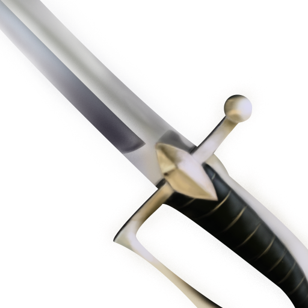|예리하고도 단단한 검이다.|이 무기는 내 스승인 전사도 사용했었던 검이다. 그에게 배움을 받은 나 역시도 이 검을 잘 쓸 수 있을 거야.|착용 시 공격력이 38 증가한다.|
|123|세계수 활|무기|X||세계수의 껍질을 이용해서 만들어졌다고 알려진 활이다.|세계수는 분명 엘프들이 지키고 있을 텐데…. 누가 이런 무기를 만들어낸 거지?|착용 시 공격력이 25 증가하며, 크리티컬 확률이 15% 증가한다.|
|124|에이션트 소드|무기|X||고대에 사용되었다고 알려진 검이다.|고대의 검인데도, 무뎌지지 않았어. 게다가 고대의 힘까지 품고 있는 것 같은데…|착용 시 공격력이 34 증가하며, 크리티컬 데미지가 75% 증가한다.|
|125|베네디캇|무기|M|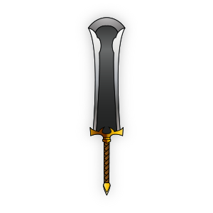|축복의 힘이 담겨져 있는 검이다.|신이 정말 이 세상을 사랑한다면, 나에게도 힘을 빌려주기를….|착용 시 공격력이 60 증가하며, 크리티컬 데미지가 50% 증가하며, 크리티컬 확률이 10% 증가한다.|
|126|다크 아머|갑옷|X||칠흑같은 어둠이 느껴진다고 알려진 갑옷이다.|이 힘은 다른 자들을 타락시킬 수 있는 위험한 힘이다. 허나 동류인 내게 전혀 통하지 않는 힘이다.|착용 시 방어력이 34 증가한다.|
|127|노블 부츠|갑옷|X||인간 귀족 병사들이 사용했다고 알려진 부츠다.|서민들을 위해서 한 목숨을 바쳐서 용맹하게 싸웠던 자들의 유품인가… 그들의 정신이 느껴진다.|착용 시 방어력이 28 증가하며, 공격 성공이 10% 보정된다.|
|128|프로테가트|갑옷|X|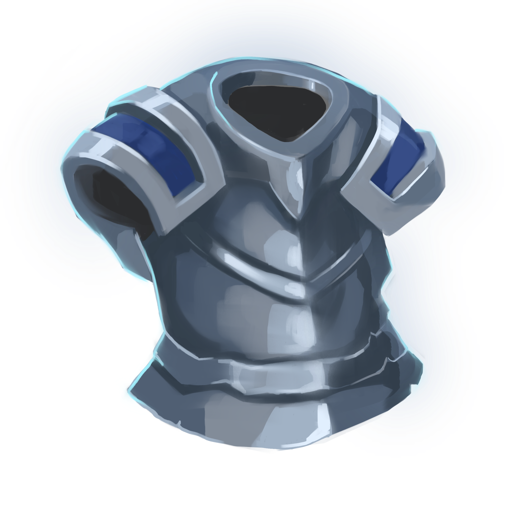|누군가의 염원이 담겨져 있는 갑옷이다.|반드시 지키겠다는 염원이 이 갑옷 안에 들어있어. 이 염원을 잇겠다는 의미로 이 투구를 사용해야겠다.|착용 시 방어력이 40 증가하며, 크리티컬 확률이 10% 증가한다.|
|129|비르투스 넥클레스|장신구|X||선한 마음을 가진 자들만이 사용할 수 있다던 목걸이다.|나를 거부하지 않는 것을 보니, 나는 확실히 착실한 자라는 것을 새삼 깨닫게 된다.|착용 시 공격 성공이 18% 보정되며, 방어력이 12 증가한다.|
|130|청결정 귀걸이|장신구|X||푸른 결정을 깎아 만든 귀걸이다.|이 푸른 결정은 분명 에르다…. 뭐였더라. 마법사는 알고 있을 텐데.|착용 시 공격 성공이 24% 보정된다.|
|131|크레센트 링|장신구|M||초승달의 달빛을 머금은 푸른 보석을 깎아 만든 반지다.|초승달의 달빛을 머금었다기 보다는, 인간들의 불빛에 반응하여 빛나는 거 뿐이지만.|착용 시 공격 성공이 38% 보정되며, 공격력이 10 증가한다.|
|132|아다만트|부적|X|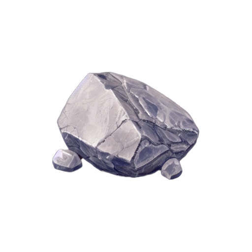|전설 속에 나오는 어떠한 광물이다.|전설의 철이 실존하는 거였다니…|착용 시 크리티컬 데미지가 165% 증가한다.|
|133|환상수의 뼈|부적|X||환상의 마수에게서 얻을 수 있는 뼈다.|환상 속에 사는 마수는 역시 실존하는 게 맞았다. 물론 나는 모르고 있었지만…|착용 시 크리티컬 확률이 24% 증가한다.|
|134|용갑의 조각|부적|L||용의 비늘로 만들었다고 알려진 용갑이라는 갑옷에서 나온 조각이다.|용의 비늘을 어떻게 다룬 거지? 용의 비늘은 그 어떤 망치로도 흠집을 낼 수 없을 텐데…?|착용 시 크리티컬 데미지가 150% 증가하며, 크리티컬 확률이 15% 증가한다.|
|135|라이트닝 포션|소비|L||번개의 힘이 담겨져 있다고 알려진 물약이다.|번개를 담은 건가….? 어떻게?|사용 시 영구적으로 공격 성공이 1% 보정되며, 크리티컬 확률이 1% 증가한다.|
|136|축복 포션|소비|L||천사의 축복이 담겨져 있다고 알려진 물약이다.|천사의 축복이 몸에 돌기 시작할 거지만, 나는 전혀 두렵지 않다.|사용 시 영구적으로 공격력이 2 증가하며, 방어력이 1 증가한다.|
|137|천상육|소비|M||식감, 맛 모든 것이 천상의 맛이라고 자부할 수 있다는 고기다.|하지만 맛보다는 건강하기 위해서 먹는 경우가 많다.|사용 시 영구적으로 체력이 30 증가하며, 크리티컬 데미지가 40% 증가한다.|
|138|라이트 액스|무기|L||빛을 머금은 강력한 도끼다.|빛을 머금은 무기들 중에서 가장 강력한 무기라고 자부할 수 있다는 무기다.|착용 시 공격력이 50 증가한다.|
|139|데빌 브레이커|무기|L||악마를 사냥한다는 전설의 검이다.|이 세상을 어지럽히는 종족을 모조리 제거하기 위해서라면…. 이 무기가 도움이 될 수 있을지도 모르겠다.|착용 시 공격력이 45 증가하며, 크리티컬 데미지가 80% 증가한다.|
|140|스페스의 눈|무기|G||스페스라는 초월적인 존재의 눈의 문양이 있는 책이다.|이계의 존재 스페스의 능력이 담겨져 있다던데…. 스페스가 어떤 존재인지는 잘 알려지지 않았지만, 강력한 존재라는 것은 알고 있다.|착용 시 공격력이 75 증가한다.|
|141|플라시두스|갑옷|L|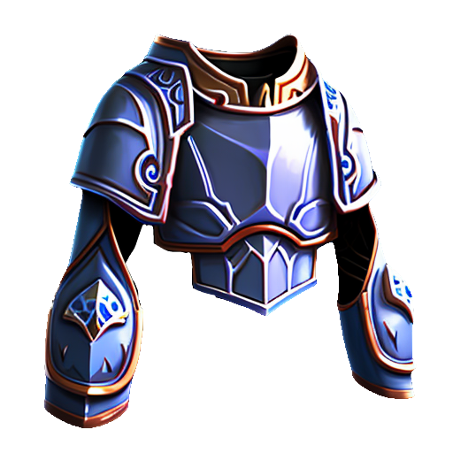|냉정함을 잃지 않으면 강력한 내구도를 가진다는 갑옷이다.|차가운 냉기를 지녔다는 만년한철로 만들어진 갑옷이다. 이 갑옷의 냉기는 사용자의 침착함에 따라 강조가 변한다고 한다.|착용 시 방어력이 40 증가한다.|
|142|홀리 아머|갑옷|L||강력한 힘이 담긴 갑옷이다.|이 갑옷에서 새어나오는 신성력이 나를 좀먹는다. 하지만 나는 버텨낼 것이다…!!|착용 시 방어력이 34 증가하며, 크리티컬 확률이 8% 증가한다.|
|143|데스티니 로브|갑옷|M||운명에 가까운 자들에게 허락이 된다는 로브다.|내 운명도 얼마 남지 않았다. 그래서 그런지 로브는 나를 거절하지 않았다.|착용 시 방어력이 55 증가한다.|
|144|축복의 반지|장신구|L||축복의 힘이 담겨져 있는 반지다.|이 반지에도 신성력이 있는데…. 내 예상과 다르게 이 반지에 깃든 신성력은 나를 괴롭게 만들지 않는다. 오히려 내게 힘을 주고 있어…?|착용 시 공격 성공이 30% 보정된다.|
|145|크리스털 이어링|장신구|L||자줏빛 크리스털로 만든 이어링이다.|이 보석에는 아무래도 생물을 흉포하게 만드는 성질이 있는 것 같다. 하지만 어째서 나에게는 아무런 효과도 없는 거지?|착용 시 공격 성공이 28% 보정되며, 공격력이 15 증가한다.|
|146|데몬 넥클레스|장신구|M||악마들이 착용한다는 목걸이다.|내가 착용한다고 해도 별 문제는 없을 거다. 다만…. 이게 정말 악마의 물건인지는 의심이 된다.|착용 시 공격 성공이 36% 보정된다.|
|147|크루세이더 코인|부적|L||크루세이더들만이 사용한다는 동전이다.|그들의 의지가 옳다고 믿기에, 이 동전은 나를 선택했다.|착용 시 크리티컬 데미지가 200% 증가한다.|
|148|용사의 화살|부적|L||용사들이 사용했었던 화살이다.|그들의 물건을 이놈들이 가지고 있다는 것 자체가 참으로 불쾌하다…. 저에게 힘을 주십시오, 스승님들.|착용 시 크리티컬 확률이 30% 증가한다.|
|149|파이널 코인|부적|G||멸망한 어떤 한 문명의 남겨진 마지막 유물이다.|멸망한 문명 속 마지막 남은 유물이라… 나 역시 이 싸움 속에서 살아 남아 이 전쟁을 끝낼 수 있을까?|착용 시 크리티컬 데미지가 200% 증가하며, 크리티컬 확률이 20% 증가하며, 공격력이 5 증가하며, 방어력이 5 증가한다.|
|150|엔드 미트|소비|L||건강이 더 좋아진다는 고기다.|이것이 내 마지막 만찬이 될 수도 있다는 생각이 나를 불안하게 만든다. 하지만 겁을 내면 안 된다.|사용 시 영구적으로 체력이 50 증가한다.|
|151|어스 포션|소비|L||땅의 힘이 담겨진 물약이다.|땅의 여신의 힘이 담긴 포션이라고 했던 것 같은데…|사용 시 영구적으로 방어력이 4 증가한다.|
|152|로드 포션|소비|G||일부 나라의 왕들이 마신다는 물약이다.|나는 왕이 될 생각이 없다. 그저 이 물약에 담긴 효능을 위해서 이것을 마시는 거다…!|사용 시 영구적으로 공격력이 4 증가하며, 크리티컬 데미지가 70% 증가한다.|

### a-2.몬스터
|연번|오브젝트 이름|등장 챕터|등급|오브젝트 이미지|체력|공격력|반격 확률|치명타 반격 확률|
|:----:|:----:|:----:|:----:|:----:|:----:|:----:|:----:|:----:|
|1|슬라임|챕터 1|일반||30|6|20|13|
|2|거대 들쥐|챕터 1|일반||40|8|25|13|
|3|들판 거미|챕터 1|일반||36|7|25|18|
|4|그린 슬라임|챕터 1|일반||54|10|35|13|
|5|블루 울프|챕터 1, 스테이지 24|일반||35|7|43|0|
|6|블랙 슬라임|챕터 2|일반||72|13|35|13|
|7|숲 전갈|챕터 2|일반||45|22|30|14|
|8|그린 울프|챕터 2|일반||63|11|50|14|
|9|포이즌 스파이더|챕터 2|일반||75|15|35|19|
|10|티스 웜|챕터 2|일반||95|10|40|14|
|11|킹즈 아이|챕터 2, 스테이지 49|보스||250|20|45|19|
|12|그로겔|챕터 3|일반||95|20|40|15|
|13|흉포한 쥐|챕터 3|일반||145|24|35|15|
|14|블루 스콜피온|챕터 3|일반||160|31|30|20|
|15|포이즌 웜|챕터 3|일반||200|25|40|25|
|16|블랙 울프|챕터 3|일반||145|20|50|15|
|17|버섯인간 스포아|챕터 3, 스테이지 74|보스||400|24|50|25|
|18|레드 스파이더|챕터 4|일반||150|28|35|15|
|19|서늘한 원혼|챕터 4|일반||125|32|32|20|
|20|포이즌 그로겔|챕터 4|일반||160|35|36|18|
|21|세 머리의 울프|챕터 4|일반||110|25|55|15|
|22|본웜|챕터 4|일반||180|27|30|25|
|23|라바 슬라임|챕터 4|일반||165|40|40|18|
|24|유령|챕터 4|일반|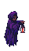|100|45|45|25|
|25|고블린 바드|챕터 4, 스테이지 99|보스||675|38|60|25|
|26|프로즌 랫|챕터 5|일반||230|40|45|30|
|27|라스 웜|챕터 5|일반||320|30|45|25|
|28|파이어 케로베로스|챕터 5|일반||200|35|60|20|
|29|불안정한 원혼|챕터 5|일반||160|60|45|20|
|30|디스커스팅 본웜|챕터 5|일반||290|55|55|28|
|31|스켈레톤|챕터 5|일반|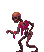|255|45|50|25|
|32|원한의 유령|챕터 5|일반||185|45|50|30|
|33|해골전사 켈트|챕터 5, 스테이지 124|보스||1000|50|65|35|
|34|크리스털 스파이더|챕터 6|일반||300|68|50|35|
|35|리더 울프|챕터 6|일반||350|50|75|30|
|36|사무친 원혼|챕터 6|일반||200|75|55|30|
|37|매드 본웜|챕터 6|일반||500|45|45|26|
|38|다크니스 그로겔|챕터 6|일반||300|55|60|30|
|39|크리스털 스콜피온|챕터 6|일반||300|40|60|40|
|40|마스터 케로베로스|챕터 6|일반||450|55|65|35|
|41|부정한 악마|챕터 6|일반||400|45|70|26|
|42|마왕|스테이지 150|보스||2500|77|70|45|

## b. 파라미터(속성) 뽑아 보기

오브젝트 태그 : Enemy

|속성|영문명칭|설명|
|:----:|:----:|:----:|
|체력|Hitpoint|해당 개체의 체력|
|공격력|Damage|해당 개체의 공격력|
|타격 확률|Attack_Pro|해당 개체의 타격 확률|
|크리티컬 카운터 확률|Death_Pro|해당 개체의 죽음의 일격 확률|
|크리티컬 데미지|Critical_Damage|해당 개체의 치명타 발생 시 결정될 데미지의 배수|
|크리티컬 확률|Critical_Pro|해당 개체의 치명타 발생 확률|

## c. 행동 뽑아 보기

1) 오브젝트 태그 : Player

|행동|영문명칭|설명|
|:----:|:----:|:----:|
|공격|Attack|적 개체를 공격한다.|
|방어|Defence|적 개체의 공격을 맞는다. 대신, 데미지가 절반 들어가며 죽음의 일격이 발생하지 않는다.|
|아이템 사용|ItemUse|조건에 맞는 아이템을 사용한다.|
|장비 변경|EquipmentChange|장비 아이템을 변경하거나 착용 및 해제한다.|
|전진|Go|해당 스테이지의 이벤트를 모두 끝냈을 경우 다음 스테이지로 넘어간다.|
|사망|Death|체력이 0이 되어 사망했을 경우, 게임에서 패배한다.|
|포기|Retire|체력이 0으로 만든다.|

2) 오브젝트 태그 : Enemy

|행동|영문명칭|설명|
|:----:|:----:|:----:|
|반격|Counter|플레이어가 공격을 실패했을 경우, 플레이어를 공격한다.|
|치명타 반격|Death_Attack|반격을 했을 경우, 해당 개체가 크리티컬 카운터( 치명타 반격 ) 확률을 가지고 있고 그 확률에 걸렸다면 플레이어를 두 배의 데미지로 공격한다.|
|사망|Death|체력이 0이 되어 사망했을 경우, 해당 개체의 보상을 플레이어에게 준다.|

3) 오브젝트 태그 : Box

|행동|영문명칭|설명|
|:----:|:----:|:----:|
|보상|Gift|보상 상자일 경우, 플레이어에게 아이템을 준다.|
|미믹|Mimic|미믹 상자일 경우, 몬스터로 변하고 전투 상태로 돌입한다.|

## d. 상태 뽑아 보기

1) 오브젝트 태그 : Player

|현 상태|전이 상태|전이 조건|
|:----:|:----:|:----:|
|Process( 진행 상태 )|Process( 진행 상태 )|아무 행동도 취하지 않은 상태|
|Process( 진행 상태 )|사망 상태|체력이 0이 된 경우|
|Process( 진행 상태 )|공격 상태|적을 공격했을 경우|

2) 오브젝트 태그 : Enemy
   
|현 상태|전이 상태|전이 조건|
|:----:|:----:|:----:|
|Process( 진행 상태 )|Process( 진행 상태 )|아무 행동도 취하지 않은 상태|
|Process( 진행 상태 )|사망 상태|체력이 0이 된 경우|
|Process( 진행 상태 )|반격 상태|플레이어의 공격이 실패하여 플레이어에게 반격했을 경우|
|반격 상태|크리티컬 카운터 상태|반격 시, 크리티컬 카운터 확률에 걸렸을 경우|

## e. 플레이어 캐릭터 속성(파라미터)

|속성|영문명칭|설명|
|:----:|:----:|:----:|
|체력|Hitpoint|플레이어의 체력|
|공격력|Damage|플레이어의 공격력|
|방어력|Defence|플레이어의 방어력|
|반격 확률 감소|Count_Decrese|적의 공격 확률을 줄어주는 변수|
|크리티컬 데미지|Critical_Damage|플레이어의 크리티컬 발생 시 결정될 데미지의 배수|
|크리티컬 확률|Critical_Pro|플레이어의 크리티컬 발생 확률|

## f. 게임의 규칙
### 1) 핵심 규칙

승리 조건 :
- 최종 스테이지에 도달했을 경우

패배 조건 :
 - 체력이 0이 되었을 경우

### 2) 보조 규칙

 아이템은 소비, 무기, 갑옷, 장신구, 부적, 배낭 아이템으로 구분되며, 중첩되지 않는다.
 무기, 갑옷, 장신구, 부적 같은 장비 아이템은 각각 한 개씩 장착이 가능하다.

 - 소비 : 인벤토리에서 조건을 만족하면 사용할 수 있는 아이템. 사용된 아이템은 즉시 제거된다.
 - 무기 : 장비 아이템 중 대체로 공격력을 높혀주는 아이템
 - 갑옷 : 장비 아이템 중 대체로 방어력을 높혀주는 아이템
 - 장신구 : 장비 아이템 중 대체로 반격 확률 감소를 높혀주는 아이템
 - 부적 : 장비 아이템 중 대체로 치명타 관련 스테이터스를 높혀주는 아이템

## g. 게임에서 사용될 공식
### 1) 적과의 전투에 사용되는 공식
 - 플레이어가 적에게 타격에 줄 확률을 구하는 공식 : 100% - ( 적 타격 확률 ) + ( 플레이어 반격 확률 감소 )
 - 적이 플레이어의 공격에 반격할 확률을 구하는 공식 : ( 적 타격 확률 ) - ( 플레이어 반격 확률 감소 )
 - 적이 플레이어의 공격에 반격해 크리티컬을 발생할 확률를 구하는 공식 : ( 최종 반격 확률 * 몬스터 크리티컬 확률 ) / 100 -> 몬스터 크리티컬 확률만큼 반격 확률 감소
 - 플레이어가 받는 피해를 구하는 공식 : ( ( 적 최종 데미지 ) - ( 플레이어의 방어력 ) )
 - 적이 받는 피해를 구하는 공식 : ( 플레이어 최종 데미지 )
 - 치명타 발생 계산 법 : ( 만약 1~100의 난수가 해당 개체의 크리티컬 확률 이하일 경우, 크리티컬을 발생 )
 - 치명타 데미지 계산 법 : ( ( 데미지 ) * ( 크리티컬 데미지 ) ) / 100
 - 몬스터의 치명타 데미지 계산 법 : ( ( 적 최종 데미지 ) - ( 플레이어의 방어력 ) ) * 2

# [ 요구사항 ]

### 플레이어 관련
- 플레이어의 체력의 기본값은 100이다.
- 플레이어의 공격력의 기본값은 10이다.
- 플레이어의 방어력의 기본값은 0이다.
- 플레이어의 반격 보정 확률의 기본값은 0%다.
- 플레이어의 치명타 데미지의 기본값은 200%다.
- 플레이어의 체력의 기본값은 100이다.
- 게임 시작 전에 특성을 플레이어가 선택하게 한다.
- 특성은 총 여섯 가지다.
- 괴력 특성을 선택할 경우, 초반 공격력이 5 증가한다.
- 불괴 특성을 선택할 경우, 초반 방어력이 3 증가한다.
- 일격 특성을 선택할 경우, 반격 보정 확률이 5% 증가한다.
- 살격 특성을 선택할 경우, 치명타 데미지가 100% 증가한다.
- 분석 특성을 선택할 경우, 치명타 확률이 10% 증가한다.
- 끈기 특성을 선택할 경우, 체력이 50 더 증가한다.
- 특성을 선택하면 로딩 씬으로 넘어간다.
- 로딩 씬으로 넘어갔을 경우, 로딩 씬으로 들어가서 5초 동안 데이터를 로드하고 게임 씬으로 넘어간다.
- 특성을 선택할 때, 특성들은 모두 세로 직사각형의 카드의 형태로 나타난다.
- 각 특성은 스토리 상 전사, 기사, 궁수, 총사, 암살자, 마법사의 힘을 계승한다고 설명에 쓰여져 있다.
- 각 특성에는 스토리와 연관된 설명이 덧붙여져 있다.
- 선택한 특성은 스테이터스 칸 바로 위에 있는 붉은 돌에 특성 이름이 특성 아이콘 옆에 뜬 채로 표시된다.
- 진행하기 버튼을 누르면, 다음 스테이지로 넘어간다.
- 포기하기 버튼을 누르면, 체력이 0이 되어 자동으로 패배한다.

### 인벤토리 관련
- 인벤토리 슬롯의 기본값은 12칸이며, 최대 네 개까지 추가될 수 있다.
- 새로운 아이템을 얻을 경우, 빈 칸이 있는 한 모두 인벤토리에 추가된다.
- 만약에 인벤토리가 꽉 차고 빈 공간이 있는 가방이 있을 경우, 아이템이 추가되면 그 가방에 자동적으로 추가된다.

### 아이템 관련 공통
- 아이템을 장비할 시 그 아이템에 따라서 추가적인 스테이터스가 적용된다.
- 아이템 정보의 설명이 현재 정보의 창보다 클 경우, 스크롤을 통해서 모든 설명을 완전하게 볼 수 있다.
- 아이템에 마우스를 올리면 해당 아이템의 설명을 인벤토리 창 아래에서 볼 수 있다.
- 아이템의 설명 창에은 아이템의 아이콘, 이름, 태그( 종류 ), 설명이 뜬다.
- 아이템은 모두 중첩이 불가능하다.
- 아이템을 인벤토리 바깥으로 놓으면 버려진다. ( 삭제된다. )
- 아이템의 정보를 csv에서 받아서 변수로 저장하게 한다.
- 아이템의 정보 확인, 변경은 아이템 정보가 모두 로드가 되었을 때 가능하게 한다.
- 여태까지 스크립트로 적용했던 아이템 클래스에 추가적으로 아이템의 효과, 설명을 추가한다.
- 단, 아이템의 이미지 같은 경우에는 현재와 똑같이 유니티에서 지정해서 사용한다.
- 아이템 사용 시, 해당 아이템의 ID를 받아서 데이터베이스로 받은 아이템의 효과를 적용하게 한다.

### 장착 아이템 관련
- 아이템을 누르면 해당 아이템이 알맞은 장비 칸으로 옮겨지면서 장착된다.
- 장착된 아이템을 누르고 해제 버튼을 누르면, 그 아이템은 인벤토리로 옮겨지면서 해제된다.

### 소비 아이템 관련
- 조건에 맞는 아이템을 누르면 아이템이 사용된다.

### 가방 아이템 관련
- 아이템을 누르면, 그 가방의 인벤토리 창이 뜬다.
- 해당 아이템과 해당 아이템의 인벤토리 창에는 해당 아이템의 Bag + 번호가 적혀져 있다.
- 다른 아이템을 해당 아이템의 인벤토리 창 슬롯 혹은 해당 아이템에 드래그 드랍하면 그 배낭 아이템에 넣어진다.
- 배낭은 다른 배낭 아이템 안에 넣을 수 없다.

### 스테이터스 관련
- 아이템 정보 아래 창에는 플레이어의 스테이터스 정보가 뜬다.
- 스테이터스 정보에는 공격력, 방어력, 반격 확률 감소, 치명타 데미지, 치명타 확률이 뜬다.

### 몬스터 관련
- 슬라임은 100% 확률로 나오며, 체력은 30, 데미지는 6, 반격 확률은 20%, 치명타 반격은 13%다.
- 슬라임에게서는 사과(85%), 코인(50%), 젬(45%), 코팅 부츠(3%)가 나온다.
- 거대 들쥐는 80% 확률로 나오며, 체력은 40, 데미지는 8, 반격 확률은 25%, 치명타 반격은 13%다.
- 거대 들쥐에게서는 사과(85%), 목걸이(50%), 반지(55%), 들쥐 부적(3%)이 나온다.
- 들판 거미는 60% 확률로 나오며, 체력은 36, 데미지는 7, 반격 확률은 25%, 치명타 반격은 18%다.
- 들판 거미에게서는 사과(85%), 가죽 갑옷(50%), 검(45%), 거미의 독니(3%)가 나온다.
- 그린 슬라임은 45% 확률로 나오며, 체력은 54, 데미지는 10, 반격 확률은 35%, 치명타 반격은 13%다.
- 그린 슬라임에게서는 사과(85%), 주괴(50%), 소형 포션(45%), 그린 슬라임 포션(3%)이 나온다.
- 블루 울프는 25% 확률로 나오며, 체력은 35, 데미지는 7, 반격 확률은 43%, 치명타 반격은 0%다.
- 블루 울프에게서는 사과(85%), 가죽 갑옷(50%), 고기(35%), 블루 울프의 갈기(3%)가 나온다.
- 블랙 슬라임은 100% 확률로 나오며, 체력은 72, 데미지는 12, 반격 확률은 35%, 치명타 반격은 13%다.
- 블랙 슬라임에게서는 소형 포션(75%), 도끼(45%), 청옥석(50%), 아이언 링(40%), 푸른 마법책(30%), 슬라임의 보은(3%)가 나온다.
- 숲 전갈은 80% 확률로 나오며, 체력은 45, 데미지는 22, 반격 확률은 30%, 치명타 반격은 14%다.
- 숲 전갈에게서는 소형 포션(75%), 트레저 부츠(45%), 은 주괴(50%), 은 갑옷(40%), 포에나(10%), 전갈 반지(3%)가 나온다.
- 그린 울프는 65% 확률로 나오며, 체력은 63, 데미지는 11, 반격 확률은 50%, 치명타 반격은 14%다.
- 그린 울프에게서는 소형 포션(75%), 열쇠(45%), 대검(40%), 고기(40%), 신선한 고기(35%), 그린 울프 갈기 망토(3%)가 나온다.
- 포이즌 스파이더는 50% 확률로 나오며, 체력은 75, 데미지는 15, 반격 확률은 35%, 치명타 반격은 19%다.
- 포이즌 스파이더에게서는 소형 포션(75%), 철 갑옷(45%), 벨트(50%), 실프 헬멧(40%), 레이피어(30%), 포이즌 글라디우스(3%)가 나온다.
- 티스 웜은 40% 확률로 나오며, 체력은 95, 데미지는 10, 반격 확률은 40%, 치명타 반격은 14%다.
- 티스 웜에게서는 소형 포션(75%), 가방(35%), 트레저 팬츠(45%), 신선한 고기(40%), 기력의 간(30%), 스팀팩(3%)가 나온다.
- 킹즈 아이는 5% 확률로 나오며, 체력은 250, 데미지는 20, 반격 확률은 45%, 치명타 반격은 19%다.
- 킹즈 아이에게서는 소형 포션(75%), 은 주괴(40%), 실프 헬멧(40%), 은 갑옷(40%), 기력의 간(40%), 포에나(25%), 블러드 아이언(15%)가 나온다.
- 그로겔은 100% 확률로 나오며, 체력은 95, 데미지는 20, 반격 확률은 40%, 치명타 반격은 15%다.
- 그로겔에게서는 고기(65%), 신선한 고기(30%), 보은의 뼈(40%), 기력버섯(25%), 최상급 고기(35%), 마골(25%), 활(30%), 그로겔 이어링(3%)가 나온다.
- 흉포한 쥐는 75% 확률로 나오며, 체력은 145, 데미지는 24, 반격 확률은 35%, 치명타 반격은 15%다.
- 흉포한 쥐에게서는 고기(65%), 신선한 고기(30%), 인내의 물약(20%), 피의 목걸이(40%), 엘프 넥클레스(35%), 드워프 벨트(30%), 누군가의 쪽지(30%), 흉포한 도끼(3%)가 나온다.
- 블루 스콜피온은 65% 확률로 나오며, 체력은 160, 데미지는 31, 반격 확률은 30%, 치명타 반격은 20%다.
- 블루 스콜피온에게서는 고기(65%), 신선한 고기(30%), 집중의 물약(20%), 하프 엘릭서(25%), 바바리안 스워드(35%), 사우전드 우드 브레이서(30%), 전투 방패(30%), 정제된 블루 스콜피온의 독(3%)가 나온다.
- 포이즌 웜는 55% 확률로 나오며, 체력은 200, 데미지는 25, 반격 확률은 40%, 치명타 반격은 25%다.
- 포이즌 웜에게서는 고기(65%), 신선한 고기(30%), 괴력육(45%), 붉은 보석(40%), 라이트 해머(15%), 블루 트레저 팬츠(30%), 고대서(20%), 독 빼낸 고기(3%)가 나온다.
- 블랙 울프은 45% 확률로 나오며, 체력은 145, 데미지는 20, 반격 확률은 50%, 치명타 반격은 15%다.
- 블랙 울프에게서는 고기(65%), 신선한 고기(30%), 힘의 물약(45%), 강철 갑옷(35%), 아메시스 헬멧(35%), 원한의 해골(40%), 철갑 갑피(30%), 둠 아머(3%)가 나온다.
- 버섯인간 스포아는 5% 확률로 나오며, 체력은 400, 데미지는 24, 반격 확률은 50%, 치명타 반격은 25%다.
- 버섯인간 스포아게서는 고기(65%), 신선한 고기(30%), 인내의 물약(30%), 월도(40%), 금괴(45%), 라이트 해머(65%), 스포아의 이어링(15%)가 나온다.
- 레드 스파이더는 100% 확률로 나오며, 체력은 150, 데미지는 28, 반격 확률은 35%, 치명타 반격은 15%다.
- 레드 스파이더에게서는 신선한 고기(55%), 괴력의 갈비(40%), 은 검(30%), 마법 모자(30%), 기력버섯(25%), 레드 에너지 팬츠(3%)가 나온다.
- 서늘한 원혼은 80% 확률로 나오며, 체력은 125, 데미지는 32, 반격 확률은 32%, 치명타 반격은 20%다.
- 서늘한 원혼에게서는 신선한 고기(55%), 괴력의 갈비(40%), 크로니클 아머(30%), 크로니클 아머(25%), 커트리스 보텀(25%), 원혼이 담긴 반지(3%)가 나온다.
- 포이즌 그로겔은 70% 확률로 나오며, 체력은 160, 데미지는 35, 반격 확률은 36%, 치명타 반격은 18%다.
- 포이즌 그로겔에게서는 신선한 고기(55%), 도마뱀 고기(40%), 에메랄드 링(30%), 에메랄드 링(25%), 붉은 마법책(20%), 포이즌 블레이드(3%)가 나온다.
- 세 머리의 울프는 60% 확률로 나오며, 체력은 110, 데미지는 25, 반격 확률은 55%, 치명타 반격은 15%다.
- 세 머리의 울프에게서는 신선한 고기(55%), 도마뱀 고기(40%), 영웅의 동전(30%), 영웅의 동전(25%), 비옥석(30%), 예리한 울프 스워드(3%)가 나온다.
- 본웜은 55% 확률로 나오며, 체력은 180, 데미지는 27, 반격 확률은 30%, 치명타 반격은 25%다.
- 본웜에게서는 신선한 고기(55%), 모어 헬스 포션(40%), 투지의 보석 아니모(10%), 신성한 도끼(35%), 폐허의 씨앗(20%), 골검(3%)이 나온다.
- 라바 슬라임은 50% 확률로 나오며, 체력은 165, 데미지는 40, 반격 확률은 40%, 치명타 반격은 18%다.
- 라바 슬라임에게서는 신선한 고기(55%), 모어 헬스 포션(40%), 성골(30%), 최상급 고기(35%), 기력버섯(25%), 라바 부츠(3%)이 나온다.
- 유령은 45% 확률로 나오며, 체력은 100, 데미지는 45, 반격 확률은 45%, 치명타 반격은 25%다.
- 유령에게서는 신선한 고기(55%), 버닝 포션(15%), 기력버섯(30%), 세월의 갑옷(30%), 홀리 헬멧(25%), 낡은 코인(3%)이 나온다.
- 고블린 바드는 5% 확률로 나오며, 체력은 675, 데미지는 38, 반격 확률은 60%, 치명타 반격은 25%다.
- 고블린 바드에게서는 신선한 고기(55%), 버닝 포션(30%), 폐허의 씨앗(40%), 붉은 마법책(45%), 풀아머드 헬멧(35%), 투지의 보석 아니모(35%), 바드의 갑옷(15%)이 나온다.
- 프로즌 랫은 100% 확률로 나오며, 체력은 230, 데미지는 40, 반격 확률은 45%, 치명타 반격은 30%다.
- 프로즌 랫에게서는 기력의 간(45%), 라이트닝 포션(15%), 마법 모자(30%), 용갑의 조각(20%), 다크 아머(30%), 프로즌 랫 에너지 아머(3%)가 나온다.
- 라스 웜은 80% 확률로 나오며, 체력은 320, 데미지는 30, 반격 확률은 45%, 치명타 반격은 25%다.
- 라스 웜에게서는 기력의 간(45%), 라이트닝 포션(15%), 마법 모자(30%), 세계수 활(30%), 노블 부츠(30%), 라스 웜의 가죽 장갑(3%)가 나온다.
- 파이어 케로베로스은 70% 확률로 나오며, 체력은 200, 데미지는 35, 반격 확률은 60%, 치명타 반격은 20%다.
- 파이어 케로베로스에게서는 기력의 간(55%), 라이트닝 포션(15%), 천선어(20%), 에이션트 소드(30%), 비르투스 넥클레스(30%), 불의 격통(3%)가 나온다.
- 불안정한 원혼는 60% 확률로 나오며, 체력은 160, 데미지는 60, 반격 확률은 45%, 치명타 반격은 20%다.
- 불안정한 원혼에게서는 기력의 간(45%), 축복 포션(15%), 하프 엘릭서(30%), 아다만트(30%), 청결정 귀걸이(30%), 검은 반지(3%)가 나온다.
- 디스커스팅 본웜은 55% 확률로 나오며, 체력은 290, 데미지는 55, 반격 확률은 55%, 치명타 반격은 28%다.
- 디스커스팅 본웜에게서는 기력의 간(45%), 천상육(10%), 스크롤(20%), 베네디캇(20%), 프로테가트(20%), 투명한 엘릭서(3%)이 나온다.
- 스켈레톤은 50% 확률로 나오며, 체력은 255, 데미지는 45, 반격 확률은 50%, 치명타 반격은 25%다.
- 스켈레톤에게서는 기력의 간(45%), 축복 포션(15%), 천선어(20%), 세계수 활(30%), 다크 아머(30%), 스켈레톤 블레이드(3%)이 나온다.
- 원한의 유령은 45% 확률로 나오며, 체력은 185, 데미지는 45, 반격 확률은 50%, 치명타 반격은 30%다.
- 원한의 유령에게서는 기력의 간(45%), 축복 포션(15%), 하프 엘릭서(30%), 세이버(30%), 크레센트 링(20%), 원한 서린 코인(3%)이 나온다.
- 해골전사 켈트는 5% 확률로 나오며, 체력은 1000, 데미지는 50, 반격 확률은 65%, 치명타 반격은 35%다.
- 해골전사 켈트에게서는 기력의 간(45%), 천상육(10%), 스크롤(20%), 베네디캇(40%), 크레센트 링(40%), 용갑의 조각(40%), 켈트의 낡은 검(15%)이 나온다.
- 크리스털 스파이더는 50% 확률로 나오며, 체력은 300, 데미지는 68, 반격 확률은 50%, 치명타 반격은 35%다.
- 크리스털 스파이더에게서는 최상급 고기(45%), 엔드 미트(15%), 설감육(20%), 플라시두스(30%), 축복의 반지(20%), 크리스털 스파이더의 수정(3%)가 나온다.
- 리더 울프는 70% 확률로 나오며, 체력은 350, 데미지는 50, 반격 확률은 75%, 치명타 반격은 30%다.
- 리더 울프에게서는 최상급 고기(45%), 엔드 미트(15%), 스크롤(30%), 라이트 액스(30%), 데스티니 로브(20%), 리더 울프의 고기(3%)가 나온다.
- 사무친 원혼은 80% 확률로 나오며, 체력은 250, 데미지는 75, 반격 확률은 55%, 치명타 반격은 30%다.
- 사무친 원혼에게서는 최상급 고기(45%), 어스 포션(15%), 하프 엘릭서(30%), 축복의 반지(30%), 크루세이더 코인(30%), 남겨진 왕관(3%)가 나온다.
- 매드 본웜은 90% 확률로 나오며, 체력은 600, 데미지는 45, 반격 확률은 45%, 치명타 반격은 26%다.
- 매드 본웜에게서는 최상급 고기(45%), 로드 포션(10%), 설감육(20%), 플라시두스(30%), 데몬 넥클레스(20%), 매드 본웜의 갈비뼈(3%)가 나온다.
- 다크니스 그로겔은 100% 확률로 나오며, 체력은 400, 데미지는 60, 반격 확률은 60%, 치명타 반격은 30%다.
- 다크니스 그로겔에게서는 최상급 고기(45%), 엔드 미트(15%), 스크롤(30%), 데빌 브레이커(30%), 용사의 화살(30%), 어둠을 머금은 칼(3%)가 나온다.
- 크리스털 스콜피온은 60% 확률로 나오며, 체력은 400, 데미지는 40, 반격 확률은 60%, 치명타 반격은 40%다.
- 크리스털 스콜피온에게서는 최상급 고기(45%), 어스 포션(15%), 하프 엘릭서(30%), 홀리 아머(30%), 크리스털 이어링(30%), 크리스털 스콜피온 쌍검(3%)가 나온다.
- 마스터 케로베로스는 20% 확률로 나오며, 체력은 550, 데미지는 70, 반격 확률은 65%, 치명타 반격은 35%다.
- 마스터 케로베로스에게서는 최상급 고기(45%), 로드 포션(10%), 설감육(20%), 스페스의 눈(20%), 파이널 코인(20%), 마스터 케로베로스의 발톱(3%)가 나온다.
- 부정한 악마는 40% 확률로 나오며, 체력은 500, 데미지는 45, 반격 확률은 70%, 치명타 반격은 26%다.
- 부정한 악마에게서는 최상급 고기(45%), 어스 포션(15%), 하프 엘릭서(30%), 라이트 액스(30%), 크루세이더 코인(30%), 부정한 악마의 마법(3%)가 나온다.
- 마왕은 0% 확률로 나오며, 체력은 2500, 데미지는 99, 반격 확률은 80%, 치명타 반격은 50%다.

# [ 프로토타입 개발 요구사항 ]

### 1) 1 ~ 4주 - 인벤토리 시스템 구현

- ~~인벤토리 슬롯의 기본값은 12칸이다. (100%)~~
- ~~새로운 아이템을 얻을 경우, 빈 칸이 있는 한 모두 인벤토리에 추가된다. (100%)~~
- ~~만약에 인벤토리가 꽉 차고 빈 공간이 있는 가방이 있을 경우, 아이템이 추가되면 그 가방에 자동적으로 추가된다. (100%)~~
- ~~아이템에 마우스를 올리면 해당 아이템의 설명을 볼 수 있다. (100%)~~
- ~~아이템의 설명 창에은 아이템의 아이콘, 이름, 태그( 종류 ), 설명이 뜬다. (100%)~~
- ~~아이템은 모두 중첩이 불가능하다. (100%)~~
- ~~아이템을 인벤토리 바깥으로 놓으면 버려진다. ( 삭제된다. ) (100%)~~
- ~~아이템을 누르면 해당 아이템이 알맞은 장비 칸으로 옮겨지면서 장착된다. (100%)~~
- ~~장착된 아이템을 누르면, 그 아이템은 인벤토리로 옮겨지면서 해제된다. (100%)~~
- ~~조건에 맞는 아이템을 누르면 아이템이 사용된다. (100%)~~
- ~~아이템을 누르면, 그 가방의 인벤토리 창이 뜬다. (100%)~~
- ~~해당 아이템과 해당 아이템의 인벤토리 창에는 해당 아이템의 Bag + 번호가 적혀져 있다. (100%)~~
- ~~다른 아이템을 해당 아이템의 인벤토리 창 슬롯 혹은 해당 아이템에 드래그 드랍하면 그 배낭 아이템에 넣어진다. (100%)~~
- ~~배낭은 다른 배낭 아이템 안에 넣을 수 없다. (100%)~~

### 2) 5주 캐릭터 스테이터스 구현 및 인벤토리 수정
- ~~( 변경점 )해당 아이템 정보가 인벤토리 창 아래에 뜨게 변경 (100%)~~
- ~~아이템 정보 아래 창에는 플레이어의 스테이터스 정보가 뜬다. (100%)~~
- ~~모든 인벤토리 창과 가방 인벤토리 창의 이미지를 변경한다. (100%)~~
- ~~이미지는 갈색, 검은색인 이미지를 사용한다. (100%)~~
- ~~스테이터스 정보에는 공격력, 방어력, 반격 확률 감소, 치명타 데미지, 치명타 확률이 뜬다. (100%)~~

### 3) 6주 아이템 사용 방식 변경 및 아이템, 효과 추가
- ~~( 변경점 ) 아이템 정보는 인벤토리 혹은 가방에서 해당 아이템을 누르면 나올 수 있도록 변경한다. (100%)~~
- ~~( 변경점 ) 아이템 정보에서 버튼을 누르면 아이템이 사용될 수 있게 변경한다. (100%)~~
- ~~갑옷 아이템, 부적 아이템을 하나씩 추가한다. (100%)~~
- ~~추가되는 갑옷 아이템은 가죽 갑옷이다. (100%)~~
- ~~추가되는 부적 아이템은 동전이다. (100%)~~
- ~~아이템을 장비할 시 변경되는 스테이터스를 적용하도록 한다. (100%)~~
- ~~아이템 정보의 설명이 현재 정보의 창보다 클 경우, 스크롤을 통해서 모든 설명을 완전하게 볼 수 있도록 한다. (100%)~~

### 4) 7주 아이템 데이터베이스화 하기
- ~~아이템의 정보를 csv에서 받아서 변수로 저장하게 한다. (100%)~~
- ~~아이템의 정보 확인, 변경은 아이템 정보가 모두 로드가 되었을 때 가능하게 한다. (100%)~~
- ~~여태까지 스크립트로 적용했던 아이템 클래스에 추가적으로 아이템의 효과, 설명을 추가한다. (100%)~~
- ~~단, 아이템의 이미지 같은 경우에는 현재와 똑같이 유니티에서 지정해서 사용한다. (100%)~~
- ~~아이템 사용 시, 해당 아이템의 ID를 받아서 데이터베이스로 받은 아이템의 효과를 적용하게 한다. (100%)~~

### 5) 8주 스타트 부분 만들기
- ~~( 변경점 )최대 체력을 100으로 변경한다. (100%)~~
- ~~게임 시작 전에 특성을 플레이어가 선택하게 한다. (100%)~~
- ~~특성은 총 여섯 가지다. (100%)~~
- ~~괴력 특성을 선택할 경우, 초반 공격력이 5 증가한다. (100%)~~
- ~~불괴 특성을 선택할 경우, 초반 방어력이 5 증가한다. (100%)~~
- ~~능숙 특성을 선택할 경우, 반격 보정 확률이 5% 증가한다. (100%)~~
- ~~일격 특성을 선택할 경우, 치명타 데미지가 100% 증가한다. (100%)~~
- ~~분석 특성을 선택할 경우, 치명타 확률이 10% 증가한다. (100%)~~
- ~~끈기 특성을 선택할 경우, 체력이 50 더 증가한다. (100%)~~
- ~~특성을 선택하면 로딩 씬으로 넘어간다. (100%)~~
- ~~로딩 씬으로 넘어갔을 경우, 로딩 씬으로 들어가서 5초 동안 데이터를 로드하고 게임 씬으로 넘어간다.(100%)~~
- ~~특성을 선택할 때, 특성들은 모두 세로 직사각형의 카드의 형태로 나타난다. (100%)~~
- ~~각 특성은 스토리 상 전사, 기사, 궁수, 총사, 암살자, 마법사의 힘을 계승한다고 설명에 쓰여져 있다. (100%)~~
- ~~각 특성에는 스토리와 연관된 설명이 덧붙여져 있다. (100%)~~
- ~~선택한 특성은 스테이터스 칸 바로 위에 있는 붉은 돌에 특성 이름이 특성 아이콘 옆에 뜬 채로 표시된다. (100%)~~

### 6) 9주 전투 베이스 제작
- ~~적의 정보를 csv에서 받아서 변수로 저장하게 한다. (100%)~~
- ~~로딩 때 적의 정보를 불러오게 한다. (100%)~~
- ~~적의 정보에는 적의 이름, 체력, 공격력, 반격 확률, 죽음 확률, 보상 아이템과 그 아이템을 얻을 확률이 들어있다. (100%)~~
- ~~좌측 화면 하단 UI 위에 슬라이더를 두 개 겹친 전투 성공 확률을 화면에 표시한다. (100%)~~
- ~~전투 성공 확률 슬라이더는 성공 : 파랑, 주황 : 반격 확률, 빨강 : 즉사 확률로 나뉘어진다. (100%)~~
- ~~전투 성공 확률 슬라이더는 공격 성공, 반격 확률, 즉사 확률 순서대로 표기된다. (100%)~~
- ~~확률은 슬라이더 위에 표시된다. (100%)~~
- ~~슬라이더와 확률은 전투 시에만 표시된다. (100%)~~
- ~~전투 시에는 전투 슬라이더, 확률 위에 공격하기 버튼이 생긴다. (100%)~~
- ~~전투 시에는 좌측 화면 상단에 적의 체력바와 체력바 위에 수치를 표시한다. (100%)~~
- ~~전투 시에는 적의 체력바 상단 좌측에 이름을 표시한다. (100%)~~
- ~~전투 시에는 적 체력바 상단 우측에 공격력을 표시한다. (100%)~~

### 7) 10주 전투 시스템 완료 및 아이템 시스템 보안하기
- ~~( 변경점 )아이템을 삭제하는 방법이 인벤 밖으로 드래그하기에서 장착 및 사용 버튼 옆에 삭제하기 아이템을 넣어서 삭제하는 방식으로 변경 (100%)~~
- ~~( 버그 )가방 인벤토리가 불러오지 않던 버그 수정 -> 원인 : 아이템의 타입을 읽어서 가방인지 판별하여 딕셔너리에 넣어야 하는데 타입이 아닌 아이템의 ID로 판별했었음 (100%)~~
- ~~전투 시에 공격 버튼을 눌러 몬스터에게 공격을 할 수 있다. (100%)~~
- ~~공격에 성공했을 경우, 몬스터가 뒤로 물러나면서 돌아오는 애니메이션 추가 (100%)~~
- ~~공격에 성공했을 경우, 몬스터가 타격을 입는 이펙트 추가 (100%)~~
- ~~몬스터가 타격을 받았을 경우, 몬스터 이미지가 잠시 붉게 점멸하는 효과 추가 (100%)~~
- ~~몬스터가 반격에 성공했을 경우, 앞으로 다가오다가 돌아오는 애니메이션 추가 (100%)~~
- ~~몬스터가 반격에 성공했을 경우, 플레이어 화면 테두리가 흐린 색으로 붉게 점멸하는 효과 추가 → 플레이어 화면 테두리가 아닌, 좌측 플레이어 화면이 붉게 점멸하는 효과로 변경 (100%)~~
- ~~화면이 붉게 점멸하는 효과는 약 2초간 유지된다. → 너무 느려서 0.5초 → 아직 느려서 0.25초 → 조금 느려서 0.125초 (100%)~~
- ~~몬스터의 반격 성공 테스트 때에는 몬스터의 반격 성공 확률을 90%로 맞출 것 (100%)~~
- ~~몬스터에게 공격 했을 경우, 난수를 돌려 그 수가 타격 성공 확률보다 낮거나 같을 경우, 몬스터에게 타격을 줄 수 있다. (100%)~~
- ~~몬스터에게 타격을 주었을 경우, 난수를 1~100까지 돌려 그 수가 플레이어의 치명타 확률 수치보다 높을 경우, 플레이어의 데미지만큼 몬스터의 체력이 줄어든다. (100%)~~
- ~~몬스터에게 타격을 주었을 경우, 난수를 1~100까지 돌려 그 수가 플레이어의 치명타 확률 수치보다 같거나 낮을 경우, 플레이어의 데미지에 치명타 데미지를 퍼센트로 치환한 수로 곱한 수치만큼 몬스터의 체력이 줄어든다. (100%)~~
- ~~치명타를 테스트할 경우, 플레이어의 치명타 확률을 90으로 올린다. (100%)~~
- ~~몬스터에게 즉사 확률이 있고, 몬스터가 반격에 성공했을 경우, 난수를 1~해당 몬스터의 반격 확률의 수까지 돌려 그 수가 몬스터의 반격 확률 수치보다 높은 경우, 플레이어의 체력이 몬스터의 공격력만큼 감소한다. (100%)~~
- ~~몬스터에게 즉사 확률이 있고, 몬스터가 반격에 성공했을 경우, 난수를 1~해당 몬스터의 반격 확률의 수까지 돌려 그 수가 몬스터의 반격 확률 수치보다 같거나 낮을 경우, 플레이어의 체력을 0으로 만든다. (100%)~~
- ~~몬스터에게 즉사 확률이 없고, 몬스터가 반격에 성공했을 경우, 플레이어의 체력이 몬스터의 공격력만큼 감소한다. (100%)~~
- ~~즉사 반격을 테스트할 경우, 몬스터의 즉사 확률을 80%로 만든다. (100%)~~
- ~~플레이어가 반격 당해 데미지를 입을 경우, 적의 데미지에 자신의 방어력을 뺀 수치만큼의 데미지를 받는다. (100%)~~
- ~~만약 플레이어의 방어력이 적의 데미지보다 높을 경우, 데미지를 받지 않는다. (100%)~~
- ~~플레이어의 방어력이 적용되는 경우는 즉사를 제외한 반격을 당했을 경우다. (100%)~~
- ~~몬스터의 체력이 0 이하가 될 경우, 플레이어는 전투에서 승리한다. (100%)~~
- ~~몬스터의 체력이 0 이하가 될 경우, 몬스터가 서서히 사라지는 애니메이션을 출력한 뒤, 전투에서 승리했다는 판정을 내린다. (100%)~~
- ~~전투에서 승리할 경우, 공격 버튼이 사라진다. (100%)~~
- ~~전투에서 승리할 경우, 몬스터의 보상 리스트에 있는 보상들 마다 난수를 1~100까지 돌려, 해당 아이템을 얻을 수 있는 확률의 수치보다 나온 난수가 같거나 작을 경우 빈 리스트에 해당 아이템을 넣는다. (100%)~~
- ~~전투에서 승리할 경우, 플레이어는 리스트에 저장되어 있는 보상을 인벤토리에 추가할 수 있다. (100%)~~
- ~~만약 리스트에 저장된 보상이 없을 경우, 아무 보상도 받지 않았다는 문구를 대신 띄운다. (100%)~~
- ~~보상 UI에서 해당 아이템을 누르면 그 아이템의 설명이 나온다. 단, 장착과 삭제 버튼은 사라지거나 나타나지 않는다. (100%)~~
- ~~아이템을 얻을 수 있는 UI 창은 완료 버튼을 누르면 사라진다. (100%)~~
- ~~보상 UI를 끄기 전까지는 행동 버튼이 나오지 않는다. (100%)~~
- ~~보상 UI를 끄면 전투 UI도 함께 사라지며, 행동 버튼이 나온다. (100%)~~

### 8) 11~12주 쳅터 데이터 불러오기 ( 11주 - 감기로 인한 제작 일시 중단 )
- ~~한 쳅터 당 8개의 스테이지가 있으며, 8개의 스테이지를 지나면 다음 쳅터로 넘어간다. (100%)~~
- ~~쳅터는 총 5개이다. (100%)~~
- ~~스테이지 데이터는 csv 파일을 불러와 List 형식으로 저장한다. (100%)~~
- ~~데이터에는 한 쳅터의 데이터들이 각각 들어있다. (100%)~~
- ~~로딩은 스테이지 불러오기가 성공하면 끝나게 된다.(100%)~~
- ~~쳅터 클래스 변수에는 해당 쳅터에서 조우하게 될 것이 몬스터인지 아니면 상자인지의 확률이 들어있다. (100%)~~
- ~~쳅터 클래스 변수에는 해당 쳅터에서 나타날 몬스터들, 그 몬스터와 조우할 확률이 어떤지 들어있다. (100%)~~
- ~~쳅터 클래스 변수에는 해당 쳅터의 상자에서 나올 아이템들이 어떤 것이며, 상자에서 나올 아이템의 확률은 어떤지가 들어있다. (100%)~~
- ~~csv파일을 불러올 때 첫 번째 칸의 내용이 Chapter일 경우, 그냥 넘어간다. ( 가장 첫번째는 설명 구간이기 때문에 불러올 데이터가 없다. )(100%)~~
- ~~csv파일을 불러올 때 첫 번째 칸의 내용이 Monster일 경우, 2칸씩 읽는다. 이때, 첫 번째 칸은 해당 몹의 ID, 두 번째 칸은 해당 몹이 나오는 확률이 된다.(100%)~~
- ~~csv파일을 불러올 때 첫 번째 칸의 내용이 Gift일 경우, 2칸씩 읽는다. 이때, 첫 번째 칸은 해당 아이템의 ID, 두 번째 칸은 해당 아이템이 나올 확률이 된다.(100%)~~
- ~~csv파일을 불러올 때 첫 번째 칸의 내용이 Encounter일 경우, 해당 수치를 변수로 저장한다. 이 수치는 플레이어가 스테이지를 지나면 조우할 것이 몬스터일 확률이 된다.(100%)~~
- ~~csv파일을 불러올 때 첫 번째 칸의 내용이 ChaapterEnd일 경우, 현재까지 저장한 데이터를 List에 넣는다. 그 후, 사용한 구조체를 초기화한다. (100%)~~
- ~~좌측 상단 빈 칸에 스테이지 진행도 슬라이더를 넣는다. (100%)~~
- ~~스테이지 진행도의 초기값은 1이며, 슬라이더 위에 현재 진행도를 텍스트로도 출력한다. (100%)~~
- ~~스테이지 진행도 슬라이더는 스테이지를 진행할 때마다 오르게 된다. (100%)~~

### 9) 13주 보물 상자 조우, 스테이지 진행 제작
- ~~보물 상자를 조우할 경우, 전투 화면에서 보물 상자가 나타난다. (100%)~~
- ~~보물 상자를 조우할 경우, 행동하기 버튼이 열기 버튼으로 바뀐다. (100%)~~
- ~~보물 상자를 열 경우, 스테이지 데이터에 저장 되어 있는 현재 쳅터에 맞는 보물 상자 보상이 나온다. (100%)~~
- ~~보물 상자를 열어서 나온 보상들은 각각 난수를 돌려, 그 수가 해당 아이템의 드랍률보다 같거나 낮을 경우에만 나온다. (100%)~~
- ~~나온 아이템들은 보상 UI에서 나오며, 플레이어는 보상 창에서 아이템을 얻을지, 말지를 결정할 수 있다. (100%)~~
- ~~완료하기 버튼을 누르면, 보상 UI가 꺼진다. 그 후, 다음 스테이지로 넘어간다. (100%)~~
- ~~스테이지가 넘어가면, 난수를 돌린다. 나온 난수가 몬스터 조우 확률보다 같거나 낮으면 몬스터와 조우한다. 아닐 경우에는 보물 상자와 조우한다. (100%)~~
- ~~몬스터와 조우할 경우, 난수를 돌린다. 각 몬스터 조우 확률을 스테이지 데이터에서 확률이 낮은 순서대로 비교한다. (100%)~~
- ~~비교해서 값이 같거나 낮을 경우, 플레이어는 그 몬스터와 전투를 실행하게 된다. (100%)~~
- ~~만약 몬스터 조우 확률보다 난수가 높을 경우, 플레이어는 보물 상자를 조우하게 된다. (100%)~~
- ~~전투 중에는 장비 아이템을 장착 / 해제할 수 없다. (100%)~~

### 10) 14주 전투 시스템 마무리, 리셋 버튼, 로드 추가
- ~~플레이어 혹은 적이 타격했을 경우, 전투 UI 텍스트를 전투 화면 좌측 상단에 띄운다. (100%)~~
- ~~적을 타격했을 경우, 크리티컬이 발생했으면 크리티컬이 발생했다고 출력한다. (100%)~~
- ~~적이 플레이어를 즉사시켰을 경우, 즉사시켰다고 출력한다. (100%)~~
- ~~전투 UI 텍스트는 최대 3줄까지 출력되며, 완전히 출력된 이후 서서히 투명해지다가 4초 후에 완전히 사라진다. → 길다. 3초로 변경. (100%)~~
- ~~전투 UI 텍스트가 처음 출력될 때, 한 글자씩 출력이 된다. (100%)~~
- ~~전투가 종료되면 텍스트는 완전히 사라진다. (100%)~~
- ~~전투 UI 텍스트는 리스트로 관리한다. (100%)~~
- ~~플레이어의 체력과 특성을 플레이어 프리팹으로 저장하게 한다. (100%)~~
- ~~특성 선택 씬 이전에 로딩 씬을 추가하여, 플레이어의 데이터( 특성, 체력 )를 불러오게 한다. (100%)~~
- ~~특성 선택 이후 로딩 씬에서는 게임 내 데이터를 불러오게 한다. (100%)~~
- ~~게임 시작 시, 만약 플레이어의 특성이 있을 경우 곧바로 게임 내 데이터를 불러오는 로딩 화면으로 이동한다. (100%)~~
- ~~게임 시작 시, 만약 플레이어의 특성이 없을 경우 특성 선택 화면 씬으로 이동한다. (100%)~~
- ~~플레이어의 체력이 0이 되었을 경우, 게임 오버 UI를 띄운다. (100%)~~
- ~~플레이어의 체력이 0이 되었을 경우, 현재까지 있던 플레이어의 인벤토리 데이터와 특성이 초기화된다. (100%)~~
- ~~플레이어가 진행하기 버튼 오른쪽의 리셋 버튼을 누를 경우, 현재까지 있던 플레이어의 인벤토리 데이터와 특성이 초기화되며, 특성 선택 씬으로 넘어간다. (100%)~~
- ~~현재 진행된 스테이지, 전투 중인 몬스터의 ID, 몬스터의 체력을 각 이벤트가 발생할 때 마다 저장한다. (100%)~~
- ~~게임을 다시 실행할 때, 스테이지, 몬스터의 ID와 전투 중 여부, 몬스터의 체력을 불러와서 게임을 계속 진행되게 만든다. (100%)~~

### 11) 15주 쳅터1 제작 & 소리 추가
- ~~쳅터1에 나올 아이템과 몬스터를 추가한다. (100%)~~
- ~~각 몬스터에게 처치 시 1% 확률로 얻을 수 있는 강력한 아이템을 하나씩 추가한다. (100%)~~
- ~~사과의 회복 능력을 5로 하향한다. (100%)~~
- ~~csv에 ,가 있으면 불러올 때 split로 자를 경우 생기는 버그가 수정되었다. -> csv 파일에는 , 대신 &를 넣었고, 데이터를 불러올 때 split 이후, Replace를 통해 &를 ,로 바꾸었다. (100%)~~
- ~~플레이어가 공격에 성공할 경우, 칼로 베는 소리를 출력한다. (100%)~~
- ~~플레이어가 공격에 실패하여 반격 당할 경우, 주먹에 맞는 소리를 출력한다. (100%)~~
- ~~플레이어가 아이템을 얻거나 가방을 열 경우, 그리고 장비를 벗을 때 주머니를 뒤적이는 소리를 출력한다. (100%)~~
- ~~플레이어가 사망할 경우, 무언가가 깨지는 소리를 출력한다. (100%)~~
- ~~플레이어가 상자를 열 경우, 무언가를 여는 소리를 출력한다. (100%)~~
- ~~플레이어가 아이템을 클릭할 경우, 딱딱한 버튼을 누르는 소리를 출력한다. (100%)~~
- ~~플레이어가 적에게 크리티컬 데미지를 입힐 경우, 둔탁한 철 소리가 출력된다. (100%)~~
- ~~몬스터가 사망하면 연기처럼 사라지는 효과음을 출력한다. (100%)~~
- ~~몬스터에게 피격을 받으면 애니메이션 이후에 데미지가 닳게 변경된다. (100%)~~
- ~~슬라임은 100% 확률로 나오며, 체력은 30, 데미지는 6, 반격 확률은 20%, 즉사 반격은 0%다. (100%)~~
- ~~슬라임에게서는 사과(80%), 코인(55%), 젬(45%), 코팅 부츠(3%)가 나온다. (100%)~~
- ~~거대 들쥐는 80% 확률로 나오며, 체력은 40, 데미지는 8, 반격 확률은 20%, 즉사 반격은 0%다. (100%)~~
- ~~거대 들쥐에게서는 사과(80%), 목걸이(55%), 반지(55%), 들쥐 부적(3%)이 나온다. (100%)~~
- ~~들판 거미는 60% 확률로 나오며, 체력은 35, 데미지는 7, 반격 확률은 25%, 즉사 반격은 5%다. (100%)~~
- ~~들판 거미에게서는 사과(80%), 가죽 갑옷(55%), 검(45%), 거미의 독니(3%)가 나온다. (100%)~~
- ~~그린 슬라임은 40% 확률로 나오며, 체력은 60, 데미지는 10, 반격 확률은 35%, 즉사 반격은 0%다. (100%)~~
- ~~그린 슬라임에게서는 사과(80%), 주괴(55%), 소형 포션(45%), 그린 슬라임 포션(3%)이 나온다. (100%)~~
- ~~블루 울프는 30% 확률로 나오며, 체력은 50, 데미지는 7, 반격 확률은 50%, 즉사 반격은 0%다. (100%)~~
- ~~블루 울프에게서는 사과(80%), 가죽 갑옷(55%), 고기(45%), 블루 울프의 갈기(3%)가 나온다. (100%)~~
- ~~쳅터 1 상자에서는 사과(80%), 주괴(50%), 목걸이(50%), 벨트(50%), 가죽 갑옷(50%), 코인(50%), 소형 포션(35%), 검(35%), 젬(35%), 반지(55%), 고기(20%)가 나온다. (100%)~~
- ~~쳅터 1에서는 들판 배경이 나타난다. (100%)~~

### 12) 16주 쳅터2 제작 & 쳅터 변경 시스템 추가 및 아이템 시스템 개편
- ~~(변경점) 한 쳅터 당 25개의 스테이지가 있다. (100%)~~
- ~~쳅터2에 나오는 몬스터와 아이템을 만든다. (50%) (100%)~~
- ~~장비를 장착할 경우, 그 장비에 적힌 효과를 모두 적용하게 만든다. ( 무기는 원래 공격력만 오르게 되었는데, 다른 스테이터스도 오르도록 수정된다. ) (100%)~~
- ~~소비 아이템을 사용할 때 그 아이템이 스테이터스를 올리는 효과를 가지고 있을 경우, 그 효과를 영구적으로 적용한다. (100%)~~
- ~~체력 회복 아이템을 사용할 때, 체력이 저장되지 않던 버그가 수정되었다. ( 사용 시 체력을 저장하게 변경 ) (100%)~~

### 13) 17주 쳅터2 제작 마무리
- ~~쳅터2에는 블랙 슬라임, 숲 전갈, 그린 울프, 포이즌 스파이더, 티스 웜, 킹즈 아이가 나온다. (100%)~~
- ~~킹즈 아이는 엘리트 격의 몬스터로 다른 몬스터들보다 능력치가 우월하다. (100%)~~
- ~~블랙 슬라임은 100% 확률로 나오며, 체력은 75, 데미지는 12, 반격 확률은 30%, 즉사 반격은 0%다.  → 너무 약해서 능력치 변경 체력 90, 데미지 14, 반격 확률 40%(100%)~~
- ~~블랙 슬라임에게서는 소형 포션(70%), 도끼(50%), 청옥석(50%), 아이언 링(40%), 푸른 마법책(30%), 슬라임의 보은(3%)가 나온다. (100%)~~
- ~~숲 전갈은 80% 확률로 나오며, 체력은 40, 데미지는 20, 반격 확률은 30%, 즉사 반격은 0%다.  → 너무 약해서 능력치 변경 체력 55, 데미지 22, 반격 확률 35%(100%)~~
- ~~숲 전갈에게서는 소형 포션(70%), 트레저 부츠(50%), 은 주괴(50%), 은 갑옷(40%), 포에나(10%), 전갈 반지(3%)가 나온다. (100%)~~
- ~~그린 울프는 65% 확률로 나오며, 체력은 60, 데미지는 10, 반격 확률은 50%, 즉사 반격은 0%다.  → 너무 약해서 능력치 변경 체력 75, 데미지 12, 반격 확률 55%(100%)~~
- ~~그린 울프에게서는 소형 포션(70%), 열쇠(50%), 대검(40%), 고기(45%), 신선한 고기(35%), 그린 울프 갈기 망토(3%)가 나온다. (100%)~~
- ~~포이즌 스파이더는 50% 확률로 나오며, 체력은 80, 데미지는 14, 반격 확률은 35%, 즉사 반격은 5%다.  → 너무 약해서 능력치 변경 체력 95, 데미지 16, 반격 확률 40%(100%)~~
- ~~포이즌 스파이더에게서는 소형 포션(70%), 철 갑옷(50%), 벨트(50%), 실프 헬멧(40%), 레이피어(30%), 포이즌 글라디우스(3%)가 나온다. (100%)~~
- ~~티스 웜은 40% 확률로 나오며, 체력은 100, 데미지는 9, 반격 확률은 40%, 즉사 반격은 0%다.  → 너무 약해서 능력치 변경 체력 120, 데미지 11, 반격 확률 45%(100%)~~
- ~~티스 웜에게서는 소형 포션(70%), 가방(30%), 트레저 팬츠(40%), 신선한 고기(35%), 기력의 간(25%), 스팀팩(3%)가 나온다. (100%)~~
- ~~킹즈 아이는 10% 확률로 나오며, 체력은 200, 데미지는 15, 반격 확률은 50%, 즉사 반격은 5%다. → 너무 약해서 능력치 변경 체력 500, 데미지 20, 반격 확률 55%(100%)~~
- ~~킹즈 아이에게서는 소형 포션(70%), 은 주괴(75%), 실프 헬멧(75%), 은 갑옷(75%), 기력의 간(75%), 포에나(20%), 블러드 아이언(50%)가 나온다. (100%)~~
- ~~(변경점)몬스터들의 능력치를 상향한다. (100%)~~
- ~~(변경점)이후 슬라임의 체력 40, 공격력 8, 반격 확률 25% (100%)~~
- ~~(변경점)이후 거대 들쥐의 체력 50, 공격력 10, 반격 확률 30% (100%)~~
- ~~(변경점)이후 들판 거미의 체력 45, 공격력 9, 반격 확률 30% (100%)~~
- ~~(변경점)이후 그린 슬라임의 체력 70, 공격력 12, 반격 확률 40% (100%)~~
- ~~(변경점)이후 블루 울프의 체력 60, 공격력 9, 반격 확률 55% (100%)~~
- ~~(변경점)보물 상자에서 나오는 사과를 제외한 모든 아이템의 확률을 10% 감소한다. (100%)~~
- ~~쳅터 1의 배경을 들판으로 변경한다. (100%)~~
- ~~쳅터 2로 변경될 때, 배경을 숲으로 변경한다. (100%)~~
- ~~쳅터2에는 철 갑옷, 도끼, 트레저 부츠, 청옥석, 대검, 은 주괴, 신선한 고기, 열쇠, 아이언 링, 실프 헬멧, 은 갑옷, 트레저 팬츠, 기력의 간, 푸른 마법책, 레이피어, 포에나, 슬라임의 보은, 전갈 반지, 그린 울프 갈기 망토, 포이즌 글라디우스, 스팀팩, 블러드 아이언이 아이템으로 나온다. (100%)~~
- ~~쳅터 1의 상자 조우 확률을 60%에서 30%로 낮춘다. (100%)~~
- ~~쳅터 2의 상자 조우 확률은 20%이다. (100%)~~
- ~~모든 몬스터의 사과와 최상급 아이템을 제외한 모든 아이템의 드랍율을 10% 낮춘다. (100%)~~

### 14) 18~20주 아이템 제작 & 쳅터3 몬스터 추가 작업
- ~~아이템이 100가지가 되도록 제작을 한다. (100%)~~
- ~~파일을 정리한다. ( 사용한 이미지는 따로 Icons 폴더에 넣을 것 )~~
- ~~각 추가될 아이템의 이름을 정한다. (100%)~~
- ~~각 추가될 아이템의 아이콘을 정한다. (100%)~~
- ~~각 추가될 아이템의 설명을 추가한다. (100%)~~
- ~~각 추가될 아이템의 효과를 정한다. (100%)~~
- ~~쳅터 2에서 나오는 몬스터에게서 나오는 희귀 아이템을 제외한 장비 아이템의 효율을 모두 50% 높힌다. ( 단, 소수점은 반올림한다. ) (100%)~~
- ~~포에나의 추가 크리티컬 데미지 수치를 75%에서 60%으로 하향한다. (100%)~~
- ~~쳅터 3에 나오는 몬스터들을 제작한다. 쳅터 3에서는 그로겔, 흉포한 쥐, 블루 스콜피온, 포이즌 웜, 블랙 울프, 버섯인간 스포아가 나온다. (100%)~~
- ~~버섯인간 스포아는 엘리트 격의 몬스터로 다른 몬스터들보다 능력치가 우월하다. (100%)~~
- ~~그로겔은 100% 확률로 나오며, 체력은 160, 데미지는 20, 반격 확률은 50%, 즉사 반격은 0%다. (100%)~~
- ~~그로겔에게서는 신선한 고기(60%), 기력의 간(35%), 힘의 물약(40%), 기력버섯(30%), 최상급 고기(30%), 마골(25%), 그로겔 이어링(3%)가 나온다. (100%)~~
- ~~흉포한 쥐는 75% 확률로 나오며, 체력은 180, 데미지는 23, 반격 확률은 45%, 즉사 반격은 0%다. (100%)~~
- ~~흉포한 쥐에게서는 신선한 고기(60%), 기력의 간(35%), 속도의 물약(40%), 기력버섯(30%), 엘프 넥클레스(30%), 드워프 벨트(25%), 흉포한 도끼(3%)가 나온다. (100%)~~
- ~~블루 스콜피온은 65% 확률로 나오며, 체력은 200, 데미지는 30, 반격 확률은 40%, 즉사 반격은 5%다. (100%)~~
- ~~블루 스콜피온에게서는 신선한 고기(60%), 기력의 간(35%), 집중의 물약(40%), 하프 엘릭서(20%), 바바리안 스워드(30%), 사우전드 우드 브레이서(25%), 정제된 블루 스콜피온의 독(3%)가 나온다. (100%)~~
- ~~포이즌 웜는 55% 확률로 나오며, 체력은 250, 데미지는 25, 반격 확률은 50%, 즉사 반격은 10%다. (100%)~~
- ~~포이즌 웜에게서는 신선한 고기(60%), 기력의 간(35%), 괴력육(40%), 하프 엘릭서(20%), 라이트 해머(10%), 블루 트레저 팬츠(25%), 독 빼낸 고기(3%)가 나온다. (100%)~~
- ~~블랙 울프은 45% 확률로 나오며, 체력은 175, 데미지는 20, 반격 확률은 60%, 즉사 반격은 0%다. (100%)~~
- ~~블랙 울프에게서는 신선한 고기(60%), 기력의 간(35%), 힘의 물약(40%), 천선어(10%), 아메시스 헬멧(30%), 금괴(25%), 둠 아머(3%)가 나온다. (100%)~~
- ~~버섯인간 스포아는 10% 확률로 나오며, 체력은 750, 데미지는 40, 반격 확률은 65%, 즉사 반격은 10%다. (100%)~~
- ~~버섯인간 스포아게서는 신선한 고기(60%), 기력의 간(35%), 속도의 물약(40%), 천선어(50%), 금괴(40%), 기력의 간(75%), 라이트 해머(60%), 스포아의 이어링(50%)가 나온다. (100%)~~

### 15) 21주 장비 아이템 내구도&등급 추가 작업
- ~~모든 장비에 내구도를 추가한다. (100%)~~
- ~~모든 아이템에 등급을 추가한다. 등급은 모두 E,D,C,B,A,AH,S,H,X,L,M,G,Z,I가 있다. (100%)~~
- ~~반지의 이름을 깨진 반지로 변경한다. (100%)~~
- ~~E등급 아이템에는 사과, 주괴, 목걸이, 코인, 깨진 반지, 젬이 해당된다. (100%)~~
- ~~D등급 아이템에는 벨트, 가죽 갑옷, 소형 포션, 검이 해당된다. (100%)~~
- ~~C등급 아이템에는 고기, 철 갑옷, 도끼, 트레저 부츠, 청옥석이 해당된다. (100%)~~
- ~~B등급 아이템에는 가방, 대검, 은 주괴, 신선한 고기, 열쇠, 아이언 링이 해당된다. (100%)~~
- ~~A등급 아이템에는 실프 헬멧, 은 갑옷, 트레저 팬츠, 푸른 마법책, 기력의 간, 레이피어, 피의 목걸이, 원한의 해골, 붉은 보석, 보은의 뼈, 힘의 물약, 속도의 물약, 집중의 물약, 괴력육이 해당된다. (100%)~~
- ~~AH등급 아이템에는 거미의 독니, 최상급 고기, 배틀 엑스, 강철 갑옷, 라피스 라줄리 목걸이, 철갑 갑피, 월도, 전투 방패, 활이 해당된다. (100%)~~
- ~~S등급 아이템에는 들쥐 부적, 블루 울프의 갈기, 포에나, 기력버섯, 누군가의 쪽지, 바바리안 스워드, 마골, 엘프 넥클레스, 드워프 벨트, 고대서, 아메시스 헬멧, 블루 트레저 팬츠, 사우전드 우드 브레이서, 금괴가 해당된다. (100%)~~
- ~~H등급 아이템에는 코팅 부츠, 하프 엘렉서가 해당된다. (100%)~~
- ~~X등급 아이템에는 스크롤, 슬라임의 보은, 전갈 반지, 그린 울프 갈기 망토, 포이즌 글라디우스, 스팀팩, 블러드 아이언, 천선어가 해당된다. (100%)~~
- ~~L등급 아이템에는 라이트 해머, 그로겔 이어링, 독 빼낸 고기, 둠 아머가 해당된다. (100%)~~
- ~~M등급 아이템에는 그림 슬라임 포션, 흉포한 도끼, 레드 에너지 팬츠, 원혼이 담긴 반지, 포이즌 블레이드, 예리한 울프 스워드, 골검, 라바 부츠, 낡은 코인, 스포아의 이어링이 해당된다. (100%)~~
- ~~G등급 아이템에는 정제된 블루 스콜피온의 독, 프로즌 랫 에너지 아머, 라스 웜의 가죽 장갑, 불의 격통, 검은 반지, 스켈레톤 블레이드, 원한 서린 코인이 해당된다. (100%)~~
- ~~Z등급 아이템에는 크리스털 스파이더의 수정, 리더 울프의 고기, 남겨진 왕관, 매드 본웜의 갈비뼈, 어둠을 머금은 칼, 크리스털 스콜피온 쌍검, 마스터 케로베로스의 발톱, 부정한 악마의 마법, 바드의 갑옷이 해당된다. (100%)~~
- ~~I등급 아이템에는 투명한 엘릭서, 켈트의 낡은 검이 해당된다. (100%)~~
- ~~E등급의 내구도는 3다. (100%)~~
- ~~D등급의 내구도는 5이다. (100%)~~
- ~~C등급의 내구도는 7이다. (100%)~~
- ~~B등급의 내구도는 9이다. (100%)~~
- ~~A등급의 내구도는 11다. (100%)~~
- ~~AH등급의 내구도는 12다. (100%)~~
- ~~S등급의 내구도는 14이다. (100%)~~
- ~~H등급의 내구도는 16이다. (100%)~~
- ~~X등급의 내구도는 18이다. (100%)~~
- ~~L등급의 내구도는 20다. (100%)~~
- ~~M등급의 내구도는 22다. (100%)~~
- ~~G등급의 내구도는 24이다. (100%)~~
- ~~Z등급의 내구도는 27이다. (100%)~~
- ~~I등급의 내구도는 30이다. (100%)~~
- ~~장비 아이템의 내구도는 전투가 끝나면 1씩 줄어든다. (100%)~~
- ~~전투가 끝난 후, 장착 중인 장비 아이템의 내구도가 0이 될 경우, 해당 아이템은 파괴되며, 파괴되는 소리를 출력한다. (100%)~~
- ~~내구도는 각 아이템 아래에 표기한다. 단, 소비 아이템일 경우에는 내구도를 표기하지 않는다. 내구도 텍스트의 폰트는 18pt다. (100%)~~
- ~~장비 아이템의 정보 칸의 이름 아래에 각 아이템의 초기 내구도값이 몇인지 출력한다. (100%)~~
- ~~가방 아이템의 아래에는 가방 아이템의 이름이 표기되지 않고, 해당 가방 아이템의 현재 사용 중인 슬롯과 수용한 가능한 아이템의 최대 갯수가 표기된다. (100%)~~
- ~~아이템의 속성 칸에 해당 아이템의 등급을 위에 표시하고, 아래에는 해당 아이템의 종류를 표시한다. (100%)~~
- ~~아이템의 속성 칸에 마우스를 누르면 속성 칸 위에 등급 순서를 표시한다. (100%)~~
- ~~아이템의 속성 칸에 마우스를 떼면 표시되었던 등급 순서를 안 보이게 만든다. (100%)~~
- ~~등급의 색은 E부터 G까지 빨간색에서 보라색으로 변하며, Z등급은 하얀색, I 등급은 검은색으로 표기된다. (100%)~~
- ~~( 버그 )아이템의 정보가 출력된 상태에서 빈 장비 창을 누르면 계속해서 정보가 출력되는 버그를 수정한다. (100%)~~
- ~~최상급 아이템 이외의 몬스터에게서 나오는 모든 아이템의 드랍율을 5% 올린다. (100%)~~
- ~~모든 몬스터의 체력과 공격력을 10% 낮추며, 반격 확률도 5% 낮춘다. (100%)~~
 
### 16) 22주 밸런스&버그 작업
- ~~모든 몬스터의 즉사 확률을 치명타 확률으로 바꾼다. 그리고 모든 몬스터의 치명타 확률을 모두 10% 올린다. ( 단, 블루 울프의 치명타는 올리지 않는다. ) (100%)~~
- ~~치명타 확률은 플레이어에게 해당 몬스터의 공격력의 두 배의 수치만큼의 데미지를 준다. 이때, 플레이어에게 방어력이 있고 데미지 계산을 할 경우, 치명타로 올라 간 데미지로 계산한다. (100%)~~
- ~~화면에 표시된 즉사 반격 텍스트를 치명타 반격으로 바꾼다. (100%)~~
- ~~치명타 발생 시 띄어지는 텍스트를 "OO(이)가 죽음의 일격을 날렸습니다!"에서 "OO의 치명적인 일격! OO 데미지를 받았습니다!"로 바꾼다. (100%)~~
- ~~코인의 치명타 발생 확률을 1%에서 2%로 상향시킨다. (100%)~~
- ~~인벤토리 아이템을 선택한 이후, 장착된 아이템을 삭제시키면 선택되었던 아이템도 삭제되던 버그를 수정한다. (100%)~~
- ~~불괴의 방어력 증가량이 5에서 3으로 하향된다. (100%)~~
- ~~( 오류 수정 ) 스테이터스 영구 지속 효과가 죽은 이후에도 계속 적용되던 버그를 수정한다. (100%)~~
- ~~인벤토리가 꽉 차면 가방 아이템을 얻을 경우, 가방 아이템에 들어가는 버그를 수정한다. (100%)~~
- ~~인벤토리가 꽉 찰 때, 가방 아이템에 들어가는 장비 아이템의 내구도가 0이 되는 버그를 수정한다. → 원인 : 내구도를 참조하지 못했었음. 추가적으로 아이템의 ID가 아닌 아이템의 종류 ID를 참조해서 아이템이 이상하게 바뀌는 현상도 있었음. (100%)~~
- ~~가방의 최대 세로 길이를 늘려서 내구도가 짤리는 현상을 수정한다. (100%)~~
- ~~인벤토리, 가방이 모두 찰 경우 아이템을 얻지 못 한다고 팝업창을 띄우며, 아이템이 얻어지지 못 하게 만든다. (100%)~~
- ~~인벤토리가 가득 찼다는 팝업창에는 " 인벤토리에 빈 칸이 없습니다. \n빈 공간을 만들어주십시오. "텍스트를 띄우며, 오른쪽 위에는 닫기 버튼이 있다. 또한, 이 팝업창은 보상 수령 완료 버튼을 가리겠끔 위치한다. (100%)~~
- ~~인벤토리가 가득 찼다는 팝업창은 보상 팝업창의 세로 1/2을 덮을 만큼의 크기를 가지고 있다. (100%)~~

### 17) 23~24주 쳅터4 콘텐츠 작업
- ~~아이템을 21 종류 추가한다. 무기 아이템 5종류, 방어 아이템 4 종류, 장신구 아이템 3 종류, 부적 아이템 3 종류, 사용 아이템 5 종류, 가방 아이템 1종류를 추가로 만든다. (100%)~~
- ~~Health 효과가 있는 아이템을 사용한 경우, 그 아이템의 수치만큼 최대 체력이 증가한다. 단, 현재 체력은 변동되지 않는다. (100%)~~
- ~~쳅터 4부터는 전투 후에 내구도를 2씩 닳게 만든다. (100%)~~
- ~~B등급 이상의 아이템의 내구도를 모두 하향한다. (100%)~~
- ~~B등급의 내구도는 8이다. (100%)~~
- ~~A등급의 내구도는 9다. (100%)~~
- ~~AH등급의 내구도는 10이다. (100%)~~
- ~~S등급의 내구도는 11이다 (100%)~~
- ~~H등급의 내구도는 12다. (100%)~~
- ~~X등급의 내구도는 13이다 (100%)~~
- ~~L등급의 내구도는 14다. (100%)~~
- ~~M등급의 내구도는 15다. (100%)~~
- ~~G등급의 내구도는 16이다. (100%)~~
- ~~Z등급의 내구도는 18이다. (100%)~~
- ~~I등급의 내구도는 20이다. (100%)~~
- ~~쳅터 3에 나오는 몹들에게서 나오는 아이템 중 신선한 고기 대신에 고기 아이템이 나오게 변경한다. (100%)~~
- ~~쳅터 4의 배경은 어두운 숲을 배경으로 한다. (100%)~~
- ~~쳅터 4에 나오는 몬스터들을 제작한다. 쳅터 4에서는 레드 스파이더, 서늘한 원혼, 포이즌 그로겔, 세 머리의 울프, 본웜, 라바 슬라임, 유령, 고블린 바드가 나온다. (100%)~~
- ~~고블린 바드는 엘리트 격의 몬스터로 다른 몬스터들보다 능력치가 우월하다. (100%)~~
- ~~레드 스파이더는 100% 확률로 나오며, 체력은 165, 데미지는 28, 반격 확률은 35%, 치명타 반격은 15%다. (100%)~~
- ~~레드 스파이더에게서는 신선한 고기(55%), 괴력의 갈비(40%), 은 검(30%), 마법 모자(25%), 기력버섯(20%), 레드 에너지 팬츠(3%)가 나온다. (100%)~~
- ~~서늘한 원혼은 80% 확률로 나오며, 체력은 140, 데미지는 32, 반격 확률은 32%, 치명타 반격은 20%다. (100%)~~
- ~~서늘한 원혼에게서는 신선한 고기(55%), 괴력의 갈비(40%), 쌍검 베나리&세미타(30%), 크로니클 아머(25%), 커트리스 보텀(20%), 원혼이 담긴 반지(3%)가 나온다. (100%)~~
- ~~포이즌 그로겔은 70% 확률로 나오며, 체력은 180, 데미지는 35, 반격 확률은 36%, 치명타 반격은 15%다. (100%)~~
- ~~포이즌 그로겔에게서는 신선한 고기(55%), 도마뱀 고기(40%), 크로니클 아머(30%), 에메랄드 링(25%), 붉은 마법책(15%), 포이즌 블레이드(3%)가 나온다. (100%)~~
- ~~세 머리의 울프는 60% 확률로 나오며, 체력은 125, 데미지는 25, 반격 확률은 55%, 치명타 반격은 15%다. (100%)~~
- ~~세 머리의 울프에게서는 신선한 고기(55%), 도마뱀 고기(40%), 비옥석(25%), 영웅의 동전(25%), 풀 아머드 헬멧(10%), 예리한 울프 스워드(3%)가 나온다. (100%)~~
- ~~본웜은 55% 확률로 나오며, 체력은 125, 데미지는 25, 반격 확률은 55%, 치명타 반격은 15%다. (100%)~~
- ~~본웜에게서는 신선한 고기(55%), 모어 헬스 포션(40%), 신성한 도끼(30%), 폐허의 씨앗(15%), 투지의 보석 아니모(10%), 골검(3%)이 나온다. (100%)~~
- ~~라바 슬라임은 50% 확률로 나오며, 체력은 185, 데미지는 40, 반격 확률은 40%, 치명타 반격은 15%다. (100%)~~
- ~~라바 슬라임에게서는 신선한 고기(55%), 모어 헬스 포션(40%), 성골(30%), 최상급 고기(30%), 천선어(15%), 라바 부츠(3%)이 나온다. (100%)~~
- ~~유령은 45% 확률로 나오며, 체력은 110, 데미지는 45, 반격 확률은 45%, 치명타 반격은 25%다. (100%)~~
- ~~유령에게서는 신선한 고기(55%), 버닝 포션(20%), 천선어(30%), 세월의 갑옷(25%), 홀리 헬멧(20%), 낡은 코인(3%)이 나온다. (100%)~~
- ~~고블린 바드는 10% 확률로 나오며, 체력은 750, 데미지는 45, 반격 확률은 60%, 치명타 반격은 30%다. (100%)~~
- ~~고블린 바드에게서는 신선한 고기(55%), 버닝 포션(40%), 폐허의 씨앗(40%), 붉은 마법책(40%), 풀아머드 헬멧(30%), 투지의 보석 아니모(30%), 바드의 갑옷(30%)이 나온다. (100%)~~

### 18) 25주 밸런스 조정
- ~~모든 아이템의 내구도를 낮춘다. (100%)~~
- ~~E등급의 내구도는 2다. (100%)~~
- ~~D등급의 내구도는 3이다. (100%)~~
- ~~C등급의 내구도는 4다. (100%)~~
- ~~B등급의 내구도는 5다. (100%)~~
- ~~A등급의 내구도는 6이다. (100%)~~
- ~~AH등급의 내구도는 7이다. (100%)~~
- ~~S등급의 내구도는 8이다 (100%)~~
- ~~H등급의 내구도는 9다. (100%)~~
- ~~X등급의 내구도는 10이다. (100%)~~
- ~~L등급의 내구도는 11이다. (100%)~~
- ~~M등급의 내구도는 12다. (100%)~~
- ~~G등급의 내구도는 13이다. (100%)~~
- ~~Z등급의 내구도는 14다. (100%)~~
- ~~I등급의 내구도는 15다. (100%)~~
- ~~쳅터1의 모든 몬스터의 치명타 반격 확률을 3%씩 늘린다. (100%)~~
- ~~쳅터2의 모든 몬스터의 치명타 반격 확률을 4%씩 늘린다. (100%)~~
- ~~쳅터3의 모든 몬스터의 치명타 반격 확률을 5%씩 늘린다. (100%)~~
- ~~쳅터4의 모든 몬스터의 치명타 반격 확률을 10%씩 늘린다. (100%)~~
- ~~블루 울프의 반격 확률을 7% 낮춘다. (100%)~~
- ~~모든 몬스터의 체력을 10%씩 낮춘다. (100%)~~
- ~~블루 울프의 체력을 35로 한다. (100%)~~

### 19) 26~27주 테스트 결과 보안할 부분 수정 및 쳅터 5 제작
- ~~테스트로 받은 피드백 및 보안할 부분을 모두 수정한다. (100%)~~
- ~~2 쳅터에서 킹스 아이 보상을 제외한 방법으로 기력의 간 안 나오게끔 수정 (100%)~~
- ~~철 갑옷의 방어력 제공량을 6으로 하향 (100%)~~
- ~~2 쳅터의 몬스터 공격력 10% 증가 (100%)~~
- ~~3 쳅터의 몬스터 공격력 15% 증가 (100%)~~
- ~~아이템을 선택한 채로 가방에 넣으면 아이템 정보가 초기화가 안 되던 버그 수정 (100%)~~
- ~~속도의 물약 드랍율 1/2만큼 하향, 랭크를 S로 변경 (100%)~~
- ~~집중의 물약 드랍율 1/2만큼 하향, 랭크를 AH로 변경 (100%)~~
- ~~스포아의 이어링, 블러드 아이언, 바드의 갑옷 드랍율 70% 만큼 하향 (100%)~~
- ~~3 쳅터의 기력버섯 드랍율 1/4만큼 하향, 천선어 드랍 X (100%)~~
- ~~3 쳅터의 금괴와 마골의 드랍율 1/4만큼 하향 (100%)~~
- ~~3 쳅터에서 나오는 아이템이 겹치는 것이 있을 경우, 그 아이템들 대신에 피의 목걸이, 원한의 해골, 붉은 보석, 보은의 뼈가 나오게 수정 (100%)~~
- ~~3 쳅터에서 30%로 나오는 회복 아이템 기력의 간을 전부 최상급 고기로 바꾼다. (100%)~~
- ~~4 쳅터의 버닝 포션 드랍율 1/4만큼 하향, 반격 보정 2%가 오르도록 수정 (100%)~~
- ~~스포아의 이어링의 반격 확률 효율 1/4 하향(100%)~~
- ~~쳅터 마지막 스테이지에서는 무조건 보스가 출현하도록 수정 (100%)~~
- ~~블루 울프 체력 5 증가 (100%)~~
- ~~3 쳅터부터 내구도가 2 닳게 수정 (100%)~~
- ~~아이템을 16 종류 추가한다. 무기 아이템 4 종류, 방어 아이템 3 종류, 장신구 아이템 3 종류, 부적 아이템 3 종류, 사용 아이템 3 종류를 추가로 만든다. (100%)~~
- ~~4 챕터에서 천선어가 나오지 않도록 수정한다. (100%)~~
- ~~모든 보스의 출현 확률을 5%로 바꾼다. (100%)~~
- ~~모든 보스의 최상급 아이템 드랍 확률을 15%로 바꾼다. (100%)~~
- ~~쳅터 5의 배경은 야영지를 배경으로 한다. (100%)~~
- ~~쳅터 5에 나오는 몬스터들을 제작한다. 쳅터 5에서는 프로즌 랫, 라스 웜, 파이어 케로베로스, 불안정한 원혼, 디스커스팅 본웜, 스켈레톤, 원한의 유령, 해골전사 켈트가 나온다. (100%)~~
- ~~해골전사 켈트는 엘리트 격의 몬스터로 다른 몬스터들보다 능력치가 우월하다. (100%)~~
- ~~프로즌 랫은 100% 확률로 나오며, 체력은 230, 데미지는 40, 반격 확률은 45%, 치명타 반격은 30%다. (100%)~~
- ~~프로즌 랫에게서는 기력의 간(45%), 라이트닝 포션(15%), 마법 모자(25%), 용갑의 조각(15%), 다크 아머(25%), 프로즌 랫 에너지 아머(3%)가 나온다. (100%)~~
- ~~라스 웜은 80% 확률로 나오며, 체력은 320, 데미지는 30, 반격 확률은 45%, 치명타 반격은 25%다. (100%)~~
- ~~라스 웜에게서는 기력의 간(45%), 라이트닝 포션(15%), 마법 모자(25%), 세계수 활(25%), 노블 부츠(25%), 라스 웜의 가죽 장갑(3%)가 나온다. (100%)~~
- ~~파이어 케로베로스은 70% 확률로 나오며, 체력은 200, 데미지는 35, 반격 확률은 60%, 치명타 반격은 20%다. (100%)~~
- ~~파이어 케로베로스에게서는 기력의 간(55%), 라이트닝 포션(15%), 천선어(15%), 에이션트 소드(25%), 비르투스 넥클레스(25%), 불의 격통(3%)가 나온다. (100%)~~
- ~~불안정한 원혼는 60% 확률로 나오며, 체력은 160, 데미지는 60, 반격 확률은 45%, 치명타 반격은 20%다. (100%)~~
- ~~불안정한 원혼에게서는 기력의 간(45%), 축복 포션(15%), 하프 엘릭서(25%), 아다만트(25%), 청결정 귀걸이(25%), 검은 반지(3%)가 나온다. (100%)~~
- ~~디스커스팅 본웜은 45% 확률로 나오며, 체력은 290, 데미지는 55, 반격 확률은 55%, 치명타 반격은 28%다. (100%)~~
- ~~디스커스팅 본웜에게서는 기력의 간(45%), 천상육(10%), 스크롤(15%), 베네디캇(15%), 프로테가트(15%), 투명한 엘릭서(3%)이 나온다. (100%)~~
- ~~스켈레톤은 55% 확률로 나오며, 체력은 255, 데미지는 45, 반격 확률은 50%, 치명타 반격은 25%다. (100%)~~
- ~~스켈레톤에게서는 기력의 간(45%), 축복 포션(15%), 천선어(15%), 세계수 활(25%), 다크 아머(25%), 스켈레톤 블레이드(3%)이 나온다. (100%)~~
- ~~원한의 유령은 50% 확률로 나오며, 체력은 185, 데미지는 45, 반격 확률은 50%, 치명타 반격은 30%다. (100%)~~
- ~~원한의 유령에게서는 기력의 간(45%), 축복 포션(15%), 하프 엘릭서(25%), 세이버(25%), 크레센트 링(15%), 원한 서린 코인(3%)이 나온다. (100%)~~
- ~~해골전사 켈트는 5% 확률로 나오며, 체력은 1000, 데미지는 50, 반격 확률은 65%, 치명타 반격은 35%다. (100%)~~
- ~~해골전사 켈트에게서는 기력의 간(45%), 천상육(10%), 스크롤(15%), 베네디캇(35%), 크레센트 링(35%), 용갑의 조각(35%), 켈트의 낡은 검(15%)이 나온다. (100%)~~

### 20) 28~29주 테스트 결과 보안할 부분 수정 및 쳅터 6 제작
- ~~아이템 삭제되면 정보 리셋되게 수정 (100%)~~
- ~~5,6 챕터 드랍율 5% 증가 (100%)~~
- ~~아이템을 15 종류 추가한다. 무기 아이템 3 종류, 방어 아이템 3 종류, 장신구 아이템 3 종류, 부적 아이템 3 종류, 사용 아이템 3 종류를 추가로 만든다. (100%)~~
- ~~쳅터 6에 나오는 몬스터들을 제작한다. 쳅터 6에서는 크리스털 스파이더, 리더 울프, 사무친 원혼, 매드 본웜, 다크니스 그로겔, 크리스털 스콜피온, 마스터 케로베로스, 부정한 악마, 마왕이 나온다. (100%)~~
- ~~마왕은 150 스테이지에서 무조건 등장하며, 149 이하의 스테이지에서는 나오지 않는다. (100%)~~
- ~~크리스털 스파이더는 50% 확률로 나오며, 체력은 300, 데미지는 68, 반격 확률은 50%, 치명타 반격은 35%다. (100%)~~
- ~~크리스털 스파이더에게서는 최상급 고기(45%), 엔드 미트(15%), 설감육(20%), 플라시두스(30%), 축복의 반지(20%), 크리스털 스파이더의 수정(3%)가 나온다. (100%)~~
- ~~리더 울프는 70% 확률로 나오며, 체력은 350, 데미지는 50, 반격 확률은 75%, 치명타 반격은 30%다. (100%)~~
- ~~리더 울프에게서는 최상급 고기(45%), 엔드 미트(15%), 스크롤(30%), 라이트 액스(30%), 데스티니 로브(20%), 리더 울프의 고기(3%)가 나온다. (100%)~~
- ~~사무친 원혼은 80% 확률로 나오며, 체력은 250, 데미지는 75, 반격 확률은 55%, 치명타 반격은 30%다. (100%)~~
- ~~사무친 원혼에게서는 최상급 고기(45%), 어스 포션(15%), 하프 엘릭서(30%), 축복의 반지(30%), 크루세이더 코인(30%), 남겨진 왕관(3%)가 나온다. (100%)~~
- ~~매드 본웜은 90% 확률로 나오며, 체력은 600, 데미지는 45, 반격 확률은 45%, 치명타 반격은 26%다. (100%)~~
- ~~매드 본웜에게서는 최상급 고기(45%), 로드 포션(10%), 설감육(20%), 플라시두스(30%), 데몬 넥클레스(20%), 매드 본웜의 갈비뼈(3%)가 나온다. (100%)~~
- ~~다크니스 그로겔은 100% 확률로 나오며, 체력은 400, 데미지는 60, 반격 확률은 60%, 치명타 반격은 30%다. (100%)~~
- ~~다크니스 그로겔에게서는 최상급 고기(45%), 엔드 미트(15%), 스크롤(30%), 데빌 브레이커(30%), 용사의 화살(30%), 어둠을 머금은 칼(3%)가 나온다. (100%)~~
- ~~크리스털 스콜피온은 60% 확률로 나오며, 체력은 400, 데미지는 40, 반격 확률은 60%, 치명타 반격은 40%다. (100%)~~
- ~~크리스털 스콜피온에게서는 최상급 고기(45%), 어스 포션(15%), 하프 엘릭서(30%), 홀리 아머(30%), 크리스털 이어링(30%), 크리스털 스콜피온 쌍검(3%)가 나온다. (100%)~~
- ~~마스터 케로베로스는 20% 확률로 나오며, 체력은 550, 데미지는 70, 반격 확률은 65%, 치명타 반격은 35%다. (100%)~~
- ~~마스터 케로베로스에게서는 최상급 고기(45%), 로드 포션(10%), 설감육(20%), 스페스의 눈(20%), 파이널 코인(20%), 마스터 케로베로스의 발톱(3%)가 나온다. (100%)~~
- ~~부정한 악마는 40% 확률로 나오며, 체력은 500, 데미지는 45, 반격 확률은 70%, 치명타 반격은 26%다. (100%)~~
- ~~부정한 악마에게서는 최상급 고기(45%), 어스 포션(15%), 하프 엘릭서(30%), 라이트 액스(30%), 크루세이더 코인(30%), 부정한 악마의 마법(3%)가 나온다. (100%)~~
- ~~마왕은 0% 확률로 나오며, 체력은 2500, 데미지는 99, 반격 확률은 80%, 치명타 반격은 50%다. (100%)~~

### 21) 30~31주 휴식

### 22) 32주 게임 시작 화면, 게임 종료 버튼, 게임 엔딩 화면 제작
- ~~게임 시작 시 화면 중앙에 위 순서대로 게임 이름, 게임 시작 버튼, 게임 조작 방법 버튼, 게임 끝내기 버튼을 추가한다. (100%)~~
- ~~인게임에서의 포기하기 버튼을 옵션 버튼으로 바꾼다. (100%)~~
- ~~옵션 버튼을 누르면 게임 종료 버튼과 게임 포기 버튼이 위, 아래로 있다. (100%)~~
- ~~첫 화면을 제외한 씬에서 게임 종료 버튼을 누를 경우, 정말로 게임을 종료시킬 거냐고 묻는다. 이때, 텍스트 아래에 종료하기, 취소 버튼이 각각 왼쪽과 오른쪽에 놓여 있다.(100%)~~
- ~~게임 종료 버튼을 누르면 게임이 종료된다. (100%)~~
- ~~게임 조작 방법 버튼을 누르면, 게임 조작 방법을 UI로 띄운다. (100%)~~
- ~~게임 시작 버튼을 누르면, 게임 시작 로딩 화면으로 넘어간다. (100%)~~
- ~~마왕을 무찌르면 보상을 출력하지 않고 곧바로 게임 엔딩 화면으로 넘어간다.(100%)~~
- ~~게임 엔딩 화면에서 돌아가기 버튼을 누르면 게임 시작 화면으로 넘어간다.(100%)~~
- ~~(피드백)인게임에서 플레이어 스테이터스 표시 창의 치명타, 치명타 확률 텍스트를 모두 크리티컬, 크리티컬 확률로 바꾼다. (100%)~~

- # [ 프로토타입 개발작업 결과 ]

### [1~4주차 구현과정]

<video width="100%" height="100%" controls="controls">
  <source src="./video/week1-4.mp4" type="video/mp4" />
</video>

인벤토리 시스템을 완성하였다.
이후 만들어질 콘텐츠에 나올 인벤토리 추가로 최대치가 된 인벤토리 슬롯 개수만큼 슬롯이 만들어진다.
아이템은 드래그 드랍으로 위치를 바꿀 수 있으며, 아이템은 탈부착이 가능하다.
해당 영상에는 사과 아이템 하나가 중첩되어 있는데, 이것은 해당 아이템이 원래 중첩이 가능했던 때 만들어져서 나온 버그로,
현재는 사과 아이템의 중첩 변수를 false로 해놓았기 때문에, 새로 만들어지는 사과는 모두 중첩이 불가능한 상태로 만들어진다.

### [5주차 구현과정]

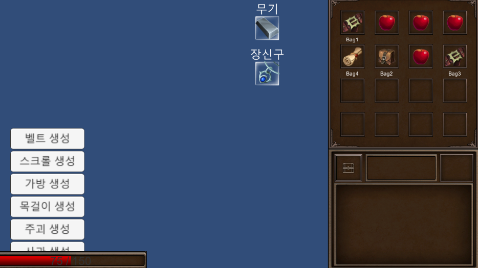

이제 아이템의 설명이 인벤토리 아래에 출력이 된다.

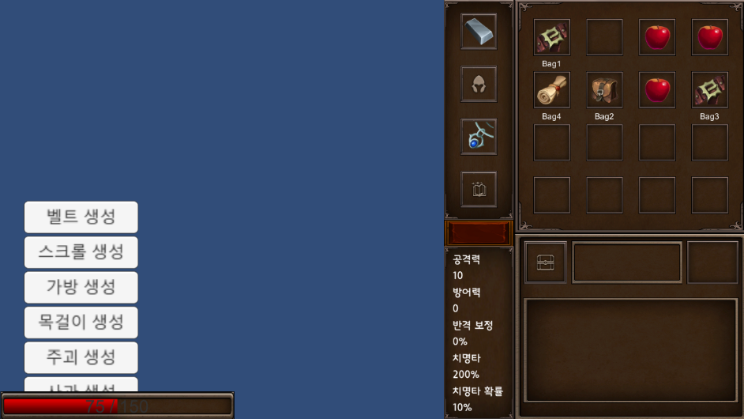

인벤토리 창 왼쪽에 보이던 장비 아이템 슬롯 디자인도 변경되었으며, 아래에는 플레이어의 스테이터스가 출력된다.

### [6주차 구현과정]

<video width="100%" height="100%" controls="controls">
  <source src="./video/week6.mp4" type="video/mp4" />
</video>

방어구 아이템, 부적 아이템이 추가가 되었다.
또한, 설명이 만약에 칸을 넘어서게 된다면 자동으로 그만큼 Content 크기를 늘리는 Content Size Fitter와 Vertical Layout Group으로 늘려주게 만들었다.
아직까지는 스크립트에서 해당 아이템에 반응해서 효과를 추가하는 시스템을 사용하지만, 다음 주부터 진행하는 아이템 데이터베이스화를 통해 해당 아이템의 효과를 불러와 적용하는 스크립트를 사용할 예정이다.

### [7주차 구현과정]

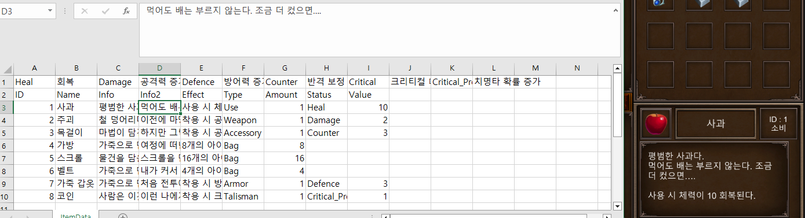

이제 csv로 저장한 데이터베이스를 게임에서 불러와 사용할 수 있다.
데이터베이스를 모두 부른 이후에 시스템이 동작할 수 있도록, 데이터베이스를 모두 불러오면 Loading이라는 bool 변수를 true로 바꾸게 했다.
그리고 인벤토리 시스템에는 Loading이 true일 경우 동작하도록 만들었다.

### [8주차 구현과정]

<video width="100%" height="100%" controls="controls">
  <source src="./video/week8.mp4" type="video/mp4" />
</video>

초기 화면에서 특성을 선택하고, 로딩이 끝난 이후에 게임 화면이 뜨게 변경되었다.
선택한 특성은 스테이터스 창 위에 있는 돌 위에 출력된다.

이것을 제작하는 과정에서 씬이 삭제되는 참사가 벌어졌는데, 다행히 백업 파일이 있었기에 복구가 가능했다.

### [9주차 구현과정]

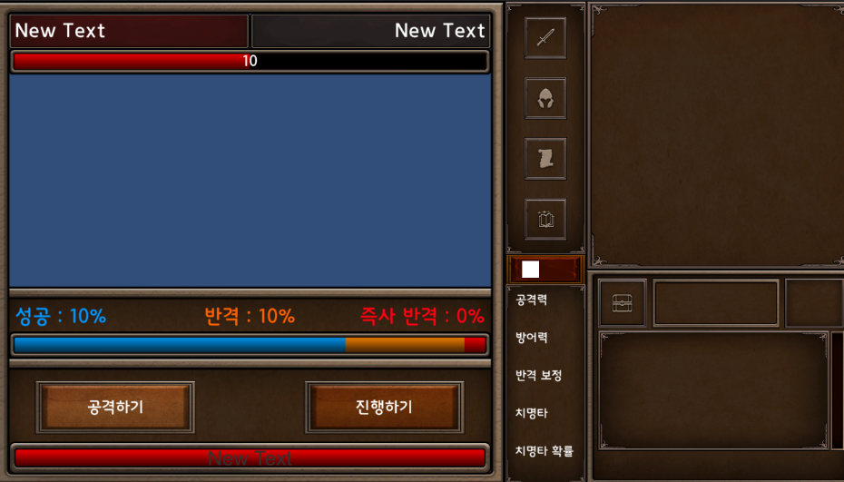

몬스터와 조우했을 경우 나오는 화면을 제작하는 과정이다.
이 당시에는 좌측 상단에 현재 스테이지 진행도를 표시하는 것을 잊었지만, 그럼에도 불구하고 이전보다 공간이 많이 쓰인 것이 보인다.

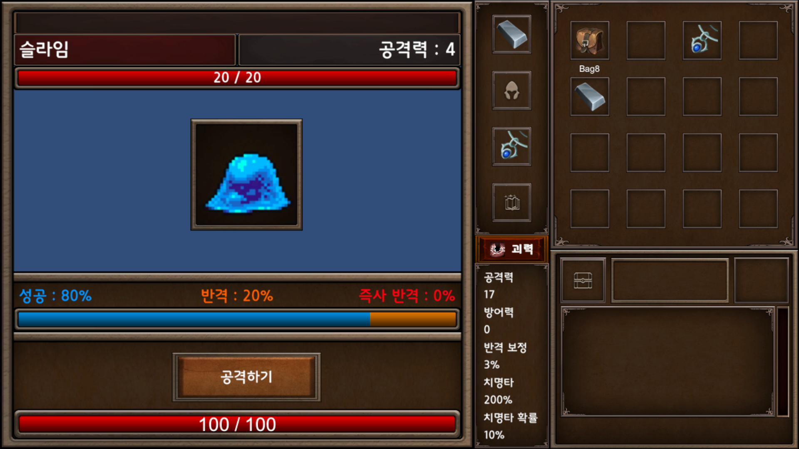

몬스터와 조우 했을 경우 나오는 화면이 완성되었다.
몬스터의 뒤에 있는 빈 공간은 스테이지를 지나면서 배경이 바뀔 예정이며, 첫 몬스터는 바로 슬라임이다.
다음 주부터 만들어질 전투 시스템 개발 과정을 통해, 가운데 그림에 있는 슬라임이 반격을 하면 앞으로 나오다가 다시 원상태로 돌아가는 모습을 확인할 수 있으며, 슬라임이 타격을 입으면 뒤로 물러났다가 원상태로 돌아온다.
이건 모든 몬스터 공통 사항이다.
참고로 위 사진과 다르게 공격하기 버튼이 가운데에 있고 진행하기 버튼이 사라진 것을 볼 수 있는데, 전투 시에는 공격하기 밖에 선택권이 없기 때문이다.

### [10주차 구현과정]

<video width="100%" height="100%" controls="controls">
  <source src="./video/week10-1.mp4" type="video/mp4" />
</video>

전투에 승리해서 보상을 얻는 영상이다.
영상에서 공격하기 버튼을 누르면 확률에 따라서 공격할지 혹은 반격을 당할지 결정이 된다.
슬라임을 처치하자 보상이 나왔고, 플레이어는 보상을 가질 지 말지 선택을 할 수 있다.

<video width="100%" height="100%" controls="controls">
  <source src="./video/week10-2.mp4" type="video/mp4" />
</video>

만약 보상을 받지 않으면 이렇게 되며, 완료를 누르면 전투 UI와 함께 보상 UI가 꺼진다.

### [11~12주차 구현과정]

감기 때문에 한 주를 쉬었지만, 어쨌든 스테이지의 데이터를 불러오는 데 성공했다.
아이템, 몬스터 데이터 처럼 엑셀 csv 파일을 불러와서 저장하며, 게임 내에서 스테이지에 대한 정보가 필요하면 그 데이터가 저장되어 있는 구조체 List를 이용한다.
또한, 스테이지 진행도가 좌측 상단에 표시되었다.
다음 주에 만들 보물 상자 조우만 만들면, 게임의 기초는 다 만든 것이나 다름없다.

### [13주차 구현과정]

<video width="100%" height="100%" controls="controls">
  <source src="./video/week13-1.mp4" type="video/mp4" />
</video>

이제 전투 중에는 장비를 장착 / 해제할 수 없다. 이는 실제로 전투 중에 장비를 교체할 수 없다는 고증에서 모티브를 가져왔다.

<video width="100%" height="100%" controls="controls">
  <source src="./video/week13-2.mp4" type="video/mp4" />
</video>

보물 상자를 열면, 아이템들이 확률적으로 나온다. 일단 기본적인 사과는 100% 주기 때문에, 사과만 넣고 테스트를 한 것이다.

<video width="100%" height="100%" controls="controls">
  <source src="./video/week13-3.mp4" type="video/mp4" />
</video>

이제 스테이지를 진행하게 만들었다. 스테이지에서 행동을 다 취하면, 진행하기 버튼으로 다음 스테이지로 넘어갈 수 있다.
다음 주에 몬스터 전투 때 발생하는 알림 UI와 목숨이 0이 되면, 게임 오버가 되는 것만 하면 쳅터 1에 나오는 모든 요소를 제작할 예정이다.

### [14주차 구현과정]

<video width="100%" height="100%" controls="controls">
  <source src="./video/week14-1.mp4" type="video/mp4" />
</video>

이제 전투 시에 몬스터나 플레이어가 타격을 받으면 그에 대한 텍스트가 출력된다.

<video width="100%" height="100%" controls="controls">
  <source src="./video/week14-2.mp4" type="video/mp4" />
</video>

### [15주차 구현과정]

<video width="100%" height="100%" controls="controls">
  <source src="./video/week15.mp4" type="video/mp4" />
</video>

쳅터1의 몬스터들과 등장 아이템의 종류가 많아졌다.
그리고 이제 해당 상황에 맞춰서 소리가 출력된다.

### [16주차 구현과정]

아이템은 모두 완성하였다.
또한, 아이템이 이제 정해진 스테이터스말고도 다른 스테이터스도 올리게 수정되었으며, 영구적으로 스테이터스를 올려주는 아이템을 추가했다.

### [17주차 구현과정]

<video width="100%" height="100%" controls="controls">
  <source src="./video/week17-1.mp4" type="video/mp4" />
</video>

쳅터2의 배경이 쳅터1의 배경으로 쓰여졌기 때문에, 쳅터1의 배경을 들판으로 변경했다.

<video width="100%" height="100%" controls="controls">
  <source src="./video/week17-2.mp4" type="video/mp4" />
</video>

쳅터2에 나오는 아이템과 적들의 제작이 완료되었다.
하지만 쳅터2의 아이템과 적들이 많아짐으로서, 난이도 또한 올라갔다.
다음 주, 쳅터3의 제작이 끝나면 밸런스를 조정할 예정이다.

### [18~20주차 구현과정]

<video width="100%" height="100%" controls="controls">
  <source src="./video/week20.mp4" type="video/mp4" />
</video>

드디어 쳅터3의 작업이 끝났다.
아이템이 총 100가지가 되었으며, 쳅터3의 몬스터들은 더욱 강력한 몬스터로 만들었다.
이 다음에는 인벤토리 시스템을 적극적으로 활용하게 모든 장비에 내구도를 추가할 예정이다.

### [21주차 구현과정]

<video width="100%" height="100%" controls="controls">
  <source src="./video/week21.mp4" type="video/mp4" />
</video>

내구도 작업이 완료되었다.
전투가 끝나면 착용 중인 장비 아이템의 내구도가 줄어든다.
또한, 아이템에 등급이 추가되었다.
등급은 아이템의 등급이 나와 있는 UI를 누르면 어떤 등급들이 있는지 나온다.

<video width="100%" height="100%" controls="controls">
  <source src="./video/week21-2.mp4" type="video/mp4" />
</video>

내구도가 0이 되면 장비가 파괴되며, 파괴되는 소리가 출력된다.

### [22주차 구현과정]

<video width="100%" height="100%" controls="controls">
  <source src="./video/week22.mp4" type="video/mp4" />
</video>

피드백으로 받은 즉사 패턴이 삭제되었고, 대신에 데미지가 두 배인 치명타 확률을 추가했다.
이것으로 갑자기 죽는 경우는 전투에서 계속 맞아서 체력이 0이 되었을 때 뿐이다.
또한, 여러 가지 버그와 함께 아이템이 모두 차 있는 상태면 얻을 수 없게 만들었다.

다음에는 4쳅터를 만들 것이며, 5쳅터에서는 데미지가 세 배인 패턴도 고려할 예정이다.

### [23~24주차 구현과정]

<video width="100%" height="100%" controls="controls">
  <source src="./video/week23.mp4" type="video/mp4" />
</video>

쳅터 4의 제작이 완료되었다.
하지만 테스트를 하면서 조절해야 할 부분들이 있다는 것을 발견하였고, 다음 주에는 밸런스를 조절할 예정이다.

### [25~27주차 구현과정]

<video width="100%" height="100%" controls="controls">
  <source src="./video/week26.mp4" type="video/mp4" />
</video>

쳅터 5의 제작과 동시에 밸런스 조정 및 피드백 반영이 완료되었다.
이전보다 난이도가 상당히 올랐으며, 내구도의 중요도가 가장 많이 언급되었다.
다음에는 챕터 6의 제작을 진행할 예정이며, 이후에는 밸런스 패치를 진행할 예정이다.

### [28~29주차 구현과정]

<video width="100%" height="100%" controls="controls">
  <source src="./video/week28.mp4" type="video/mp4" />
</video>

드디어 모든 챕터를 완성했다.
다음 주에는 깃허브 내용을 재정리할 예정이며, 다다음 주부터는 게임 시작 화면, 종료 화면을 만들 예정이다.

### [32주차 구현과정]

<video width="100%" height="100%" controls="controls">
  <source src="./video/week32.mp4" type="video/mp4" />
</video>

게임 시작 화면과 게임 종료 버튼이 추가되었다.
마지막으로 BGM를 추가해서 프로토타입 버전 마무리 작업에 들어갈 예정이다.

# [ 알파1 개발 요구사항 ]

### 1) 1주 음악 추가, 피드백 반영
- ~~음악을 추가한다. (100%)~~
- ~~첫 화면과 특성을 선택하는 화면, 엔딩 화면에서는 평화로운 음악을 출력한다. (100%)~~
- ~~챕터가 지날수록( 50 스테이지 마다 ) 더 긴박감 있는 음악을 출력한다. (100%)~~
- ~~게임에서 패배할 시, 음악이 꺼진다. (100%)~~
- ~~마지막 스테이지인 마왕과 싸울 때에는 가장 긴박감 있는 음악을 출력한다. (100%)~~
- ~~(피드백)장비를 장착할 때, 드래그&드롭으로도 장착할 수 있도록 변경한다. (100%)~~
- ~~(버그)몬스터와 전투에서 승리하여 몬스터가 사라지는 연출 때 게임을 재시작하면 몬스터의 체력이 0인 상태에서 다시 싸워야하는 버그 수정 (100%)~~
- ~~(버그)플레이 방법 안내문에 이전과 다음 버튼이 동시에 출력이 되는 곳에서 둘 중에 하나만 출력이 되는 버그 수정 (100%)~~
- ~~(버그)보상 받을 때 드래그 드롭으로 장비를 착용할 수 없던 버그 수정 (100%)~~

### 2) 2주 음량 조절 시스템, 로딩 중 팁 추가 및 밸런스 조절
- ~~한 챕터 당 라운드를 25에서 20으로 바꾼다. 이때, 마왕은 120라운드에서 등장하도록 수정한다. (100%)~~
- ~~음량을 조절할 수 있는 시스템을 만든다. 음량은 스크롤 바로 조정할 수 있도록 수정한다. (100%)~~
- ~~음량을 수정하는 스크롤 바는 홈 화면에서 How To Play 버튼 아래에서 오디오 버튼을 추가해서, 그 버튼을 누르면 나오는 팝업창에 띄우게 한다. (100%)~~
- ~~또한, 음량을 수정하는 스크롤 바는 게임 도중에 옵션에 오디오 버튼을 포기하기와 종료하기 버튼 중간에 둬서, 그 버튼을 누르면 나오게 만든다. (100%)~~
- ~~조절한 음량은 float값으로 PlayerPrefs으로 저장하며, 다른 씬으로 넘어가거나 게임을 시작할 때 값을 불러와서 이전에 플레이어가 저장한 음량을 불러오게 한다. (100%)~~
- ~~로딩 중에는 아이템의 종류와 그 종류의 아이템이 어떤 효과를 지녔는지에 대한 설명과 스테이터스에 대한 설명이 나오도록 수정한다. (100%)~~
- ~~로딩 중에 시간이 얼마나 남았는지 슬라이더로 표시한다. (100%)~~
- ~~가방 아이템들의 공간을 모두 하향한다. ( 벨트 : 3개, 가방 : 4개, 마법 모자 : 6개, 스크롤 8개 ) (100%)~~
- ~~모든 ' 공격 성공 보정 '이라는 텍스트를 ' 반격 보정 증가 '로 변경한다. (100%)~~
- ~~인게임에서 스테이지 표기의 양옆에 각각 챕터와 내구도 감소량을 표기한다. (100%)~~

### 3) 3주 사전 시스템 제작
- ~~홈 화면에 사전 버튼을 추가한다. 사전 버튼은 게임 시작 버튼 옆에 100x100 크기로 둔다. (100%)~~
- ~~사전 버튼을 누르면 사전 팝업창이 다른 팝업창들처럼 게임 이름과 버튼을 모두 가릴 크기로 나온다. (960x640) (100%)~~
- ~~사전 팝업창에는 아이템 아이콘과 이름이 표시된 칸들이 128x128의 크기로 나온다. 또한, 서로의 여백은 64x64이며, 최대 가로 5개, 세로 3개까지의 칸이 나온다. (100%)~~
- ~~사전 팝업창의 상단에는 1~11이 적힌 작은 칸이 48x48 크기로 좌측에 놓여져 있으며, 선택된 상태면 색이 살짝 어두워지게 변한다. (100%)~~
- ~~사전에 아이템 아이콘이 표시되는 칸 아래에는 해당 아이템의 ID와 그 아이템의 이름이 표시된다. ( 텍스트의 크기는 자동으로 조정 ) (100%)~~
- ~~사전은 한 장에 최대 15개의 아이템이 표시가 되며, 각각 1~11장으로 구분해놓는다. ( 예시 : 1장은 1~15의 ID 아이템이, 2장은 31~45의 ID 아이템이 표시된다. ) (100%)~~
- ~~json 파일로 플레이어가 아이템을 얻으면 그 아이템의 ID에 해당하는 ID 변수를 true로 바꾼다. ( 초기값은 false ) (100%)~~
- ~~플레이어의 json 파일에서 해당 아이템의 ID와 같은 ID의 bool 변수가 false로 되어 있으면, 사전에 표시되는 아이템의 아이콘이 검은색으로 출력되며, 이름, 아이템 종류, 등급 또한 ???로 표시된다. (100%)~~
- ~~플레이어의 json 파일에서 해당 아이템의 ID와 같은 ID의 bool 변수가 false로 되어 있으면, 사전에 표시되는 설명은 모두 ???로 출력되며, 출저가 모두 출력되지 않는다. (100%)~~
- ~~플레이어의 json 파일에서 해당 아이템의 ID와 같은 ID의 bool 변수가 true로 되어 있으면, 사전에 표시되는 아이템의 아이콘이 정상적으로 출력되며, 이름 또한 정상적으로 표시된다. (100%)~~
- ~~사전에 있는 아이템 칸을 클릭하면 아이템 설명 팝업창을 출력한다. 해당 아이템 설명 팝업창은 다른 팝업창과 동일한 크기를 가진다. (100%)~~
- ~~아이템 설명 팝업창의 우측 상단에는 팝업창을 끄는 버튼이 놓여져 있다. 그리고 그 중앙에는 아이템의 ID가 적혀져 있으며, 그 양옆에는 이전과 다음 아이템으로 넘어갈 수 있는 버튼이 놓여져 있다. (100%)~~
- ~~아이템 설명 팝업창의 좌측에는 위에서부터 아래로 아이템의 이미지, 아이템의 이름, 아이템의 등급, 그리고 아이템의 태그가 표시된다. (100%)~~
- ~~아이템 설명 팝업창의 중앙에는 해당 아이템의 설명, 스토리 설명, 효과가 위에서부터 차례로 출력된다. (100%)~~
- ~~아이템 설명 팝업창의 우측에는 해당 아이템을 어떤 몬스터에게서 얻을 수 있는지, 어떤 챕터의 보물 상자에서 얻을 수 있는지 출력된다. (100%)~~
- ~~아이템 설명 팝업창의 우측에 있는 몬스터 안내는 32x32 크기의 이미지 칸으로 표시하며, 그 칸의 우측에는 그 몬스터의 이름이 출력이 된다. (100%)~~
- ~~챕터 6의 모든 일반 몬스터의 체력을 100 낮춘다. ( 단, 사무친 원혼은 50 낮춘다. ) (100%)~~
- ~~다크니스 그로겔과 마스터 케로베로스의 공격력을 55로 변경한다. (100%)~~
- ~~부정한 악마의 반격 확률을 65로 변경한다. (100%)~~
- ~~마왕의 공격력을 77로, 반격 확률을 70으로, 치명타 반격 확률을 45%로 변경한다. (100%)~~
- ~~킹스 아이, 스포아, 바드, 켈트의 크기를 키운다. (64x64 사이즈로) (100%)~~
- ~~인게임 옵션에서 홈으로 돌아가기 버튼을 추가한다. 버튼의 위치는 게임 종료와 음량 버튼 중간에 위치해 있다. (100%)~~
- ~~홈으로 돌아가기 버튼을 누르면 정말 돌아갈 것이냐고 묻는다. 돌아가기 버튼을 누르면 첫 화면으로 돌아가며, 취소 버튼을 누르면 팝업창이 꺼진다. (100%)~~
- ~~모든 버튼에 효과음을 추가한다. ( 홈 화면의 버튼들, 인게임의 옵션들 ) (100%)~~
- ~~만약에 몬스터를 처치했을 때, 보상 아이템이 없을 경우에는 공격력 + 1, 크리티컬 피해 + 10%, 체력 + 5 중 무작위로 하나를 보상으로 받게 한다. (100%)~~

### 4) 4주 몹 사전 시스템 제작 및 피드백 반영
- ~~( 피드백 )6챕터에도 상자가 나오게 변경, 이때 상자를 조우할 확률은 7%다. (100%)~~
- ~~( 피드백 )6챕터의 모든 무기와 방어구, 그리고 데몬 넥클레스를 상향시킨다. (100%)~~
- ~~( 피드백 )끈기의 체력 추가 증가량을 25로 낮추고, 진행하기를 누를 때마다 체력이 3이 회복되게 리워크한다. (100%)~~
- ~~( 피드백 )아이템을 더블 클릭하면 사용되게 변경한다. (100%)~~
- ~~( 오류 )피격 중간에 게임을 끄면 피격 판정 자체가 일어나지 않은 취급이 되는 버그를 수정한다. (100%)~~
- ~~5챕터의 몬스터들에게서 나오는 기력의 간의 확률을 45%에서 50%로 증가시킨다. (100%)~~
- ~~도끼와 트레저 부츠가 1 스테이지 상자에서 10%로 나오게 변경 (100%)~~
- ~~체력이 회복되거나 아이템을 사용할 때 효과음을 추가한다. (100%)~~
- ~~타격 안내에 따라서 텍스트의 색깔이 변경되도록 수정 ( 플레이어의 타격 : 흰색, 플레이어의 치명타 : 파란색, 몬스터의 타격 : 주황색, 몬스터의 치명타 타격 : 빨간색, 플레이어의 데미지 0 : 초록색 ) (100%)~~
- ~~한 챕터의 최종 스테이지 돌입 전에 플레이어에게 다음 스테이지가 확정 몬스터라는 것과 그 몬스터가 무엇인지 붉은 텍스트로 표시되게 변경 (100%)~~
- ~~내구도가 0이 되어 아이템들이 한번에 깨질 경우, 깨지는 소리가 겹쳐서 재생되지 않고 한 번만 재생되게 변경 (100%)~~
- ~~킹즈 아이를 킹스 아이로 이름 변경 (100%)~~
- ~~투명한 엘릭서가 체력을 1000 회복하게 변경 (100%)~~
- ~~그린 슬라임 포션이 체력을 150 회복하게 변경 (100%)~~
- ~~아이템 사전은 랭크가 낮은 순부터 출력되게 만들며, 몬스터는 가장 빠른 챕터부터 출력되게 만든다. (100%)~~
- ~~사전 팝업창 오른쪽에 현재 플레이어가 해금한 아이템 혹은 몬스터가 얼마나 되는지 상하 슬라이더로 표시하며, 슬라이더 위에는 현재 해금한 몬스터 혹은 아이템과 전체 갯수, 그리고 진행도를 표시한다. (100%)~~
- ~~홈 화면에 몬스터 사전 버튼을 추가한다. 몬스터 사전 버튼은 아이템 사전 버튼 옆에 100x100 크기로 둔다. (100%)~~
- ~~몬스터 사전에 몬스터 아이콘이 표시되는 칸 아래에는 해당 몬스터의 ID와 그 몬스터의 이름이 표시된다. ( 텍스트의 크기는 자동으로 조정 ) (100%)~~
- ~~몬스터 사전은 한 장에 최대 15개의 몬스터가 표시가 되며, 각각 1~3장으로 구분해놓는다. (100%)~~
- ~~json 파일로 플레이어가 몬스터를 처치하면 그 몬스터의 ID에 해당하는 ID 변수를 true로 바꾼다. ( 초기값은 false ) (100%)~~
- ~~플레이어의 json 파일에서 해당 몬스터의 ID와 같은 ID의 bool 변수가 false로 되어 있으면, 사전에 표시되는 몬스터의 아이콘이 검은색으로 출력되며, 이름, 체력, 공격력, 반격 확률, 치명타 반격 확률 또한 ???로 표시된다. (100%)~~
- ~~플레이어의 json 파일에서 해당 몬스터의 ID와 같은 ID의 bool 변수가 false로 되어 있으면, 사전에 표시되는 설명은 모두 ???로 출력되며, 출저가 모두 출력되지 않는다. (100%)~~
- ~~플레이어의 json 파일에서 해당 몬스터의 ID와 같은 ID의 bool 변수가 true로 되어 있으면, 사전에 표시되는 몬스터의 아이콘이 정상적으로 출력되며, 이름 또한 정상적으로 표시된다. (100%)~~
- ~~사전에 있는 몬스터 칸을 클릭하면 몬스터 설명 팝업창을 출력한다. 해당 몬스터 설명 팝업창은 다른 팝업창과 동일한 크기를 가진다.(100%)~~
- ~~몬스터 설명 팝업창의 우측 상단에는 팝업창을 끄는 버튼이 놓여져 있다. 그리고 그 중앙에는 몬스터의 ID가 적혀져 있으며, 그 양옆에는 이전과 다음 몬스터으로 넘어갈 수 있는 버튼이 놓여져 있다. (100%)~~
- ~~몬스터 설명 팝업창의 좌측에는 위에서부터 아래로 몬스터의 이미지, 몬스터의 이름, 몬스터의 보스 여부, 몬스터의 체력, 몬스터의 공격력, 몬스터의 반격 확률, 몬스터의 치명타 반격 확률이 표시된다. (100%)~~
- ~~몬스터 설명 팝업창의 중앙에는 해당 몬스터의 설명이 출력된다. (100%)~~
- ~~몬스터 설명 팝업창의 우측에는 해당 몬스터에게서 어떤 아이템을 얻을 수 있는지, 어떤 챕터에서 나오는지 출력된다. (100%)~~
- ~~몬스터 설명 팝업창의 우측에 있는 아이템 안내는 32x32 크기의 이미지 칸으로 표시하며, 그 칸의 우측에는 그 아이템의 이름이 출력이 된다. 만약에 얻지 못한 상태일 경우, 아이콘이 검은색으로 표시되며, 이름은 ???로 출력된다. (100%)~~
- ~~아이템 설명 팝업창에서 몬스터 안내에서 그 몬스터를 처치하지 못한 상태일 경우, 아이콘이 검은색으로 표시되며, 이름은 ???로 출력된다. (100%)~~
- ~~챕터 3 상자에서 월도가 나오게 변경 (100%)~~
- ~~마왕의 공격력을 80로, 반격 확률을 70으로 변경한다. (100%)~~
- ~~챕터 3에 썩은 쥐 몬스터를 추가한다. (100%)~~
- ~~썩은 쥐는 37% 확률로 나오며, 체력은 175, 데미지는 27, 반격 확률은 42%, 치명타 반격은 25%다. (100%)~~
- ~~썩은 쥐에게서는 고기(45%), 신선한 고기(25%), 집중의 물약(20%), 최상급 고기(35%), 월도(30%), 라피스 라줄리 목걸이(30%), 바바리안 스워드(30%), 부식된 가죽(3%)가 나온다. (100%)~~
- ~~챕터 4~6의 3% 아이템을 제외한 모든 장착 아이템의 드랍 확률을 5%씩 올린다. (100%)~~
- ~~챕터 1의 몬스터 등장 확률을 재조정한다. ( 블루 울프 15%, 그린 슬라임 15%, 들판 거미 20%, 거대 들쥐 25%, 슬라임 25% ) (100%)~~
- ~~챕터 2의 몬스터 등장 확률을 재조정한다. ( 킹스 아이 3%, 티스 웜 15%, 포이즌 스파이더 17%, 그린 울프 20%, 숲 전갈 20%, 블랙 슬라임 25% ) (100%)~~
- ~~챕터 3의 몬스터 등장 확률을 재조정한다. ( 버섯 인간 스포아 3%, 썩은 쥐 12%, 블랙 울프 15%, 포이즌 웜 15%, 블루 스콜피온 15%, 흉포한 쥐 20%, 그로겔 20% ) (100%)~~
- ~~챕터 4의 몬스터 등장 확률을 재조정한다. ( 고블린 바드 3%, 유령 10%, 라바 슬라임 12%, 본웜 15%, 세 머리의 울프 15%, 포이즌 그로겔 15%, 서늘한 원혼 15%, 레드 스파이더 15% ) (100%)~~
- ~~챕터 5의 몬스터 등장 확률을 재조정한다. ( 해골전사 켈트 3%, 디스커스팅 본웜 10%, 원한의 유령 12%, 스켈레톤 15%, 불안정한 원혼 15%, 파이어 케로베로스 15%, 라스 웜 15%, 프로즌 랫 15% ) (100%)~~
- ~~챕터 6의 몬스터 등장 확률을 재조정한다. ( 크리스털 스콜피온 10%, 마스터 케로베로스 10%, 부정한 악마 10%, 다크니스 그로겔 10%, 크리스털 스파이더 15%, 리더 울프 15%, 사무친 원혼 15%, 매드 본웜 15% ) (100%)~~
- ~~바드의 갑옷과 켈트의 낡은 검의 드랍 확률을 5% 낮춘다. (100%)~~
- ~~바드의 갑옷의 방어력 증가량이 125에서 100으로 하향된다. (100%)~~

### 5) 5주 개인 랭킹 시스템 제작 & 밸런스 조정
- ~~크리스털 스파이더의 수정의 효과가 75%에서 60%로 하향된다. (100%)~~
- ~~크리스털 스콜피온의 쌍검의 반격 보정 효과가 25%에서 20%로 하향된다. (100%)~~
- ~~플레이어가 아이템을 얻거나 적을 처치하면 그 수가 저장이 되며, 그 수는 사전에서 표시된다. ( 각각 내구도 아래, 치명타 반격 아래에 표기한다. ) (100%)~~
- ~~홈 화면 우측 상단에 랭킹 버튼을 만든다. 랭킹 버튼을 누르면 랭킹 팝업창이 나오는데, 팝업창의 크기는 사전 팝업창의 크기와 같다. (100%)~~
- ~~랭킹 팝업 우측 상단에는 X 표시 버튼이 있다. X표시 버튼을 누르면 랭킹 팝업창이 숨겨진다. (100%)~~
- ~~팝업 창이 나올 때에는 버튼을 숨긴다. (100%)~~
- ~~랭킹 팝업 중앙에는 플레이어의 가장 높은 점수 순으로 플레이 기록 버튼이 최대 10개까지 표시된다. (100%)~~
- ~~기록 버튼에는 플레이어의 이름, 플레이어가 선택했던 특성, 플레이어가 얻었던 가장 높은 랭크의 아이템이 종류별로 표시되며, 점수와 도달했던 챕터 및 클리어 여부가 뜬다. 그리고 최종적으로 가장 빨리 얻었던 가장 높은 랭크의 아이템이 표시된다. [ 순서 : 상단(플레이어의 이름, 플레이어가 점수, 플레이어가 최종적으로 도달한 챕터), 하단( 플레이어가 선택했던 특성, 플레이어가 얻었던 가장 높은 랭크의 아이템, 그리고 각각 종류별로 하나씩 ) ] (100%)~~
- ~~기록 버튼을 누르면 다른 팝업창과 같은 크기를 가진 기록 팝업창이 나온다. (100%)~~
- ~~기록 팝업창에는 좌측부터 플레이어의 이름, 점수, 특성, 도달한 챕터 및 클리어 여부와 아이템은 얼마나 얻었고, 몇 개의 아이템이 파괴되었고, 몇 개의 아이템이 사용되었는지, 그리고 적은 얼마나 처치했는지 위에서 아래로 차례로 출력되며, 중앙에는 플레이어가 얻었던 아이템들 중 가장 높았고 빨랐던 랭크 아이템, 플레이어가 그 게임에서 얻었던 가장 높은 아이템이 종류별로 출력되며, 우측에는 플레이어가 랭크 별로 얻은 아이템의 수와 플레이어가 각 챕터에서 얼마나 몬스터를 처치했었는지( 마왕 제외 )차례로 출력이 된다. ( 보스 몬스터는 따로 표시한다. ) (100%)~~
- ~~게임 오버 또는 포기 및 게임 승리를 하면 이름과 점수가 화면에 나오게 표시한다. (100%)~~
- ~~특성을 선택하는 화면에서 플레이어가 이름을 정할 수 있는 칸을 화면 기준 좌측에 넣는다. ( 만약, 빈칸이라면 용사라는 이름이 자동으로 정해지며, 카드들의 x값 차이를 각각 300으로 하여 자리를 만든다. ) (100%)~~
- ~~플레이어가 게임 중에 몬스터를 처치하면 챕터 x 150의 점수를 얻는다. ( 단, 챕터내 가장 강한 몬스터를 처치하면 x200의 점수를 주며, 보스를 처치할 경우 x500의 점수를 주며, 마왕은 점수를 주지 않는다. ) (100%)~~
- ~~플레이어가 게임 중에 챕터를 넘기게 되면, 그 챕터의 x 1000의 점수를 얻는다. (100%)~~
- ~~플레이어가 게임을 클리어하면 10,000점을 얻는다. (100%)~~
- ~~플레이어가 아이템을 얻으면 랭크를 숫자로 바꾼 점수 x 20만큼의 점수를 얻는다. 단, 희귀성이 Rare인 경우에는 x 40만큼의 점수를, Wonder인 경우에는 x 120만큼의 점수를 얻으며, Epic인 경우에는 x180만큼의 점수를 얻는다.( 각각 E:1, D:2, C:3, B:4, A:5, AH:8, S:11, H:14, X:16, L:20, M:25, G:30, Z:35, I:40 ) (100%)~~
- ~~json 파일로 플레이어의 게임 기록을 저장한다. ( 저장되는 값은 플레이어의 이름, 점수, 특성, 챕터, 클리어 여부, 플레이어가 얻었던 가장 높은 랭크의 아템과 각각 종류별로 하나씩 출력되며, 아래에는 플레이어가 랭크별로 얻은 아이템의 수와 챕터별로 처치했던 몬스터의 수, 사용된 아이템의 수, 얻은 아이템의 수, 파괴된 아이템의 수이다. ) (100%)~~
- ~~게임에서 승리 또는 패배하면 기록을 저장한다. ( 저장할 때 점수가 높은 순으로 리스트를 정렬해서 저장한다. ) (100%)~~
- ~~만약 사전이 첫 페이지일 경우, 혹은 끝 페이지일 경우에 각가 사전에 표시된 왼쪽 혹은 오른쪽 화살표가 숨겨진다. ( 둘 다 아니면 화살표가 모두 나타나며, 첫 페이지와 끝 페이지는 각각 오른쪽, 왼쪽 화살표가 그에 맞게 나타나게 만든다. ) (100%)~~
- ~~점수는 모두 천자리 수마다 ,로 구별하게 한다. ( 예 : 1,000 ) (100%)~~
- ~~다음 스테이지 확정 몬스터 알림 때 경고하는 듯한 효과음을 출력하게 한다. (100%)~~
- ~~플레이어의 체력바 왼쪽에는 플레이어의 이름, 오른쪽에는 플레이어의 점수를 추가한다. (100%)~~
- ~~아이템들에게 희귀성 태그를 붙인다. 보스 몬스터 아이템들은 Epic라는 태그를, 3% 아이템들은 Wonder이라는 태그를, 희귀하게 나오는 아이템들은 Rare이라는 태그를, 나머지는 Normal 태그를 붙인다. (100%)~~
- ~~인게임에서 태그에 따라서 색깔이 변하도록 한다. ( Epic : 보라, Wonder : 노랑, Rare : 하늘, Normal : 흰색 ) (100%)~~
- ~~인게임 및 사전에 각각 아이템의 희귀성이 무엇인지 표시한다. ( 인게임 : 내구도 왼쪽, 사전 창 : 이름 아래 ) (100%)~~
- ~~치명타가 발생했을 경우에는 검은색이 점멸되게 변경, 몬스터의 치명타 발생시 터지는 이펙트로 변경 (100%)~~
- ~~분석의 치명타 확률 10%에서 7%로 하향 (100%)~~
- ~~일격의 치명타 데미지 100%에서 80%로 하향 (100%)~~
- ~~6 챕터 이상, 원더 희귀성의 방어구와 장신구 아이템의 각각 방어력과 반격 보정 효율을 10% 낮춘다. (100%)~~

- # [ 알파1 개발작업 결과 ]

### [1주차 구현과정]

<video width="100%" height="100%" controls="controls">
  <source src="./video/week33.mp4" type="video/mp4" />
</video>

이후 이 프로젝트는 다시 시작할 예정이며, 그동안은 테스트를 진행할 예정이다.

### [2주차 구현과정]

<video width="100%" height="100%" controls="controls">
  <source src="./video/week34.mp4" type="video/mp4" />
</video>

음량 조절 시스템을 추가했고, 예전까지만 해도 휑했던 로딩 씬에 게임의 팁과 로딩 진행 바가 추가되었다.
또한, 스테이지 표시의 양 옆에는 현재 챕터가 몇인지, 내구도가 몇 감소되는지 표시되게 바뀌었다.

### [3주차 구현과정]

<video width="100%" height="100%" controls="controls">
  <source src="./video/week35.mp4" type="video/mp4" />
</video>

이제 사전 시스템을 통해서 아이템의 정보와 출처를 확인할 수가 있다.
또한, 이제 아이템 보상이 없을 경우에는 무작위로 스테이터스를 강화시킬 수가 있다.( 피드백 )

### [4주차 구현과정]

<video width="100%" height="100%" controls="controls">
  <source src="./video/week36.mp4" type="video/mp4" />
</video>

이제 몬스터 사전 시스템을 통해서 몬스터의 정보와 스토리 정보를 확인할 수 있다.
또한, 끈기의 능력이 리워크가 되어서 이제는 매 스테이지마다 체력을 3을 회복시켜준다.

마지막으로 여러 테스트를 걸쳐서 몬스터들의 출현 확률과 여러 아이템의 능력치가 재조정되었으며, 피드백에 의해서 6챕터에도 상자가 나타나게 되었다.
이제 랭킹 시스템만 만들면 알파1 제작은 마무리할 예정이다.

### [5주차 구현과정]

<video width="100%" height="100%" controls="controls">
  <source src="./video/week37.mp4" type="video/mp4" />
</video>

랭킹 시스템을 만들었고, 해당 아이템이 희귀한 아이템인지 표시했다.
그리고 후반부에 사기적인 성능을 가지는 아이템들을 모두 하향했고, 제작하면서 발견된 버그( 장비 삭제 버그, 정보 실종 버그 )를 모두 고쳤다.
이후에는 알파2 제작으로 넘어갈 예정이며, 2주 동안은 밸런스 조정겸 휴식 시간을 가질 예정이다.

# [ 알파2 개발 요구사항 ]

### 1) 1주 내구도 수리 아이템 추가, 피드백 반영

- ~~몬스터가 크리티컬 데미지를 받을 경우, 뒤로 더 밀려나게 된다. (100%)~~
- ~~플레이어가 타격을 받을 경우, 화면이 흔들리게 된다. ( 치명타 반격을 받을 경우에는 더 흔들립니다. ) (100%)~~
- ~~플레이어가 타격을 받을 경우, 모두 빨간 점멸이 일어나게 변경된다. (100%)~~
- ~~몬스터가 치명타 반격을 할 경우, 더 앞으로 다가오는 연출이 추가된다. (100%)~~
- ~~몬스터가 사망할 때 뒤로 밀려나는 연출이 추가되며, 빨간빛이 돌게 변경된다. (100%)~~
- ~~전투 이후 보상을 받는 화면에서 진행가기 버튼에 완료 버튼을 추가한다. (100%)~~
- ~~가방 팝업창의 닫기 버튼의 크기가 조금 커진다. (100%)~~
- ~~내구도 수리 아이템을 다른 장비 아이템에 드래그 드롭을 할 때, 그 장비 아이템이 해당 내구도 수리 아이템과 호환이 된다면 그 장비 아이템의 내구도가 그 아이템의 효과량만큼 오른다. (100%)~~
- ~~내구도 수리 아이템을 사용하면, 장착하고 있는 해당 아이템에 호환이 되는 장비 아이템의 내구도가 그 아이템의 효과량만큼 오른다. (100%)~~
- ~~분노의 고대석과 복수의 고대석은 모두 무기 아이템의 내구도를 회복시켜주며, 각각 2, 3만큼의 내구도를 회복시켜준다. (100%)~~
- ~~보호의 고대석과 수호의 고대석은 모두 방어구 아이템의 내구도를 회복시켜주며, 각각 2, 3만큼의 내구도를 회복시켜준다. (100%)~~
- ~~예측의 고대석과 간파의 고대석은 모두 장신구 아이템의 내구도를 회복시켜주며, 각각 2, 3만큼의 내구도를 회복시켜준다. (100%)~~
- ~~강타의 고대석과 파괴의 고대석은 모두 부적 아이템의 내구도를 회복시켜주며, 각각 2, 3만큼의 내구도를 회복시켜준다. (100%)~~
- ~~마음의 고대석과 의지의 고대석은 모두 장착하고 있는 아이템들의 내구도를 회복시켜주며, 각각 2, 3만큼의 내구도를 회복시켜준다. (100%)~~
- ~~분노의 고대석, 보호의 고대석, 예측의 고대석, 강타의 고대석, 마음의 고대석은 모두 3,4 챕터의 몬스터에게 30%로 나온다. 이때 한 몬스터에게 한 고대석만 출현하며, 마음의 고대석은 몬스터와 챕터 상자에서 각각 20%, 15%의 확률로 나온다. (100%)~~
- ~~복수의 고대석, 수호의 고대석, 간파의 고대석, 파괴의 고대석, 의지의 고대석은 모두 5,6 챕터의 몬스터에게 30%로 나온다. 이때 한 몬스터에게 한 고대석만 출현하며, 의지의 고대석은 몬스터와 챕터 상자에서 각각 20%, 15%의 확률로 나온다. (100%)~~
- ~~보스 몬스터는 챕터에 따라서 마음의 고대석 또는 의지의 고대석이 15% 확률로 나온다. (100%)~~

### 2) 2~3주 공격 마법 아이템 제작 및 시스템 개선 (A1.009 패치)

- ~~인벤토리 칸의 소비 아이템이 아래에 어떤 효과를 가지고 있는지 표시되게 변경.( 능력치 증가는 Status, 내구도 수리는 Fix, 회복 아이템은 +이라는 글자 옆에 회복량을 표시한다. ) (100%)~~
- ~~마법 아이템 타입을 추가한다. 특정 아이템은 자신이 마법 아이템이라고 표시한다. (100%)~~
- ~~새로운 희귀성인 Legend를 추가한다. Legend는 가장 높은 등급이며, 빨간색으로 표시된다. (100%)~~
- ~~Legend 희귀성 아이템을 얻으면 그 아이템의 랭크 x 300의 점수를 얻는다. (100%)~~
- ~~무속성의 데미지를 주는 마법 아이템을 사용하면 푸른 타격 이펙트를 출력하게 한다. (100%)~~
- ~~무속성의 데미지를 주는 마법 아이템을 사용하면 마법을 사용한 듯한 효과음을 출력한다. (100%)~~
- ~~마법 아이템으로 타격을 주면 마법에 의해 데미지를 받았다는 텍스트를 출력하게 한다.( 텍스트 색깔은 청록색으로 뜬다. ) (100%)~~
- ~~공격하기 타격 이펙트의 색깔을 아이템의 등급의 색깔과 똑같은 색상으로 바꾼다. (100%)~~
- ~~몬스터가 처치되었을 경우 연기가 피어오르는 연출을 추가한다. (100%)~~
- ~~새로운 마법 아이템을 6개를 추가한다. (100%)~~
- ~~매직 미사일은 그린 슬라임을 제외한 챕터 1의 모든 몬스터들에게 20% 확률로 나오며, 무속성의 데미지를 적에게 준다. 이때, 효과는 무언가에 타격을 받은 듯한 효과가 출력된다. (100%)~~
- ~~매직 미사일의 데미지는 25며, 등급은 E다. (100%)~~
- ~~매직 스워드은 챕터 2의 몬스터들에게 20% 확률로 나오며, 무속성의 데미지를 적에게 준다. 이때, 효과는 무언가를 베는 듯한 효과가 출력된다. (100%)~~
- ~~매직 스워드의 데미지는 40이며, 등급은 D다. (100%)~~
- ~~슬래쉬 블로우는 챕터 3의 몬스터들에게 20% 확률로 나오며, 무속성의 데미지를 적에게 준다. 이때, 효과는 무언가를 두 번 베는 듯한 효과가 출력된다. (100%)~~
- ~~슬래쉬 블로우의 데미지는 60리며, 등급은 B다. (100%)~~
- ~~쇼크웨이브는 챕터 4의 몬스터들에게 20% 확률로 나오며, 무속성의 데미지를 적에게 준다. 이때, 효과는 무언가에 충격을 주는 듯한 효과가 출력된다. (100%)~~
- ~~쇼크웨이브의 데미지는 100리며, 등급은 A다. (100%)~~
- ~~에너지 슬래셔는 챕터 5의 몬스터들에게 20% 확률로 나오며, 무속성의 데미지를 적에게 준다. 이때, 효과는 무언가를 수 번 베는 듯한 효과가 출력된다. (100%)~~
- ~~에너지 슬래셔의 데미지는 150리며, 등급은 R다. (100%)~~
- ~~크레피투스는 챕터 6의 몬스터들에게 20% 확률로 나오며, 무속성의 데미지를 적에게 준다. 이때, 효과는 무언가 터지는 듯한 효과가 출력된다. (100%)~~
- ~~크레피투스의 데미지는 200리며, 등급은 S다. (100%)~~
- ~~챕터 3의 상자에서 벨트 대신에 가방이 나오도록 변경하며, 확률을 30%에서 40%로 늘린다. (100%)~~
- ~~모든 고대석의 드랍 확률을 5% 낮춘다. ( 단, 보스는 제외 ) (100%)~~
- ~~기록에 최고 등급의 마법 아이템과 마법 아이템 사용 횟수를 저장하게 변경한다. 또한, 기록에서 저 둘이 표시되게 수정한다.( 기록 요약 버튼에서는 최고 등급의 마법 아이템도 표시되게 변경 ) (100%)~~

### 3) 4주 공격 화염 마법 아이템 제작 및 상태 이상 추가 (A1.010 패치)

- ~~몬스터가 상태 이상에 걸릴 경우, 그 상태 이상에 맞는 이미지를 몬스터 체력바 아래에 출력하게 한다. ( 우측에서부터 출력이 된다. ) (100%)~~
- ~~상태 이상 이미지나 특성 이미지를 클릭하면 그 상태 이상의 설명 혹은 특성의 설명이 그 아래에 출력되게 한다.( 팝업창을 사용한다. ) (100%)~~
- ~~상태 이상 이미지를 클릭하거나 특성 이미지를 클릭하며 설명 팝업창이 켜진 상태일 경우, 다른 곳을 누르면 팝업창이 꺼지도록 만든다. (100%)~~
- ~~가방 팝업창이 누르면 마우스 아래에 출력되게 변경한다. (100%)~~
- ~~상태 이상 이미지의 위에 몇 턴 남았는지 표시한다. (100%)~~
- ~~화상 1단계에 걸릴 경우, 2턴 동안 지속이 되며 그동안 받는 피해가 10%만큼 증가한다. (100%)~~
- ~~화상 2단계에 걸릴 경우, 3턴 동안 지속이 되며 그동안 받는 피해가 15%만큼 증가한다. (100%)~~
- ~~화상 3단계에 걸릴 경우, 4턴 동안 지속이 되며 그동안 받는 피해가 20%만큼 증가한다. (100%)~~
- ~~같은 종류의 상태 이상이 이미 높은 단계로 걸려 있을 경우에는 그 상태 이상은 적용되지 않는다. ( 화상 2단계가 적용된 상태면, 화상 1단계는 적용되지 않는다. ) (100%)~~
- ~~같은 종류의 상태 이상이 이미 낮은 단계로 걸려 있을 경우에는 적용되어 있는 상태 이상 대신에 지금 추가될 상태 이상이 적용된다. ( 화상 1단계가 적용된 상태면, 화상 1단계 상태 이상이 사라지고 화상 2단계 효과가 상대에게 부여된다. ) (100%)~~
- ~~적이나 플레이어가 상태 이상이 걸리면 그 값과 남은 지속 턴이 몇인지 저장한다. 그 후, 게임을 불러오면 저장된 상태 이상 값을 불러오게 한다. (100%)~~
- ~~상대에게 상태 이상을 부여할 수 있는 아이템에는 맨 아래의 설명에 해당 아이템이 부여하는 상태 이상이 어떤 효과를 주는지까지 출력한다. (100%)~~
- ~~몬스터가 화상 상태 이상에 걸렸을 경우, 불타오르고 있는 연출을 출력한다. (100%)~~
- ~~화염 속성의 데미지를 주는 마법 아이템은 붉은 타격 이펙트를 출력하게 한다. (100%)~~
- ~~화염 속성의 데미지를 주는 마법 아이템을 사용하면 타오르는 효과음을 출력하게 한다. (100%)~~
- ~~몬스터가 화상 상태 이상에 걸리면 몬스터가 화상 상태 이상에 걸렸다고 주황색 텍스트로 출력하게 한다. (100%)~~
- ~~새로운 마법 아이템을 6개 추가한다. (100%)~~
- ~~스파크의 데미지는 15이며, 적에게 화상 1단계 상태이상을 부여하며, 등급은 E다. (100%)~~
- ~~거대 들쥐에게서 매직 애로우 대신 스파크가 나오게 변경한다. (100%)~~
- ~~파이어 슛의 데미지는 30이며, 적에게 화상 1단계 상태이상을 부여하며, 등급은 D다. (100%)~~
- ~~블랙 슬라임에게서 매직 스워드 대신 파이어 슛가 나오게 변경한다. (100%)~~
- ~~파이어 불렛의 데미지는 45이며, 적에게 화상 2단계 상태이상을 부여하며, 등급은 B다. (100%)~~
- ~~흉포한 쥐에게서 슬래쉬 블로우 대신 파이어 불렛가 나오게 변경한다. (100%)~~
- ~~플레어 쇼크웨이브의 데미지는 80이며, 적에게 화상 2단계 상태이상을 부여하며, 등급은 A다. (100%)~~
- ~~라바 슬라임에게서 쇼크웨이브 대신 플레어 쇼크웨이브가 나오게 변경한다. (100%)~~
- ~~레드 블래스터의 데미지는 125이며, 적에게 화상 3단계 상태이상을 부여하며, 등급은 R이다. (100%)~~
- ~~파이어 케로베로스에게서 에너지 슬래셔 대신 레드 블래스터가 나오게 변경한다. (100%)~~
- ~~인페르노의 데미지는 170이며, 적에게 화상 3단계 상태이상을 부여하며, 등급은 S다. (100%)~~
- ~~부정한 악마에게서 크레피투스 대신 인페르노가 나오게 변경한다. (100%)~~ (100%)~~
- ~~가방의 제공 인벤토리 칸이 6칸으로, 마법 모자의 제공 인벤토리 칸이 8칸으로, 스크롤의 제공 인벤토리 칸이 10으로 늘어난다. (100%)~~
- ~~가방의 등급을 B로, 마법 모자의 등급을 R로, 스크롤의 등급을 S로 변경한다. (100%)~~
- ~~주머니 아이템을 추가한다. 주머니 아이템은 가방 아이템으로, 인벤토리 칸을 4개까지 제공한다. (100%)~~
- ~~주머니 아이템의 등급은 D이다. (100%)~~
- ~~1챕터의 상자에서 주머니가 10%의 확률로 나오게 변경한다. (100%)~~
- ~~2챕터에서 가방 대신에 주머니가 등장하게 한다. (100%)~~
- ~~티스 웜이 실프 헬멧 대신 붉은 보석을 드랍하게 변경 ( 확률은 20% ) (100%)~~
- ~~포이즌 웜이 붉은 보석 대신 주머니를 드랍하게 변경 ( 확률은 40% ) (100%)~~
- ~~3챕터의 상자에서 가방이 20%로 나오게 변경 (100%)~~
- ~~4챕터의 몬스터에서 마법 모자 대신 가방이 나오게 변경 (100%)~~
- ~~4챕터의 상자에서 마법 모자가 10%의 확률로 나오게 변경 (100%)~~
- ~~5챕터의 상자에서 스크롤이 10%의 확률로 나오게 변경 (100%)~~
- ~~5챕터의 몬스터들에게서 드랍되는 마법 모자의 확률을 33%에서 30%으로 변경 (100%)~~
- ~~5챕터의 몬스터들에게서 드랍되는 스크롤의 확률을 25%에서 20%로 변경 (100%)~~
- ~~아이템 기본 설명과 스토리 설명에 빈칸을 둔다.( 기본 설명 이후에 한 줄 띄우고 스토리 설명 출력 ) (100%)~~

### 4) 5주 공격 빙결 마법 아이템 제작 및 마력 시스템 추가 (A1.011 패치)
**추가 사항**

- ~~체력 옆에 마력을 추가한다. ( 체력 바의 크기를 반으로 줄여서 왼쪽에 두고, 마력은 남은 공간만큼의 크기를 가지며, 체력바의 오른쪽에 둔다. ) (100%)~~
- ~~마력 또한 체력처럼 현재 마력에 따라서 프로세스 바가 조정된다. (100%)~~
- ~~마력 프로세스 바 위에 현재 마력과 최대 마력을 표시한다. ( 예 : 10/10 ) (100%)~~
- ~~마력 프로세스 바는 푸른색으로 표시한다. (100%)~~
- ~~마력의 첫 최대값은 10이다. (100%)~~
- ~~마법 아이템이 일정 마력을 소비해서 발동하는 것으로 변경한다. (100%)~~
- ~~마법 아이템 사용 시 마력이 부족할 경우, 전투 텍스트 창에 마력이 부족하다는 텍스트와 함께 에러가 난듯한 소리를 출력한다. (100%)~~
- ~~전투가 끝나면 마력을 최대 마력까지 회복하게 한다. (100%)~~
- ~~보스 스테이지에서는 배경이 약간 어둡고 붉은색으로 변하게 만든다. (100%)~~
- ~~모든 보스 스테이지에서 비장한 음악이 흐르게 만든다. (100%)~~
- ~~보스 스테이지에서는 몬스터 배경이 검은색으로 변하며, 테두리에는 검은 장식이 달리게 변경한다. (100%)~~
- ~~가방 UI을 끄면 켜져 있는 아이템 정보를 초기화한다. (100%)~~
- ~~체력 프로세스 바 또는 마력 프로세스 바를 클릭하면 해당 능력치에 대한 설명이 팝업창으로 표시되게 변경한다. (100%)~~
- ~~동결 1단계에 걸릴 경우, 3턴 동안 지속이 되며 그동안 몬스터의 원래 반격 확률이 본래의 8% 만큼 감소한다.(100%)~~
- ~~동결 2단계에 걸릴 경우, 3턴 동안 지속이 되며 그동안 몬스터의 원래 반격 확률이 본래의 10% 만큼 감소한다.(100%)~~
- ~~동결 3단계에 걸릴 경우, 3턴 동안 지속이 되며 그동안 몬스터의 원래 반격 확률이 본래의 12% 만큼 감소한다.(100%)~~
- ~~몬스터가 동결 상태 이상에 걸렸을 경우, 얼어붙고 있는 연출을 출력한다.(100%)~~
- ~~빙결 속성의 데미지를 주는 마법 아이템은 푸른 타격 이펙트를 출력하게 한다.(100%)~~
- ~~빙결 속성의 데미지를 주는 마법 아이템을 사용하면 얼어붙는 듯한 효과음을 출력하게 한다.(100%)~~
- ~~몬스터가 동결 상태이상에 걸리면 몬스터가 동결 상태이상에 걸렸다고 푸른 텍스트로 출력하게 한다.(100%)~~
- ~~새로운 소비 아이템 3개, 마법 아이템을 6개 추가한다.(100%)~~
- ~~마나 포션을 사용할 경우, 최대 마력이 1 증가한다.(100%)~~
- ~~흐름의 포션을 사용할 경우, 마력이 2 회복된다.(100%)~~
- ~~에센스 포션을 사용할 경우, 최대 마력이 2 증가한다.(100%)~~
- ~~아이스 슛의 데미지는 15이며, 적에게 동결 1단계 상태이상을 부여하며, 등급은 E다.(100%)~~
- ~~프로스트 슬래셔의 데미지는 30이며, 적에게 동결 1단계 상태이상을 부여하며, 등급은 D다.(100%)~~
- ~~아이스 캐논의 데미지는 45이며, 적에게 동결 2단계 상태이상을 부여하며, 등급은 C다.(100%)~~
- ~~프로즌 브레스의 데미지는 80이며, 적에게 동결 2단계 상태이상을 부여하며, 등급은 A다.(100%)~~
- ~~콜드 웨이브의 데미지는 125이며, 적에게 동결 3단계 상태이상을 부여하며, 등급은 R다.(100%)~~
- ~~블리자드의 데미지는 170이며, 적에게 동결 3단계 상태이상을 부여하며, 등급은 S다.(100%)~~
- ~~게임을 새로 시작했을 경우, 프롤로그 팝업창이 뜨게 변경한다.(100%)~~
- ~~보상 받기를 완료할 때, 아직 못 받은 아이템이 있을 경우 그 아이템들을 모두 점수로 반환하고 팝업창을 닫게 한다.(100%)~~
- ~~How To Play에 마력과 마법 아이템에 대한 설명을 추가한다.(100%)~~

**변경 사항**
  
- ~~포이즌 그로겔에서 도마뱀 고기 대신 마나 포션이 나오도록 변경한다. ( 확률은 18% ) (100%)~~
- ~~슬라임에게서 매직 애로우 대신 아이스 슛이 나오게 변경한다. (100%)~~
- ~~티스 웜에게서 매직 스워드 대신 프로스트 슬래셔가 나오게 변경한다. (100%)~~
- ~~블루 스콜피온에게서 슬래쉬 블로우 대신 아이스 캐논이 나오게 변경한다. (100%)~~
- ~~서늘한 원혼에게서 쇼크웨이브 대신 플레어 프로즌 브레스가 나오게 변경한다. (100%)~~
- ~~프로즌 랫에게서 에너지 슬래셔 대신 콜드 웨이브가 나오게 변경한다. (100%)~~
- ~~사무친 원혼에게서 크레피투스 대신 블리자드가 나오게 변경한다. (100%)~~
- ~~본웜에게서 모어 헬스 포션 대신 마나 포션이 나오도록 변경한다. ( 확률은 18% ) (100%)~~
- ~~프로즌 랫에게서 라이트닝 포션 대신 흐름의 포션이 나오도록 변경한다. ( 확률은 30% ) (100%)~~
- ~~원한의 유령에게서 축복 포션 대신 흐름의 포션이 나오도록 변경한다. ( 확률은 30% ) (100%)~~
- ~~리더 울프에게서 엔드 미트 대신 에센스 포션이 나오도록 변경한다. ( 확률은 18% ) (100%)~~
- ~~사무친 원혼에게서 어스 포션 대신 에센스 포션이 나오도록 변경한다. ( 확률은 18% ) (100%)~~
- ~~마법 아이템이 만약 데미지를 주는 마법 아이템일 경우, 아이템 아래에 그 아이템의 데미지를 표시한다. ( 예 : 25의 데미지를 주는 마법 아이템일 경우, -25라 표시 ) (100%)~~
- ~~슬래쉬 블로우와 파이어 불렛의 등급을 C로 변경한다. (100%)~~
- ~~정제된 블루 스콜피온의 독과 투명한 엘릭서의 이미지를 고급스러운 이미지로 변경한다. (100%)~~

**밸런스 패치**
  
- ~~쇼크웨이브의 데미지가 100에서 110으로 증가한다. (100%)~~
- ~~에너지 슬래셔의 데미지가 150에서 165로 증가한다. (100%)~~
- ~~크레피투스의 데미지가 200에서 220으로 증가한다. (100%)~~
- ~~모든 화상이 3턴 동안 지속되도록 변경한다. (100%)~~
- ~~화상의 피해 증가량을 모두 5%씩 올린다. (100%)~~
- ~~게임을 처음 시작했을 때, F등급 무기를 모두 착용한 상태로 시작하게 변경한다. (100%)~~

### 5) 6주 공격 번개 마법 아이템 제작 및 무기 개별화 시작 (A1.012 패치)
**추가 사항**

- ~~총 타입의 무기와 활 타입의 무기를 추가한다. (100%)~~
- ~~아이템 데이터베이스에서 무기가 어떤 무기인지 세분화하기 위해서 Type2 테이블을 하나 더 둔다. (100%)~~
- ~~총 타입의 무기로 공격하면 무언가 발사되는 소리가 출력되며, 크리티컬이 발생될 경우 무언가가 폭발하면서 발포되는 소리가 출력된다. (100%)~~
- ~~총 타입의 무기로 공격하면 적에게 무언가 피격되는 이펙트가 출력되며, 크리티컬이 발생될 경우 충격파가 일어나며 피격되는 이펙트가 출력된다. (100%)~~
- ~~활 타입의 무기로 공격하면 무언가가 빠르게 날아가는 소리가 출력되며, 크리티컬이 발생될 경우 무언가가 더 빠르고 강하게 날아가는 소리가 출력된다. (100%)~~
- ~~활 타입의 무기로 공격하면 무언가가 빠르게 적에게 날아가는 듯한 이펙트가 출력되며, 크리티컬이 발생될 경우 무언가가 회전하며 빠르게 날아가는 듯한 이펙트가 출력된다. (100%)~~
- ~~감전 1단계에 걸릴 경우, 3턴 동안 지속이 되며 그동안 몬스터의 원래 치명타 반격 확률이 본래의 30% 만큼 감소한다. (100%)~~
- ~~감전 2단계에 걸릴 경우, 3턴 동안 지속이 되며 그동안 몬스터의 원래 치명타 반격 확률이 본래의 45% 만큼 감소한다. (100%)~~
- ~~감전 3단계에 걸릴 경우, 3턴 동안 지속이 되며 그동안 몬스터의 원래 치명타 반격 확률이 본래의 60% 만큼 감소한다. (100%)~~
- ~~몬스터가 감전 상태 이상에 걸렸을 경우, 전기가 일어나고 있는 듯한 연출을 출력한다. (100%)~~
- ~~번개 속성의 데미지를 주는 마법 아이템은 푸른 타격 이펙트를 출력하게 한다. (100%)~~
- ~~번개 속성의 데미지를 주는 마법 아이템을 사용하면 저릿저릿한 효과음을 출력하게 한다. (100%)~~
- ~~몬스터가 감전 상태이상에 걸리면 몬스터가 감전 상태이상에 걸렸다고 밝은 하늘색 텍스트로 출력하게 한다. (100%)~~
- ~~라이트닝의 데미지는 20이며, 적에게 감전 1단계 상태이상을 부여하며, 등급은 E다. (100%)~~
- ~~라이트닝 쇼크의 데미지는 35이며, 적에게 감전 1단계 상태이상을 부여하며, 등급은 D다. (100%)~~
- ~~썬더 볼트의 데미지는 53이며, 적에게 감전 2단계 상태이상을 부여하며, 등급은 C다. (100%)~~
- ~~썬더 스트라이크의 데미지는 70이며, 적에게 감전 2단계 상태이상을 부여하며, 등급은 A다. (100%)~~
- ~~썬더 익스플로전의 데미지는 118이며, 적에게 감전 3단계 상태이상을 부여하며, 등급은 R다. (100%)~~
- ~~풀구르의 데미지는 195이며, 적에게 감전 3단계 상태이상을 부여하며, 등급은 S다. (100%)~~

**변경 사항**

- ~~블루 울프에게서 매직 애로우 대신 라이트닝이 나오게 변경한다. (100%)~~
- ~~숲 전갈에게서 매직 스워드 대신 라이트닝 쇼크가 나오게 변경한다. (100%)~~
- ~~포이즌 웜에게서 슬래쉬 블로우 대신 썬더 볼트가 나오게 변경한다. (100%)~~
- ~~본웜에게서 쇼크웨이브 대신 플레어 썬더 스트라이크가 나오게 변경한다. (100%)~~
- ~~스켈레톤에게서 에너지 슬래셔 대신 썬더 익스플로전이 나오게 변경한다. (100%)~~
- ~~크리스털 스파이더에게서 크레피투스 대신 풀구르가 나오게 변경한다. (100%)~~
- ~~포에나가 수르쿨루스라는 총 타입의 무기로 변경된다. (100%)~~
- ~~배틀 엑스가 라이플이라는 총 타입의 무기로 변경된다. (100%)~~
- ~~포이즌 블레이드가 포이즌 이그니스라는 총 타입의 무기로 변경된다. (100%)~~
- ~~은 검이 샤프 슈터라는 총 타입의 무기로 변경된다. (100%)~~
- ~~에이션트 소드가 실버 라이플이라는 총 타입의 무기로 변경된다. (100%)~~
- ~~데빌 브레이커가 노블 라이플이라는 총 타입의 무기로 변경된다. (100%)~~
- ~~인게임 화면 우측의 모든 텍스트에 검은 선을 추가한다. (100%)~~
- ~~아이템 사전에서 상태이상을 부여하는 아이템의 효과 설명에 그 아이템이 가지고 있는 상태 이상에 대한 성명을 추가한다. (100%)~~
- ~~아이템의 정보에서 효과가 먼저 나오도록 수정한다. (100%)~~

### 6) 6주 잔류 마법 아이템 제작 및 무기 개별화 마무리 (A1.013 패치)
**추가 사항**

- ~~검, 방패, 단검, 지팡이 타입의 무기를 추가한다. (100%)~~
- ~~검 타입은 기본적으로 공격력만을 제공하는 무기 아이템이다. (100%)~~
- ~~방패 타입은 기본적으로 부가 효과로 방어력을 제공하는 무기 아이템이다. (100%)~~
- ~~단검 타입은 기본적으로 부가 효과로 반격 보정 확률 증가를 제공하는 무기 아이템이다. (100%)~~
- ~~검 타입의 무기로 공격하면 무언가를 베는 듯한 소리가 출력된다. (100%)~~
- ~~검 타입의 무기로 공격하면 적을 베는 이펙트가 출력되며, 크리티컬이 발생될 경우 적을 베면서 무언가가 뿜어져 나오는 듯한 이펙트가 출력된다. 이때, 이펙트의 각도는 랜덤으로 출력된다. (100%)~~
- ~~방패 타입의 무기로 공격하면 무언가를 둔탁하게 내리치는 듯한 소리가 출력되며, 크리티컬이 발생될 경우 무언가를 내리치면서 철이 부딪치는 듯한 소리가 출력된다. (100%)~~
- ~~방패 타입의 무기로 공격하면 적을 둔탁하게 내리치는 이펙트가 출력되며, 크리티컬이 발생될 경우 충격파와 함께 적을 내리치는 듯한 이펙트가 출력된다. (100%)~~
- ~~단검 타입의 무기로 공격하면 무언가를 베는 듯한 소리가 출력된다. (100%)~~
- ~~단검 타입의 무기로 공격하면 빠르게 적을 베는 이펙트가 출력되며, 크리티컬이 발생될 경우 빠르게 베며 충격파가 일어나는 듯한 이펙트가 출력된다. 이때, 이펙트의 각도는 랜덤으로 출력된다. (100%)~~
- ~~지팡이 타입의 무기로 공격하면 마법을 사용하는 듯한 신비한 소리가 출력된다. (100%)~~
- ~~지팡이 타입의 무기로 공격하면 신비한 무언가로 적을 타격하는 듯한 이펙트가 출력되며, 크리티컬이 발생될 경우 마법진이 발생과 함께 충격파로 적을 타격하는 듯한 이펙트가 출력된다. (100%)~~
- ~~기존에 있던 플레이어의 공격, 치명타 공격 이펙트는 무기 없이 공격했을 때 출력된다. (100%)~~
- ~~무기 없이 공격해서 크리티컬이 발생될 경우, 강하게 내리치는 소리가 출력된다. (100%)~~
- ~~플레이어 잔류 효과는 플레이어의 점수 위에 오른쪽부터 출력되게 한다.( 단, 전투 중일 경우에는 성공 확률을 나타내는 UI 위에 출력하게 한다. ) (100%)~~
- ~~출혈, 기절 상태이상을 추가한다. (100%)~~
- ~~출혈에 걸리게 되면 개체는 전투 결과 이후에 기존 체력의 10%만큼의 데미지를 받는다. ( 단, 보스 몬스터들은 체력의 5%만큼의 데미지를 받는다. ) (100%)~~
- ~~기절에 걸린 개체는 반격 실패 확률이 100%가 되어 다음 공격에 무조건 공격을 받는다. ( 몬스터가 이 상태이상에 결렸을 경우 반격 확률을 0으로 만들며, 플레이어가 이 상태이상에 결렸을 경우 몬스터의 반격 확률을 100%로 한다. ) (100%)~~
- ~~기절에 걸린 적에게는 위에 노란 원이 빙빙 돌고 있고, 별이 뿜어져 나오는 연출이 추가된다. (100%)~~
- ~~출혈에 걸린 적은 피를 뿜어내는 듯한 붉은 연기 연출이 추가된다. (100%)~~
- ~~투지, 수호, 반사, 회복 잔류 효과를 추가한다. (100%)~~
- ~~투지 잔류 효과를 적용받고 있을 경우, 공격력이 40% 증가한다. (100%)~~
- ~~수호 잔류 효과를 적용받고 있을 경우, 방어력이 30% 증가한다. (100%)~~
- ~~반사 잔류 효과를 적용받고 있을 경우, 데미지를 받으면 그 데미지의 75%만큼의 피해를 적에게 준다. (100%)~~
- ~~혼흡 잔류 효과를 적용받고 있을 경우, 공격에 성공할 때마다 8%만큼의 체력을 회복한다. (100%)~~
- ~~새로운 마법 아이템 6개를 추가한다.
- ~~스트렝스 마법 아이템을 추가한다. 스트렝스는 마력 3가 소모되며, 3턴 동안 투지 효과를 플레이어에게 부여하는 효과를 가지고 있다. 등급은 D다. (100%)~~
- ~~프로텍트 마법 아이템을 추가한다. 프로텍트는 마력 3가 소모되며, 3턴 동안 수호 효과를 플레이어에게 부여하는 효과를 가지고 있다. 등급은 D다. (100%)~~
- ~~리플렉션 마법 아이템을 추가한다. 리플렉션은 마력 3가 소모되며, 3턴 동안 반사 효과를 플레이어에게 부여하는 효과를 가지고 있다. 등급은 D다. (100%)~~
- ~~파이트 리커버리 마법 아이템을 추가한다. 파이트 리커버리는 마력 3가 소모되며, 3턴 동안 혼흡 효과를 플레이어에게 부여하는 효과를 가지고 있다. 등급은 D다. (100%)~~
- ~~쇼크 브레이크 마법 아이템을 추가한다. 쇼크 브레이크는 마력 4가 소모되며, 적에게 기절 상태이상을 부여하는 효과를 가지고 있다. 등급은 C다. (100%)~~
- ~~블러드 해프닝 마법 아이템을 추가한다. 블러드 해프닝은 마력 4가 소모되며, 적에게 3턴 동안 출혈 상태이상을 부여하는 효과를 가지고 있다. 등급은 C다. (100%)~~
- ~~스트렝스, 프로텍트, 리플렉션, 파이트 리커버리는 전투 중이 아니라도 사용할 수 있다. (100%)~~
- ~~투지, 수호, 반사, 혼흡 효과는 전투가 끝나더라도 카운트가 남아 있으면 잔류하게 된다. (100%)~~
- ~~투지 효과를 받을 경우, 투지 효과를 받는다는 텍스트를 주황색 글씨로 출력한다. (100%)~~
- ~~수호 효과를 받을 경우, 수호 효과를 받는다는 텍스트를 노란색 글씨로 출력한다. (100%)~~
- ~~반사 효과를 받을 경우, 반사 효과를 받는다는 텍스트를 하늘색 글씨로 출력한다. (100%)~~
- ~~혼흡 효과를 받을 경우, 호흡 효과를 받는다는 텍스트를 붉은색 글씨로 출력한다. (100%)~~
- ~~플레이어가 적의 공격을 반사했을 경우 흰색 글씨로 반사되어 적이 데미지를 받았다는 텍스트를 출력한다. (100%)~~
- ~~자신이 좋은 잔류 효과를 받았을 경우, 왼쪽화면이 초록색으로 깜빡거리게 만든다. (100%)~~
- ~~출혈 상태이상에 걸렸을 경우, 출혈 상태이상에 걸렸다는 텍스트를 붉은색 글씨로 출력한다. (100%)~~
- ~~기절 상태이상에 걸렸을 경우, 기절 상태이상에 걸렸다는 텍스트를 주황색 글씨로 출력한다. (100%)~~
- ~~새로운 무기 아이템을 한 개 추가한다. (100%)~~
- ~~고목 방패는 D등급의 Wonder 아이템으로, 공격력 9, 방어력 3을 제공하는 방패 타입 무기다. (100%)~~
- ~~슬라임, 숲 전갈, 버섯 인간 스포아, 라바 슬라임, 파이어 케로베로스, 사무친 원혼, 마스터 케로베로스가 스트렝스를 드랍하게 된다. ( 확률은 15% ) (100%)~~
- ~~들판 거미, 티스 웜, 흉포한 쥐, 서늘한 원혼, 본웜, 원한의 유령, 부정한 악마가 프로텍트를 드랍하게 된다. ( 확률은 15% ) (100%)~~
- ~~그린 슬라임, 포이즌 스파이더, 블루 스콜피온, 유령, 고블린 바드, 디스커스팅 본웜, 매드 본웜이 리플렉션을 드랍하게 된다. ( 확률은 15% ) (100%)~~
- ~~거대 들쥐, 그린 울프, 블랙 울프, 레드 스파이더, 라스 웜, 스켈레톤, 크리스털 스콜피온이 파이트 리커버리를 드랍하게 된다. ( 확률은 15% ) (100%)~~
- ~~킹스 아이, 썩은 쥐, 세 머리의 울프, 불안정한 원혼, 해골전사 켈트, 리더 울프가 쇼크 브레이크를 드랍하게 된다. ( 확률은 15% ) (100%)~~
- ~~블루 울프, 블랙 슬라임, 그로겔, 포이즌 그로겔, 프로즌 랫, 크리스털 스파이더, 다크니스 그로겔이 블러드 해프닝을 드랍하게 된다. ( 확률은 15% ) (100%)~~
- ~~포이즌 웜이 금괴를 드랍하게 변경한다. ( 확률은 30% ) (100%)~~

**변경 사항**

- ~~기존 주괴 아이템을 검 아이템으로 바꾼다. (100%)~~
- ~~기존 검 아이템을 대검 아이템으로 바꾼다. (100%)~~
- ~~기존 도끼 아이템을 레이피어 아이템으로 바꾼다. (100%)~~
- ~~기존 대검 아이템을 월도 아이템으로 바꾼다. (100%)~~
- ~~기존 푸른 마법책 아이템을 활 아이템으로 바꾼다. (100%)~~
- ~~기존 레이피어 아이템을 슬래셔라는 단검 타입의 아이템으로 바꾼다. (100%)~~
- ~~기존 활 아이템을 롱보우라는 활 타입의 아이템으로 바꾼다. (100%)~~
- ~~기존 월도 아이템을 바바리안 스워드 아이템으로 바꾼다. (100%)~~
- ~~기존 바바리안 스워드 아이템을 히트 라이플이라는 총 타입의 아이템으로 바꾼다. (100%)~~
- ~~기존 고대서 아이템을 은 검 아이템으로 바꾼다. (100%)~~
- ~~기존 라이트 해머 아이템을 라이트 라이플이라는 총 타입의 아이템으로 바꾼다. (100%)~~
- ~~기존 신성한 도끼 아이템을 에이션트 소드 아이템으로 바꾼다. (100%)~~
- ~~기존 커트리스 보텀 아이템을 아머드 보우라는 활 타입의 아이템으로 바꾼다. (100%)~~
- ~~기존 붉은 마법책 아이템을 포에나 아이템으로 바꾼다. (100%)~~
- ~~기존 베네디캇 아이템을 실렌티움이라는 총 타입의 아이템으로 바꾼다. (100%)~~
- ~~기존 홀리 액스 아이템을 데빌 브레이커 아이템으로 바꾼다. (100%)~~
- ~~기존 스페스의 눈 아이템을 스페스의 검이라는 검 타입의 아이템으로 바꾼다. (100%)~~
- ~~기존 거미의 독니 아이템을 독 바른 검이라는 검 타입의 아이템으로 바꾼다. (100%)~~
- ~~기존 포이즌 글라디우스 아이템을 포이즌 불렛 라이플이라는 총 타입의 아이템으로 바꾼다. (100%)~~
- ~~기존 흉포한 도끼 아이템을 브루탈 라이플이라는 총 타입의 아이템으로 바꾼다. (100%)~~
- ~~기존 골검 아이템을 골궁이라는 활 타입의 아이템으로 바꾼다. (100%)~~
- ~~기존 스켈레톤 블레이드를 스켈레톤 라이플이라는 총 아이템으로 바꾼다. (100%)~~
- ~~기존 마스터 케로베로스의 단검을 마스터 케로베로스의 인내라는 방패 아이템으로 바꾼다. (100%)~~
- ~~기존 불의 격통 아이템이 검의 형태의 아이템으로 변경하며, 검 타입의 아이템으로 변경한다. (100%)~~
- ~~기존 부정한 악마의 마법의 이름이 부정한 악마의 해골로 변경한다. (100%)~~
- ~~기존 상태 이상 및 능력치 설명을 하던 UI를 위에는 이름, 아래는 효과가 출력되게 변경한다. ( 그 사이에는 테두리로 구분을 해둔다. ) (100%)~~
- ~~특성을 선택할 때, 결정할지 말지 UI를 띄운다. 결정을 누르면 게임이 시작된다. 이때, 기존에 있던 이름을 입력하는 UI는 결정 선택 UI 칸에 띄운다. (100%)~~
- ~~화상, 동결, 감전 효과가 4턴 동안 지속되도록 변경 (100%)~~
- ~~포이즌 스파이더가 매직 스워드 대신에 고목 방패를 드랍하게 변경( 확률은 20% ) (100%)~~
- ~~5챕터에서 나오는 장비 아이템들의 출현 확률이 2% 증가 (100%)~~
- ~~썬더 스트라이크의 공격력을 70에서 95로 상향한다. (100%)~~

### 7) 7주 특성 추가와 보스 리메이크, 그리고 피드백 반영 (A1.014 패치)
**추가 사항**

- ~~특성을 세 가지 추가한다. (100%)~~
- ~~탐색 특성은 보물 상자 조우 확률을 본래 확률의 25%만큼 높여준다. (100%)~~
- ~~제약 특성은 모든 회복 아이템의 효율을 20% 높여준다. (100%)~~
- ~~마강 특성은 최대 마력을 5 올려주며, 마법 아이템의 필요 마력을 1 줄여준다. (100%)~~
- ~~새로운 상태이상인 분신을 추가한다. 분신 효과를 가진 몬스터는 체력과 공격력이 기존의 20%만큼 감소한다. (100%)~~
- ~~다음 챕터 넘어가기 이전 보스 스테이지가 아닌 보스에게 영구적으로 분신 상태이상을 부여한다. (100%)~~
- ~~새로운 챕터로 넘어갈 때 내구도 감소량이 증가하면, 화면에 감소량이 증가한다며 감소량이 얼마나 증가하는지에 대한 텍스트를 출력한다. (100%)~~
- ~~몬스터가 사망하면 파편을 흩뿌리는 연출을 추가한다. 크리티컬을 받으면 더 넓게, 그리고 더 큰 파편을 흩뿌린다. (100%)~~
- ~~보스 몬스터의 이름, 공격력 UI, 체력바 테두리가 푸른 테두리로 변경하며, 마왕의 이름, 공격력 UI, 체력바 테두리가 어두운 노란 테두리로 변경한다. (100%)~~
- ~~팁에 마력에 관한 설명을 추가한다. (100%)~~
- ~~로딩 중 화면에 팁만이 아니라 50% 확률로 아이템에 관한 정보를 출력하게 한다. 아이템 이미지, 이름, 설명, 스토리 설명을 순차적으로 출력하며, 만약 얻지 못한 아이템일 경우에는 아이템 이미지를 검은색으로 바꾸고, 설명과 이름 모두 ???로 출력한다. (100%)~~
- ~~내구도가 감소하면 그 아이템이 붉은 빛으로 점멸하고 내구도 감소량만큼의 숫자가 나타나며, 텍스트는 위로 솟아오르다가 사라진다. ( 감소량이 1이면 -1 ) (100%)~~
- ~~내구도가 현재 내구도 감소량 이하로 감소하게 되면 무언가가 닳는 소리가 출력된다. ( 단, 2개 이상의 내구도가 닳을 경우에는 하나의 소리만 출력된다. ) (100%)~~
- ~~몬스터가 타격을 입으면 그만큼의 데미지를 텍스트의 형식으로 그 몬스터에게서 텍스트가 위 또는 왼쪽 위 또는 오른쪽 위로 솟아오르다가 사라진다. (100%)~~
- ~~보스와 일반 몬스터 옆에 심볼을 둔다. 보스는 뿔이 달린 투구의 심볼을 두고, 일반 몬스터는 뿔이 달린 해골 심볼을 둔다. (100%)~~

**변경 사항**

- ~~스크롤 바를 통해서 특성들을 정렬시킨다. 그리고 스크롤 바를 내려서 다른 특성들도 볼 수 있게 변경한다. (100%)~~
- ~~보상을 받을 때, 인벤토리가 꽉 찼다는 안내를 보상 화면 중앙에 출력하게 만들며, 보상 화면을 어둡게 만든다. (100%)~~
- ~~진행하기, 공격하기, 완료, 옵션, 열기 버튼의 텍스트 왼쪽에 그에 맞는 아이콘을 둔다. ( 각각 위쪽 포인터, 검, 체크, 두 개의 맞물려진 톱니바퀴, 상자 ) (100%)~~
- ~~보상이 없을 때 나오는 능력치 강화 화면의 능력치 표시 이미지를 버튼에서 뒷배경이 있는 프레임으로 변경한다. (100%)~~
- ~~홈 버튼의 텍스트 옆에 아이콘을 띄우게 한다. ( New Game과 Load Game 옆에는 위쪽 포인터, How To Play의 옆에는 물음표, Dictionary 옆에는 책, Setting의 옆에는 두 개의 맞물려진 톱니바퀴, Game Exit 옆에는 열려진 문 ) (100%)~~
- ~~이제 게임을 처음 시작하면 이름을 결정하는 화면이 뜨고 특성을 선택하는 화면이 뜬다. 이때, 특성 카드를 누르면 결정을 할 것인지 물어보는 UI를 띄운다. ( 이때, 결정 UI를 제외한 모든 화면을 살짝 어둡게 만든다. ) (100%)~~
- ~~보스의 테두리가 기존 검은 테두리에서 두껍고 어두운 노란 테두리로 변경한다. (100%)~~
- ~~마왕의 테두리는 기존 검은 테두리에 두껍고 어두운 노란 테두리가 추가한 형태를 하게 있게 변경한다. (100%)~~
- ~~무기, 방어구, 장신구, 부적 아이콘을 그 장비 종류에 맞는 아이콘으로 변경한다. (100%)~~
- ~~몬스터가 사망하게 되면, 몬스터가 서서히 사라지는 것이 아니라 네 개의 조각으로 갈라져서 떨어지는 연출로 변경한다. (100%)~~

### 8) 8주 연출 및 배경 패치 (A1.015 패치)
**추가 사항**

- ~~몬스터의 종류에 따라서 플레이어에게 타격을 주었을 때 다른 연출을 출력되게 만든다. (100%)~~
- ~~크리티컬 반격을 할 경우, 출력되는 연출의 크기가 1.5배 커지며, 붉은색으로 출력된다. (100%)~~
- ~~거미 종류, 웜 종류, 본웜 종류, 킹스 아이는 모두 이빨 공격을 하며, 이빨 공격을 하면 이빨이 한 번 물었다 다시 입을 벌리는 연출이 출력된다. (100%)~~
- ~~쥐 종류, 울프 종류, 스켈레톤은 모두 할퀴기 공격을 하며, 할퀴기 공격을 하면 두 손으로 플레이어를 할퀴는 연출이 출력된다. (100%)~~
- ~~슬라임 종류, 그로겔 종류는 모두 물 공격을 하며, 물 공격으로 하면 탄력이 있는 액체가 플레이어를 때리는 연출이 출력된다. (100%)~~
- ~~버섯인간 스포아는 타격 공격을 하며, 타격 공격을 하면 둔기를 때리는 듯한 연출이 출력된다. (100%)~~
- ~~영혼 종류, 유령 종류 몬스터는 모두 영적인 공격을 하며, 영적인 공격을 하면 무언가 소용돌이치는 연출이 출력된다. (100%)~~
- ~~고블린 바드, 해골전사 켈트, 마왕은 모두 검 공격을 하며, 검 공격을 하면 검으로 베는 듯한 연출이 출력된다. (100%)~~
- ~~전갈 종류는 모두 찌르기 공격을 하며, 찌르기 공격을 하면 뾰족한 것으로 찌르는 듯한 연출이 출력된다. (100%)~~
- ~~몬스터가 이빨 공격을 하면 무언가를 물어뜯는 소리가 출력된다. (100%)~~
- ~~몬스터가 할퀴기 공격을 하면 무언가를 빠르게 스치는 소리가 출력된다. (100%)~~
- ~~몬스터가 물 공격을 하면 물을 흩뿌리는 소리가 출력된다. (100%)~~
- ~~몬스터의 타격 공격은 기존에 사용했던 몬스터의 타격 소리로 대체한다. (100%)~~
- ~~몬스터가 영적인 공격을 하면 바람소리가 출력된다. (100%)~~
- ~~몬스터가 검 공격을 하면 대검으로 베는 듯한 소리가 출력된다. (100%)~~
- ~~몬스터가 찌르기 공격을 하면 무언가를 찌르는 듯한 소리가 출력된다. (100%)~~
- ~~장비의 내구도 감소하면, 원래의 장비 아이콘이 갈라지는 연출이 출력된다. (100%)~~
- ~~장비가 파괴되면, 산산조각이 나는 연출이 출련된다. (100%)~~

**변경 사항**

- ~~반사의 효과가 받은 데미지의 75%만큼 데미지를 주는 것에서 몬스터의 데미지의 75%만큼의 데미지를 몬스터에게 주는 것으로 변경된다. (100%)~~
- ~~홈 화면, 로딩 화면 전체를 테두리로 감싼다. (100%)~~
- ~~인게임의 옵션의 직사각형 버튼을 2x2 형태로 배치되게 변경한다. (100%)~~
- ~~2~6 챕터의 배경이 숲으로 변경된다. 이때, 2~3 챕터의 분위기가 조금은 밝은 분위기로 변경된다. ( 진행되면서 분위기가 어두워진다. ) (100%)~~

### 9) 9주 휴식

### 10) 10~11주 상점 제작
**추가 사항**

- ~~게임 시작과 게임 불러오기를 통합한다. (게임 스타트 버튼을 누르면 뉴 게임과 로드 게임 버튼이 나오는 팝업창이 나타난다.) (100%)~~
- ~~기존 게임 불러오기가 있는 칸에 상점 버튼을 추가한다. 이 버튼을 누르면 상점 씬으로 이동할 수 있다. (100%)~~
- ~~플레이어가 게임을 클리어 혹은 패배하거나 뉴 게임으로 현재 데이터를 리셋할 경우, 그 전에 현재 플레이어가 가지고 있는 점수 / 100만큼의 몽환석을 플레이어에게 지급한다. 이 몽환석은 저장할 수 있도록 만든다. (100%)~~
- ~~몽환석의 모습은 보라색과 검은색이 어우러진 보석이다. (100%)~~
- ~~홈 화면 좌측 상단, 인게임 옵션 팝업창의 중앙 상단에 현재 플레이어가 보유하고 있는 몽환석의 갯수를 표시한다. ( 몽환석 갯수를 표시할 때에는 몽환석의 이미지를 왼쪽에 출력하도록 한다. ) (100%)~~
- ~~상점 씬의 좌측에는 상단에 현재 플레이어의 보유 몽환석의 갯수, 중간에 검은 실루엣과 함께 뒤에는 몽환적인 집의 배경이, 마지막으로 하단에는 NPC의 대사가 출력되는 칸이 출력되도록 한다. (100%)~~
- ~~상점 씬의 우측에는 상단에 여러 범주로 갈 수 있는 버튼과 상점에서 나갈 수 있는 버튼이, 중간에서 하단까지 아이템이 표시되는 창이 출력된다. ( 상점에서 나갈 수 있는 버튼에는 문 아이콘을 두며, 그 버튼을 누르면 홈 씬으로 이동된다. ) (100%)~~
- ~~상점에서는 은은하고 잔잔한 BGM이 출력되도록 한다. (100%)~~
- ~~상점의 실루엣을 누르면 NPC가 여러 대사들 중 하나의 대사를 무작위로 출력하도록 하며, 이 대사는 한 글자씩 출력 되도록한다.( 만약에 대사가 출력 중이라면 NPC를 눌러도 새로운 대사를 출력되지 않도록 방지한다. ) (100%)~~
- ~~아이템 전시장은 상단에 현재 범주와 필터 버튼을, 하단에는 물건들이 출력되도록 만든다. 이때, 물건은 한 줄에 세 개가 출력되도록 한다.( 가로 한 줄 ) (100%)~~
- ~~아이템 전시장에 있는 물건을 누르면 NPC의 대화 창이 아이템의 정보를 확인할 수 있는 칸으로 변경된다.( 이때, 아이템의 정보마다 줄을 쳐서 구별할 수 있도록 만든다. ) (100%)~~
- ~~아이템의 정보는 상단부터 이름과 종류, 효과, 등장 챕터와 출처, 마녀의 대사와 구입 버튼이 출력된다. 또한, NPC의 중간에는 아이템의 이미지가 출력된다. (100%)~~
- ~~만약 아이템이 구입된 상태일 경우, 이미 구입된 물건이라는 마녀의 대사가 출력된다. (100%)~~
- ~~만약 몽환석이 부족한 상태일 경우, 몽환석이 부족하다는 마녀의 대사가 출력된다. (100%)~~
- ~~만약 모든 조건이 충족된 상태일 경우, 이 물건이 마음에 들었냐는 마녀의 대사가 출력된다. (100%)~~
- ~~아이템의 정보에 있는 구입 버튼을 누르면 구입 확정 팝업창이 출력된다. (100%)~~
- ~~구입 확정 팝업창이 출력되는 동안에는 팝업창을 제외한 모든 화면이 살짝 검게 변한다. (100%)~~
- ~~구입 확정 팝업창에는 정말 구입하겠냐는 텍스트와 함께 중앙에는 좌측부터 아이템의 이미지, 아이템의 이름과 등장 챕터가 출력된다. 그리고 하단에는 현재 플레이어가 보유한 몽환석과 아이템의 가격 비교, 구입하기와 취소하기 버튼이 출력된다. (100%)~~
- ~~아이템을 구입하면 그 아이템만큼의 몽환석이 플레이어의 몽환석에서 빠지게 된다. (100%)~~
- ~~인게임에서 만약 플레이어가 해당 아이템을 구입했다면, 그 아이템의 드랍 확률에 따라서 보상으로 나오도록 만든다. (100%)~~
- ~~아이템 해금이나 아이템 강화에서 필터를 사용하면 원하는 아이템의 종류나 등급, 그리고 희귀성에 맞는 아이템만을 볼 수 있다. (100%)~~
- ~~필터 버튼을 누르면 필터 팝업창이 나온다. (100%)~~
- ~~필터 팝업창에서 어떤 종류, 등급, 희귀성의 아이템을 볼 것인지 체크할 수 있는 UI가 출력된다. (100%)~~
- ~~구입한 아이템은 구입하지 않은 아이템이 모두 출력된 이후에 출력되도록 만든다. (100%)~~
- ~~게임에서 패배하거나 승리하면 받은 몽환석의 갯수를 출력한다. (100%)~~

**변경 사항**

- ~~장착된 아이템을 드래그 드랍해서 인벤토리와 상호작용하도록 변경한다. (100%)~~
- ~~롱보우의 드랍 확률을 40%로 상향시킨다. (100%)~~
- ~~젬의 드랍 확률을 15%로 상향시킨다. (100%)~~
- ~~라이플의 드랍 확률을 30%로 하향시킨다. (100%)~~

### 11) 12주 특성 구입 제작
**추가 사항**

- ~~새로운 무기 타입인 지팡이를 추가한다. (100%)~~
- ~~지팡이 타입의 무기로 공격하면 마법이 사용된 듯한 소리가 출력되며, 크리티컬이 발생될 경우 바람이 휘몰아치는 소리가 출력된다. (100%)~~
- ~~지팡이 타입의 무기로 공격하면 신비로운 무언가가 적을 피격하는 이펙트가 출력되며, 크리티컬이 발생될 경우 마법진이 돌아가다가 중앙에서 충격파가 일어나는 이펙트가 출력된다. (100%)~~
- ~~지팡이 타입의 무기는 공격에 성공할 경우, 특정 확률에 따라서 특정 상태이상을 적에게 부여하는 특징이 있다. (100%)~~
- ~~매직 스태프는 상점에서 구입할 수 있으며, 공격력을 9 올려준다. 그리고 공격에 성공하면 30% 확률로 적에게 감전 상태이상을 1턴 동안 부여하는 효과가 있다. ( 가격은 420 몽환석, 숲 전갈에게 드롭된다. ) (100%)~~
- ~~새로운 특성을 세 개 추가한다. 이 특성은 모두 상점에서 구입이 가능하도록 변경한다. (100%)~~
- ~~선취 특성은 전투가 시작 되면 플레이어에게 선취 잔류 효과를 부여한다. (100%)~~
- ~~선취 잔류 효과 동안 플레이어나 적의 공격력과 방어력이 25%만큼 증가한다. (100%)~~
- ~~금강 특성은 적에게 치명타를 받을 경우, 그 피해를 85%로 감소시키는 효과가 있다. (100%)~~
- ~~진귀 특성은 Unique 희귀성 아이템의 출현 확률을 2% 올려주는 효과가 있다. (100%)~~
- ~~상점의 특성 해금 버튼을 누르면, 전시장에 특성 상품들을 출력시킨다. (100%)~~
- ~~특성 상품을 누르면, NPC의 대화창에 그 특성에 대한 설명을 출력시킨다. ( 특성의 이미지는 아이템처럼 NPC 중앙에 출력되게 한다. ) (100%)~~
- ~~특성 해금에는 필터가 존재하지 않으니, 필터 버튼을 활성화시키지 않는다. (100%)~~
- ~~특성을 정말 구입할 거냐고 재차 물어보는 팝업창에는 이름과 챕터가 나오는 아이템과 달리 이름만 출력되도록 한다. (100%)~~
- ~~특성 구입 시 나오는 NPC의 대사는 아이템 구입 시 나오는 NPC의 대사와 똑같게 만든다. (100%)~~

**변경 사항**

- ~~게임 데이터의 보안을 강화한다.( 자세한 설명은 기밀이기에 넣지 않는다.(?) )(100%)~~
- ~~특성을 선택하는 씬에서 특성이 한 가로 줄에 네 개가 나오도록 변경한다. (100%)~~
- ~~특성의 이름이 특성의 이미지 오른쪽에 표기되도록 수정하며, 특성의 이미지를 살짝 왼쪽으로 이동시킨다. (100%)~~
- ~~특성을 선택하는 씬에서 특성의 효과와 스토리 설명 사이에 구분선을 추가한다. (100%)~~
- ~~인게임의 아이템 정보에 구분선을 넣어서 설명들의 구분을 정확하게 해 놓는다. ( 예 : 효과 설명 ( 구분선 ) 설명 ) (100%)~~
- ~~로딩 중 아이템의 이름 색을 희귀성에 따라서 변경되도록 수정한다. (100%)~~

### 12) 13주 상자 선택지 및 부활 시스템 추가
**추가 사항**

- ~~상자에 선택지를 추가한다. 일반 상자 말고도 상기 상자를 열 수 있도록 상자를 선택할 수 있는 팝업창이 상자를 조우하면 나오도록 만든다. (100%)~~
- ~~상기 상자는 Rare~Wonder 희귀성 아이템이 하나가 나오며, 일정 몽환석을 소비하여 그 아이템을 얻을 수 있다. (100%)~~
- ~~상기 상자에서 나오는 아이템들의 가격은 그 아이템을 얻으면 주는 점수의 8을 나눈 수치이다. (100%)~~
- ~~상기 상자에서 나오는 아이템의 버튼의 텍스트는 Get 대신에 해당 아이템의 가격으로 표시되어 있다. (100%)~~
- ~~상기 상자에서 나오는 아이템의 버튼을 누를 때, 몽환석이 부족할 경우 몽환석이 부족하다는 팝업창을 뜨게 만든다. (100%)~~
- ~~상기 상자에서 나오는 아이템의 버튼을 누를 때, 몽환석이 충분하다면 정말로 구입할 거냐는 팝업창이 뜬다. 이때, 그 팝업창에는 해당 아이템의 가격과 플레이어가 보유한 몽환석을 비교하는 텍스트가 중앙에 출력된다. (100%)~~
- ~~정말로 구입할 거냐고 재차 묻는 팝업창의 구입 버튼을 누르면, 그 아이템의 가격만큼의 몽환석을 소비하고 아이템을 얻을 수 있다. (100%)~~
- ~~재몽석을 보유한 상태에서 플레이어의 체력이 0이 된다면, 게임에서 패배하지 않고 재몽석을 사용할 거냐는 팝업창이 뜬다. (100%)~~
- ~~재몽석을 소비할 경우, 플레이어는 마나와 체력이 최대 체력까지 회복된 상태에서 게임을 계속 플레이할 수 있다. (100%)~~
- ~~재몽석은 한 게임에 한 번만 사용할 수 있다. 재몽석을 사용하고 다시 체력이 0이 된다면, 게임에서 패배하게 된다. (100%)~~
- ~~상점 대표 차트에서 재몽석 아이템이 출력되게 만든다. (100%)~~
- ~~재몽석의 가격은 5000 몽환석이다. (100%)~~
- ~~홈 화면의 몽환석 개수 표시 오른쪽, 인게임 옵션 아래에 현재 보유하고 있는 몽환석이 몇 개인지 표시한다. (100%)~~
- ~~상점에서 플레이어가 가질 수 있거나 강화할 수 아이템들은 해당 아이템 아래에 현재 플레이어가 보유하거나 그 아이템을 얼마나 강화했는지에 대한 수치를 표기한다. (100%)~~
- ~~여러 개를 살 수 있는 아이템은 정말 사겠냐는 팝업창의 이름 아래에 갯수를 설정할 수 있게 입력창과 양옆에 숫자를 늘리거나 줄이는 시스템을 만든다. (100%)~~
- ~~플레이어가 설정한 숫자에 따라서 물건의 가격이 달라지고, 구입을 하면 그만큼의 재화가 소모되고 설정한 수만큼의 물건을 얻을 수 있게 만든다. (100%)~~
- ~~여러 개를 살 수 있는 아이템을 사면 NPC가 그 물건이 여정에 도움이 되길 바란다는 대사를 출력한다. (100%)~~
  
**변경 사항**

- ~~아이템 사전과 몬스터 사전을 필터로 작동되는 스크롤 형태로 변경한다. 이때, 필터를 사용하면 해금되지 않은 객체는 출력되지 않는다. (100%)~~
- ~~아이템 사전의 필터는 아이템 종류, 등급, 희귀성으로 거를 수 있게 만든다. (100%)~~
- ~~몬스터 사전의 필터는 몬스터 보스 여부, 등장 챕터로 거를 수 있게 만든다. (100%)~~
- ~~커트리스 보텀의 공격력이 50에서 60으로 증가한다. (100%)~~
- ~~베네디캇의 공격력이 75에서 80으로 증가한다. (100%)~~
- ~~세이버의 공격력이 38에서 41로 증가한다. (100%)~~
- ~~세계수 활의 공격력이 30에서 33으로 증가한다. (100%)~~
- ~~실버 라이플의 공격력이 34에서 37로 증가한다. (100%)~~

### 13) 14주 아이템, 특성 강화 시스템 추가
**추가 사항**

- ~~상점에 아이템 강화와 특성 강화 버튼을 활성화시킨다. (100%)~~
- ~~모든 몬스터에게서 1%의 확률로 강몽석이 나오게 만든다. 강몽석의 등급과 희귀성은 A, Epic이다. (100%)~~
- ~~강몽석은 상점에서 200 몽환석을 지불하여 구입할 수 있다. (100%)~~
- ~~아이템 강화는 검, 가죽 보호대, 목걸이, 코인, 마물의 꼬리가 가능하며, 특성 강화는 괴력, 불괴, 능숙, 일격, 분석, 끈기가 가능하다. (100%)~~
- ~~일단 아이템과 특성 강화는 한 번만 가능하며, 아이템 강화는 가죽 보호대를 제외한 모두 2 강몽석이 요구된다. 가죽 보호대는 3 강몽석이 요구되며, 특성은 모두 6 강몽석이 요구된다. (100%)~~
- ~~아이템 강화 및 특성 강화를 할 경우, 구입 확인 창의 Buy 글자가 Enhance 글자로 표시된다. (100%)~~
- ~~아이템 강화 및 특성 강화의 강화 확인 창에는 아이템 또는 특성의 이미지, 이름이 중앙에 표시되며, 그 위에는 현재 아이템 또는 특성의 현재 강화도가 표시된다. (100%)~~
- ~~아이템 강화 및 특성을 표시하는 아이템 칸에는 현재 강화 진행도가 보유 수 대신에 표시된다. (100%)~~
- ~~아이템 강화 및 특성의 NPC 대사 출력 중앙에는 위아래로 각각 현재 강화의 효과와 다음 강화의 효과가 표시된다. 만약에 강화가 최대치일 경우에는 이미 다 강화되었다고 표시한다. (100%)~~
- ~~아이템 강화 및 특성 강화의 강화 확인 창에서 Enhance 버튼을 누르면 강화에 성공했다는 팝업창을 표시한다. 이때, 강화 성공 이후 강화 수치가 최대치가 아닐 때에는 강화 확인 창을 끄지 않는다. (100%)~~
- ~~홈 화면 상단, 인게임 옵션 중앙에 강몽석의 현재 보유 수를 표시한다. (100%)~~

**변경 사항**

- ~~아이템 구입 확인 팝업창에 해당 아이템의 설명 위에 그 아이템이 여러 개를 가질 수 있다면, 현재 보유수를 표시한다. (100%)~~
- ~~모든 씬에서 출력되는 아이템과 특성( 몬스터 사전에 표기된 드랍되는 아이템들의 이름 제외 )은 만약에 강화된 상태일 경우, 그 이름에 (" + 강화 수치 ")를 붙이며, 효과는 현재 강화된 아이템 또는 특성의 수치로 표기한다. (100%)~~
- ~~인게임의 희귀성과 등급 안내 팝업의 텍스트에 표시된 희귀성과 등급을 해당 희귀성 또는 등급에 맞는 색으로 칠한다. (100%)~~

### 14) 15주 접몽 석상 추가
**추가 사항**

- ~~상자 조우 시에 접몽 석상을 선택할 수 있도록 변경된다. (100%)~~
- ~~접몽 석상을 선택할 경우, 나무로 가득한 숲과 중앙에 접몽 석상이 나오는 배경을 출력한다. (100%)~~
- ~~접몽 석상을 선택할 경우, 조합 아이템들의 목록이 표시된다. 이때, 왼족에는 조합 아이템이, 중앙에는 재료 아이템들이, 그리고 오른쪽에는 조합 버튼이 출력되며, 아이템들 아래에는 이름이 출력된다. (100%)~~
- ~~목록의 조합 버튼은 해당 조합 아이템의 재료 아이템을 플레이어가 인벤토리에 모두 존재할 경우, 활성화시킨다. 그렇지 않다면 활성화시키지 않는다. (100%)~~
- ~~목록의 조합 버튼을 누르면 조합 팝업창이 출력된다. (100%)~~
- ~~조합 팝업창에는 위에서부터 조합 아이템, 재료 아이템, 그리고 플레이어가 아이템을 넣을 수 있는 재료 아이템과 같은 수의 칸이 중앙에 출력된다. (100%)~~
- ~~플레이어는 아이템을 재료 아이템을 둘 수 있는 칸에 드래그해서 놓을 수 있다. 또한, 다른 아이템과 교체할 수 있으며, 이미 넣어진 재료 아이템은 눌러서 다시 인벤토리로 불러올 수 있다. (100%)~~
- ~~플레이어가 조합 팝업창을 끌 경우, 칸에 넣어져 있는 재료 아이템들을 모두 인벤토리에 수거하도록 만든다. 이때, 만약에 중간에 빈 곳이 없으면 빈 칸이 없다는 팝업창을 띄우고 수거를 중지한다. (100%)~~
- ~~플레이어가 재료 아이템들을 알맞은 칸에 놓을 때까지, 조합 버튼은 출력되지 않는다. 만약에 플레이어가 재료 아이템들을 알맞게 놓아서 버튼이 활성화 되었고, 플레이어가 그 버튼을 눌렀다면 재료 아이템들을 삭제한다. 그리고 조합 팝업창을 종료하고 플레이어에게 해당 조합 아이템을 주며, 조합이 되었다는 팝업창을 뜨게 만든다. (100%)~~

**변경 사항**

- ~~아이템, 몹 사전을 다시 불러올 경우, 지정되어 있던 필터를 리셋시킨다. (100%)~~
- ~~경고 연출이 화면 상단에 검은 배경을 가진 텍스트로 따로 출력되게 변경한다. (100%)~~
- ~~How To Play에 상점과 접몽 석상에 관한 설명을 추가한다. (100%)~~
- ~~단검, 슬래셔, 월도, 바바리안 스워드, 쌍검 베나리&세미타, 예리한 울프 스워드의 이미지 크기를 키운다. (100%)~~
- ~~상자와 재화들을 누르면 해당 객체의 설명이 나오도록 추가한다. (100%)~~

**버그 수정**

- ~~제약 효과로 적용되는 회복량이 변하지 않던 버그가 수정된다. (100%)~~
- ~~포기를 할 경우, 데이터 리셋이 정상적으로 이루어지지 않던 버그가 수정된다. (100%)~~
- ~~재시작을 할 경우, 마나가 이상한 수치로 로드가 되는 버그가 수정된다. (100%)~~
- ~~가방을 삭제할 경우, 그 가방의 파일이 삭제되지 않던 버그가 수정된다. (100%)~~

- # [ 알파2 개발작업 결과 ]

### [1주차 구현과정]

<video width="100%" height="100%" controls="controls">
  <source src="./video/week38.mp4" type="video/mp4" />
</video>

전투 연출이 변경되었고, 수리석이 추가되어서 장비 관리가 조금은 수월해졌다.
이제 다음 주부터는 마법 아이템 제작에 착수할 예정이다.

### [2~3주차 구현과정]

<video width="100%" height="100%" controls="controls">
  <source src="./video/week39.mp4" type="video/mp4" />
</video>

전투 연출이 다시 변경되었다.
또한, 무속성의 마법 아이템이 추가되어서 전보다 더 전략적으로 아이템을 사용할 수 있게 되었다.
마법 아이템을 사용해도 적은 반격하지 않으니, 위급할 때 사용하면 좋다.

### [4주차 구현과정]

<video width="100%" height="100%" controls="controls">
  <source src="./video/week41.mp4" type="video/mp4" />
</video>

새로운 가방 아이템이 추가되었고, 새로운 마법 아이템이 추가되었다.
또한, 상태이상의 추가로 더 전략적이게 전투가 가능해졌다.
다음에는 다른 상태이상을 추가할 것이며, 마법 아이템에 제한을 둘 예정이다.

### [5주차 구현과정]

<video width="100%" height="100%" controls="controls">
  <source src="./video/week42.mp4" type="video/mp4" />
</video>

예정대로 마법 아이템에 제한을 두기 위해서 마력 시스템을 추가했다.
이를 통해서 플레이어는 전략적으로 마법 아이템을 사용할 필요가 생겼다.
또한, 빙결 마법을 통해서 잠시 동안 적의 반격 확률을 낮출 수 있게 되었다.

다음에는 번개 마법의 추가와 무기의 다양성 패치가 시작될 예정이다.

### [6주차 구현과정]

<video width="100%" height="100%" controls="controls">
  <source src="./video/week43.mp4" type="video/mp4" />
</video>

번개 속성 마법이 추가되었다.
다음에는 플레이어에게 잔류 효과가 남는 마법이 추가될 예정이며, 무기 타입에 따라서 연출을 다르게 만들 예정이다.

### [7주차 구현과정]

<video width="100%" height="100%" controls="controls">
  <source src="./video/week44-2-1.mp4" type="video/mp4" />
</video>

이제 무기마다 이펙트가 달라지도록 변경되었다.
지팡이 무기는 이후에 추가될 예정이다.

<video width="100%" height="100%" controls="controls">
  <source src="./video/week44-2-2.mp4" type="video/mp4" />
</video>

<video width="100%" height="100%" controls="controls">
  <source src="./video/week44-3.mp4" type="video/mp4" />
</video>

새로운 상태이상과 잔류 효과가 대거 추가되었다.
이제 다양한 방식으로 전투를 치룰 수 있도록 바뀌었다.

이제 다음 주에는 여러 피드백 반영과 특성을 추가할 예정이다.

### [8주차 구현과정]

<video width="100%" height="100%" controls="controls">
  <source src="./video/week45-1.mp4" type="video/mp4" />
</video>

홈 화면 ~ 특성 선택 바뀐 점

<video width="100%" height="100%" controls="controls">
  <source src="./video/week45-2.mp4" type="video/mp4" />
</video>

전투 및 몬스터 관련되어서 바뀐 점

특성 세 개가 추가되었고, 연출과 UI 부분에 많은 점들이 바뀌었다.
이제 다음 주부터는 상점과 재화를 만들 예정이다.

### [9주차 구현과정]

<video width="100%" height="100%" controls="controls">
  <source src="./video/week46.mp4" type="video/mp4" />
</video>

이제 몬스터의 타격의 연출과, 장비 내구도 감소 및 파괴의 연출이 추가되었다.
이제 이 다음에는 드디어 상점과 재화를 제작할 예정이다.
그리고 이후에는 상자 관련 패치를 진행할 예정이다.

### [10~11주차 구현과정]

<video width="100%" height="100%" controls="controls">
  <source src="./video/week48.mp4" type="video/mp4" />
</video>

상점이 추가되었다.
이것으로 플레이어는 다연차 플레이를 위한 콘텐츠를 즐길 수 있게 되었다.
이후에는 특성을 해금할 수 있는 시스템을 추가하고, 상자 조우 시스템을 개편할 예정이다.

### [12주차 구현과정]

<video width="100%" height="100%" controls="controls">
  <source src="./video/week49.mp4" type="video/mp4" />
</video>

이제 특성을 해금할 수 있게 되었다.
또한, 보안이 강화가 되었고, 새로운 무기 타입의 추가, 마지막으로 설명에는 나오지 않았지만, 설명 UI를 개편했다.
다음에는 상자 조우 시스템에 선택지를 넣을 예정이다.

### [13주차 구현과정]

<video width="100%" height="100%" controls="controls">
  <source src="./video/week50.mp4" type="video/mp4" />
</video>

상자 조우 시스템에 선택지가 추가되었고, 재몽석 부활 시스템이 추가되었다.
영상에서 나오지는 않았지만, 사전이 개편되어서 이제 필터가 가능하게 변했다.
다음에는 아이템과 특성을 강화되도록 만들 예정이다.

현재는 패치 되어서 상기 상자에서 하나의 아이템만이 나온다.

### [14주차 구현과정]

<video width="100%" height="100%" controls="controls">
  <source src="./video/week51-1.mp4" type="video/mp4" />
</video>
<video width="100%" height="100%" controls="controls">
  <source src="./video/week51-2.mp4" type="video/mp4" />
</video>
강화 시스템이 모두 제작되었다.
이제 다음에는 조합소를 제작하여 알파 2의 제작을 마무리할 예정이다.
베타부터는 난이도와 스토리, 그리고 아이템 추가 제작과 데모 공개가 예정되어있다.

### [15주차 구현과정]

<video width="100%" height="100%" controls="controls">
  <source src="./video/week52.mp4" type="video/mp4" />
</video>

알파2의 마지막 작업인 조합소가 제작되었다.
이제 알파2 작업은 끝이 났으며, 데모 버전을 개시할 예정이다.
이후의 제작은 베타 버전 제작이다.

오랫동안 묵혔던 스토리 떡밥을 드디어 회수할 작업을 할 수 있다니 참.... 너무 빨리 제작했나.

# [ 베타 개발 요구사항 ]

### 1) 1주 조합법 안내 추가, 피드백 반영
**추가 사항**
- ~~게임 옵션에 조합법을 확인할 수 있는 팝업창을 띄우는 버튼을 추가한다. (100%)~~
- ~~가방 아이템 위에 마우스를 올리거나 꾹 누르면 해당 가방 아이템의 내부를 간략하게 이미지로 표시한다. (100%)~~
- ~~보상을 받는 창에 모든 아이템을 한꺼번에 얻는 버튼을 추가한다. 중간에, 아이템 내부가 꽉 차면 꽉 찼다는 팝업창을 띄우고 얻는 것을 중단한다. (100%)~~
- ~~가방 아이템이 이미 8개를 보유하고 있는 경우, 가방이 8개가 있다는 팝업창을 띄운다. (100%)~~
- ~~화면 왼쪽으로 아이템을 버릴 수 있는 시스템을 추가한다. ( 아이템을 드래그할 경우, 투명한 칸을 켜서 이를 처리하게 만든다. 그리고 접몽 석상 사용 시에는 이 칸을 절대로 키게 만들지 않는다. ) (100%)~~
- ~~스테이지를 진행하다가 체력을 회복할 수 있는 회복소를 조우하게 만든다. ( 배경은 접몽 석상의 숲 )이곳에서는 0 몽환석으로 체력을 25% 회복하거나 10 몽환석으로 체력을 65% 회복하거나 15 몽환석으로 체력을 100% 회복하는 선택지를 만든다. (100%)~~
- ~~스테이지를 진행하다가 능력치를 올릴 수 있는 능력치 강화 구역을 만든다. ( 배경은 어두운 배경의 산 )이곳에서는 공격력 + 4, 방어력 + 2, 반격 보정 + 2%, 크리티컬 데미지 + 50%, 크리티컬 확률 + 4%, 체력 + 50 중에 하나의 혜택을 받을 수 있다. (100%)~~

**변경 사항**

- ~~옵션의 화면 크기 조절 버튼을 아래에 둔다. (100%)~~
- ~~가방에 제한을 둔다. 가방 아이템을 최대 8개까지 얻을 수 있게 변경한다. (100%)~~
- ~~가방 아이템의 효율을 1.5배 강화한다. (100%)~~
- ~~가방 아이템의 출현 확률을 기존의 25%만큼 감소시킨다. (100%)~~
- ~~글라디우스 재료에 대검을 뺀다. (100%)~~
- ~~누군가의 반지 재료에 피의 목걸이 대신에 청옥석을 추가한다. (100%)~~
- ~~괴기를 품은 두개골 재료에 원한의 해골 제거한다. (100%)~~
- ~~마법사의 물약 재료에 하프 엘릭서 대신 기력의 간 추가한다. (100%)~~
- ~~보상이 없을 때 나오는 능력치 강화를 플레이어가 선택할 수 있도록 변경한다. ( 이때, 크리티컬 확률은 10%에서 15%로 상향하며, 체력은 5에서 8까지 추가하는 것으로 상향한다. ) (100%)~~
- ~~보상이 있는 상태에서 완료 버튼을 누르면, 정말 완료할 거냐는 팝업창을 띄운다. (100%)~~

### 2) 2주 패스트 모드 추가 및 아이템 강화 추가
**추가 사항**
- ~~게임 시작하는 팝업창에서 속도를 조정할 수 있도록 변경한다. (100%)~~
- ~~속도가 Fast일 경우, 한 챕터 당 스테이지 15개가 있으며, Very Fast일 경우, 한 챕터 당 스테이지가 10개씩 있다. (100%)~~
- ~~속도에 따라서 랭킹이 다르게 표시되도록 저장 데이터를 두 개 추가한다.( 하나는 Fast 모드의 게임 랭킹, 하나는 Very Fast 모드의 게임 랭킹 ) (100%)~~
- ~~다크 파이어 스태프를 추가한다. 다크 파이어 스태프는 라바 슬라임에게서 35% 확률로 나오는 아이템으로 24 공격력을 가진 A등급 Normal 지팡이 무기다. ( 공격 성공 시, 50%확률로 적에게 1턴 동안 화상 2단계 상태이상 부여 ) (100%)~~
- ~~프로즌 스태프를 추가한다. 프로즌 스태프는 프로즌 랫에게서 35% 확률로 나오는 아이템으로 33 공격력을 가진 R등급 Normal 지팡이 무기다. ( 공격 성공 시, 60%확률로 적에게 1턴 동안 동결 3단계 상태이상 부여 ) (100%)~~
- ~~상점에 메탈 크로스보우와 붉은 마법책을 추가한다.( 가격은 각각 2370 몽환석, 2790 몽환석 ) (100%)~~
- ~~메탈 크로스보우는 스켈레톤에게서 25%확률로 나오는 아이템으로 49 공격력과 12% 크리티컬 확률 효과를 가진 R등급 Rare 활 무기다. (100%)~~
- ~~붉은 마법책은 레드 스파이더에게서 15%확률로 나오는 아이템으로 200% 크리티컬 데미지 효과를 가진 A등급 Wonder 부적 아이템이다. (100%)~~
- ~~접몽 석상에 투지의 방패 아이템 조합을 추가한다. (100%)~~
- ~~투지의 방패는 45 공격력과 15 방어력 효과를 가진 방패 무기다. ( 조합식은 고목 방패 + 포에나 + 실버 라이플 ) (100%)~~
- ~~벨트를 제외한 모든 F,E 등급의 아이템 강화가 가능하게 변경한다. ( 강화 가격과 강화율은 정리된 자료로 정한다. ) (100%)~~
- ~~스폰싱 버튼 옆에 디스코드 채널로 갈 수 있는 버튼을 추가한다. (100%)~~

**변경 사항**

- ~~마녀 스프라이트가 변경된다.( Poliyas 님께 큰 감사의 말씀 드립니다. ) (100%)~~
- ~~스트렝스, 프로텍트, 리플렉션, 파이트 리커버리의 잔류 효과의 지속 턴이 3턴에서 4턴으로 변경한다. (100%)~~
- ~~마왕 처치 점수가 10,000에서 15,000으로 변경한다. (100%)~~
- ~~능력치 강화 구역에서 혜택을 받을 경우, 2,000점을 얻게 변경한다. (100%)~~
- ~~치유소에서 치유를 받을 경우, 200점을 얻게 변경한다. (100%)~~
- ~~누군가의 반지의 재료에서 청옥석이 피의 목걸이로 롤백한다. (100%)~~
- ~~블랙 애로우의 가격이 4030으로 변경한다.( 버그 ) (100%)~~
- ~~검과 마물의 꼬리의 강화 가격이 강몽석 2에서 강몽석 1로 변경한다. (100%)~~
- ~~가죽 보호대의 강화 가격이 강몽석 3에서 강몽석 2로 변경한다. (100%)~~
- ~~마물의 꼬리의 강화율이 10%에서 3%으로 변경한다. (100%)~~
- ~~랭킹이 15위까지 표시되도록 변경한다. (100%)~~
- ~~홈 화면의 버전 표시와 크레딧, 스폰싱 버튼의 크기를 절반으로 줄인다. (100%)~~

### 3) 3주 재화 수급 방법 추가
**추가 사항**
- ~~1% 확률로 재화를 얻을 수 있는 스테이지를 조우할 수 있도록 만든다. ( 이때, 얻을 수 있는 재화는 몽환석과 강몽석, 그리고 재몽석이다. ) (100%)~~
- ~~보너스 재화 스테이지에서 얻을 수 있는 몽환석은 챕터 1에서는 25~100, 챕터 2에서는 75~175, 챕터 3에서는 150~300, 챕터 4에서는 200~400, 챕터 5에서는 1~1000이다. (100%)~~
- ~~보너스 재화 스테이지에서 얻을 수 있는 강몽석은 1~3이며, 재몽석은 하나만 얻을 수 있다. (100%)~~
- ~~보너스 재화 스테이지에서 보상을 얻을 경우, 몽환석은 79%로, 강몽석은 20%로, 재몽석은 1% 확률로 얻을 수 있다. (100%)~~
- ~~보너스 재화 스테이지는 6챕터에서는 등장하지 않는다. (100%)~~
- ~~새로운 상태이상인 중독을 추가한다. (100%)~~
- ~~중독 상태이상에 걸린 적 또는 플레이어는 공격력이 그 상태이상의 단계에 따라서 낮아지게 된다. ( 1단계 : 15%, 2단계 : 20%, 3단계 : 25% ) (100%)~~
- ~~단단한 방패를 추가한다. 단단한 방패는 그린 울프에게서 20% 확률로 나오는 아이템으로 10 공격력과 3 방어력 효과를 가진 C등급 Normal 방패 무기다. (100%)~~
- ~~포이즌 스태프를 추가한다. 포이즌 스태프는 포이즌 웜에게서 40% 확률로 나오는 아이템으로 14 공격력을 가진 B등급 Normal 지팡이 무기다. ( 공격 성공 시, 40% 확률로 적에게 1턴 동안 중독 1단계 상태이상 부여 ) (100%)~~
- ~~상점에 코팅 실드, 루비 반지, 엘릭서를 추가한다. ( 가격은 각각 2145, 1860, 2020 몽환석이다. ) (100%)~~
- ~~코팅 실드는 슬라임에게서 3% 확률로 나오는 아이템으로 16 공격력과 5 벙어력 효과를 가진 C등급 Unique 방패 무기다. (100%)~~
- ~~루비 반지는 서늘한 원혼에게서 25% 확률로 나오는 아이템으로 반격 보정 22% 증가 효과를 가진 A등급 Rare 장신구다. (100%)~~
- ~~엘릭서는 크리스털 스콜피온에게서 10% 확률로 나오는 아이템으로 체력 80 회복 효과를 가진 S등급 Noraml 소비 아이템이다. (100%)~~
- ~~오래 전 영웅의 견갑은 방어력 74, 크리티컬 확률 10% 증가 효과를 가진 S등급 Unique 방어구 아이템이다. ( 조합식은 가죽 보호대 + 은 갑옷 + 철갑 갑피 + 힘의 견갑 + 풀아머드 헬멧이다. ) (100%)~~
- ~~스트렝스, 프로텍트, 파이트 리커버리, 리플렉션, 주머니를 제외한 모든 D등급 아이템을 강화할 수 있도록 변경 (100%)~~
- ~~게임 결과 점수에서 75,000마다 강몽석을 하나씩 지급하도록 시스템 추가 (100%)~~

**변경 사항**
- ~~투지의 보석 아니모의 반격 확률 증가 효과가 17%에서 18%에서 증가 (100%)~~
- ~~고목 방패의 방어력 증가 효과가 3에서 4로 증가 (100%)~~
- ~~스틸 실드의 가격이 보통보다 높았던 버그 수정. ( 원래는 1,860 몽환석 ) (100%)~~
- ~~챕터 5, 챕터 6의 일반 상자에서 15%확률로 흐름의 포션이 나오도록 수정 (100%)~~
- ~~붉은 마법책, 메탈 크로스보우가 상기 상자에서 안 나오던 버그 수정 (100%)~~
- ~~강몽석 가격을 200에서 185으로 상향 (100%)~~
- ~~크레딧, 접몽 석상 아이템 목록, 조합식의 스크롤이 다시 켜지면 처음으로 돌아가도록 변경 (100%)~~
- ~~몽환석의 지급 배율을 점수 / 100에서 점수 / 95로 상향 (100%)~~
- ~~유니크 아이템의 지급 점수 배율을 130에서 150으로 상향 (100%)~~
- ~~에픽 아이템의 지급 점수 배율을 180에서 225로 상향 (100%)~~
- ~~레전드 아이템의 지급 점수 배율을 300에서 400으로 상향 (100%)~~
- ~~만료된 디스코드 링크를 패치합니다. (100%)~~
- ~~엔딩의 내용을 이후의 이야기를 암시하는 듯한 내용으로 변경됩니다. (100%)~~

 ### 4) 4주 히든 보스 및 등장 연출 추가
 **추가 사항**
 - ~~몬스터 등장 연출을 추가한다. (100%)~~
 - ~~일반 몬스터가 등장할 경우, 뒤에서 앞으로 오는 느낌이 들게 만든다. 또한, 흙먼지를 일으키는 효과를 추가해서 빠르게 가까워진다는 느낌을 받게 만든다. (100%)~~
 - ~~보스 몬스터가 등장할 경우, 검은 상태에서 서서히 모습이 보이도록 만들게 한다. 이때, 뒤에 보라색 마법진이 돌아가는 연출을 추가한다. (100%)~~
 - ~~마왕이 등장할 경우, 검고 투명한 상태에서 서서히 모습이 보이도록 만들게 한다. 이때, 보스 몬스터 연출보다 더 큰 진한 보라색 마법진이 뒤에서 돌아가는 연출을 추가한다. (100%)~~
 - ~~히든 보스가 등장할 경우, 빛나는 두 원이 교차하며 보라색 연기가 나오는 연출이 나오며, 히든 보스가 투명한 상태에서 서서히 모습이 보이도록 만든다. (100%)~~
 - ~~너클 타입 무기를 추가한다. 너클 타입 무기는 체력과 마력을 제외한 모든 능력치를 올리는 대표 효과를 가지고 있으며, 희귀성이 모두 Unique 이상이다. (100%)~~
 - ~~너클 타입 무기의 공격 이펙트는 무기가 없을 때의 이펙트와 동일하다. (100%)~~
 - ~~히든 보스로 어둠 속에 존재하는 자를 추가한다. 어둠 속에 존재하는 자를 조우하면 배경이 붉은 하늘로 변한다. (100%)~~
 - ~~히든 보스의 몬스터 아이콘은 후드를 쓴 자의 모습을 한 검은 아이콘이다. (100%)~~
 - ~~어둠 속에 존재하는 자는 체력이 5,000이며, 공격력이 53이며, 반격 확률이 70%이며, 치명타 확률이 38%다. (100%)~~
 - ~~어둠 속에 존재하는 자에게 패배 혹은 완전히 패배( 재몽석까지 사용했을 경우 )할 경우, 체력을 50%로 채우고 전투를 종료한다. (100%)~~
 - ~~어둠 속에 존재하는 자를 쓰러뜨리면 100% 확률로 ????를 얻게 된다. (100%)~~
 - ~~어둠 속에 존재하는 자는 모든 챕터에서 1%로 나온다. 단, 이번 버전 이후부터 기억을 얻었을 경우에만 만날 수 있다. ( 만약에 조건을 충족하지 않은 상태에서 조우하면 세 번째 몬스터가 나오도록 한다. ) (100%)~~
 - ~~????는 SR등급 Legend 아이템으로, 공격력 97, 방어력 37, 반격 보정 17%, 크리티컬 177%, 크리티컬 확률 17% 상승시키는 너클 타입 무기 아이템이다. (100%)~~
 - C등급 아이템 강화

**변경 사항**

- ~~최종보스인 마왕이 사용하는 아이콘을 추가하여 변경한다. 아이콘은 중장갑 투구를 착용한 보라색 존재의 아이콘이다. (100%)~~
- ~~마왕의 이름을 보라색으로 변경한다. (100%)~~
- ~~기억 획득 여부, 난이도 클리어 여부를 저장할 수 있게 변경한다. (100%)~~
- ~~블러드 아이언의 등급이 B에서 A로 올라가며, 크리티컬 확률 증가가 26%에서 27%로 증가하며, 크리티컬 데미지가 100%에서 110%로 증가한다. (100%)~~
- ~~블러드 아이언과 스포아의 이어링의 드랍 확률이 15%에서 14%로 하락한다. (100%)~~

- # [ 베타 개발작업 결과 ]

### [1주차 구현과정]

<video width="100%" height="100%" controls="controls">
  <source src="./video/week53-1.mp4" type="video/mp4" />
</video>

<video width="100%" height="100%" controls="controls">
  <source src="./video/week53-2.mp4" type="video/mp4" />
</video>

이번 주에는 피드백이 많아서 모든 피드백을 반영하기로 결정했다.
다음 주부터는 아이템 추가 및 상점에 상품을 추가할 예정이다.... 아마 이건 10주까지는 계속 이어질 것 같다.

### [2주차 구현과정]

<video width="100%" height="100%" controls="controls">
  <source src="./video/week54-1.mp4" type="video/mp4" />
</video>

<video width="100%" height="100%" controls="controls">
  <source src="./video/week54-2.mp4" type="video/mp4" />
</video>

예정대로 아이템이 추가되었다.
그리고 속도 모드를 추가해서 더 빠르게 게임을 진행할 수 있게 변경되었다.
다음에는 스테이지에서 조우할 콘텐츠가 더 늘어나며, 강화 가능한 아이템이 늘어날 예정이다.

### [3주차 구현과정]

<video width="100%" height="100%" controls="controls">
  <source src="./video/week55-1.mp4" type="video/mp4" />
</video>

<video width="100%" height="100%" controls="controls">
  <source src="./video/week55-2.mp4" type="video/mp4" />
</video>

스테이지 조우 콘텐츠가 증가했으며, 재화를 수급할 수 있는 수단이 더욱 늘어났다.
다음에는 히든 보스 스테이지를 준비할 예정이다. ( 히든 보스이라고 한들, 1%로 나오는 보스다. )
그리고 연출과 스토리 추가가 또 예정되어 있다.
